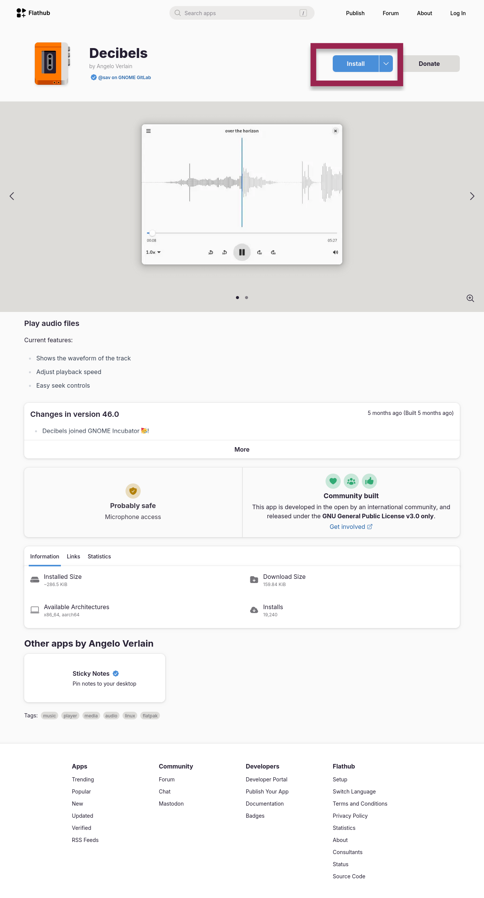
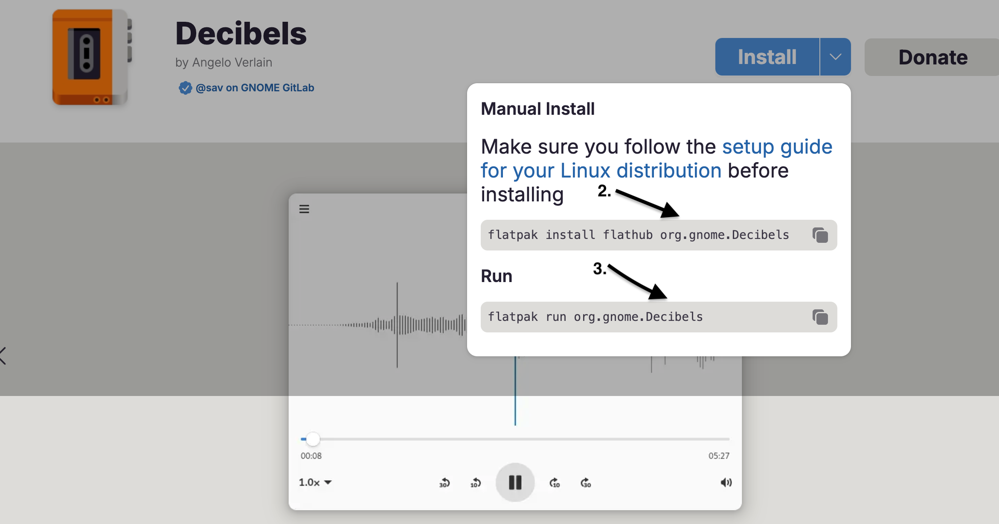
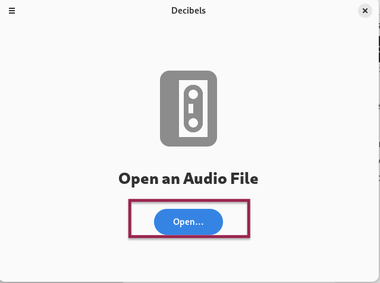
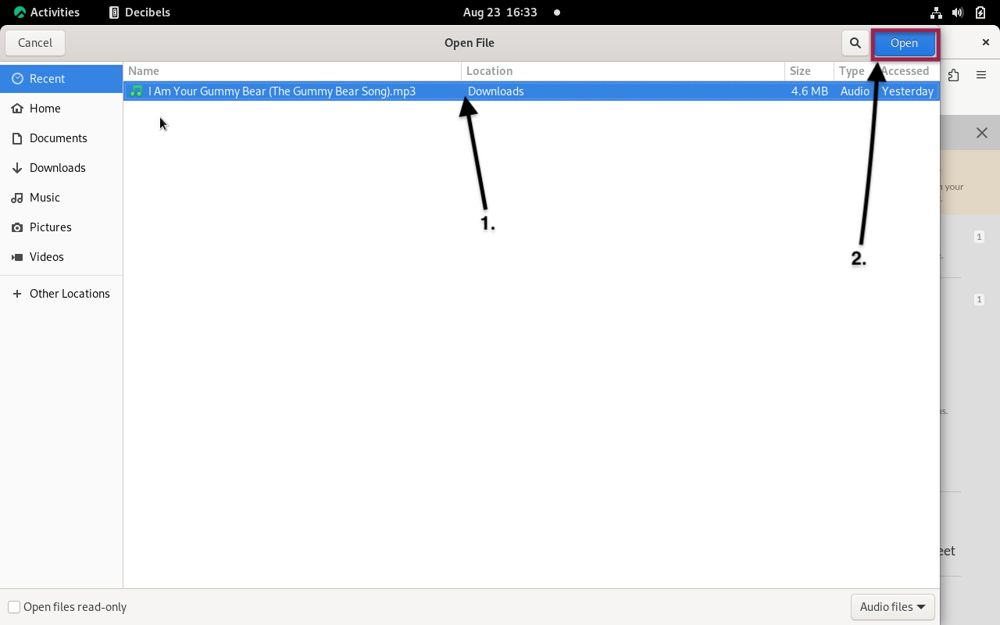

## Introduction

`Decibels` est un logiciel qui lit des fichiers audio. Son interface conviviale facilite le téléchargement (et la lecture) de vos chansons préférées, ainsi que des enregistrements de cours, des idées de projets et d'autres fichiers.

## Prérequis

Ce guide suppose que vous disposez de la configuration suivante :

 - Rocky Linux
 - Flatpak
 - FlatHub

## Processus d'Installation

Accédez à [Flathub.org](https://flathub.org), tapez `Decibels` dans la barre de recherche et cliquez sur **Install**.





2. Copiez le script d'installation manuelle et exécutez-le dans un terminal :

   ```bash
   flatpak install flathub org.gnome.Decibels
   ```

3. Enfin, copiez la commande à lancer et exécutez-la dans votre terminal :

   ```bash
   flatpak run org.gnome.Decibels
   ```

## Mode d'emploi

Pour utiliser le programme `Decibels`, procédez comme suit :

1. Cliquez sur **Open**

   

2. Sélectionnez le fichier souhaité et cliquez sur le bouton **Open** qui apparaîtra dans le coin supérieur droit de l'écran

   

!!! note "Remarque"

```
Fatigué de cliquer avec la souris ? Voici quelques façons d'utiliser le clavier pour interagir avec des fichiers audio

- ++ctrl++ + ++shift++ + ++o++ = Ouvrir le fichier
- ++space++ = Lecture ou pause
- ++left++ = Reculer de 10 secondes
- ++right++ = Avancer de 10 secondes
```

## Conclusion

Êtes-vous impatient d’en savoir plus sur cette application ou avez-vous des idées à proposer ? [Soumettez un issue au dépôt de Decibels sur GitLab](https://gitlab.gnome.org/GNOME/Incubator/decibels/-/issues).
