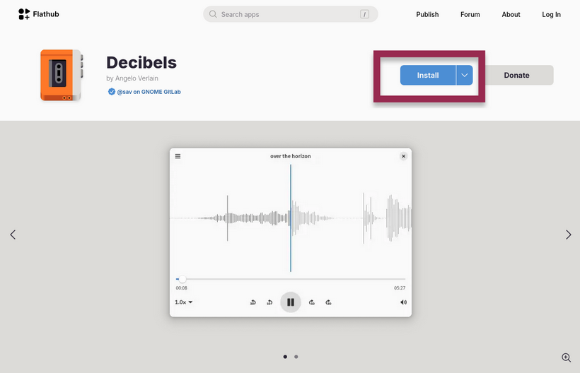
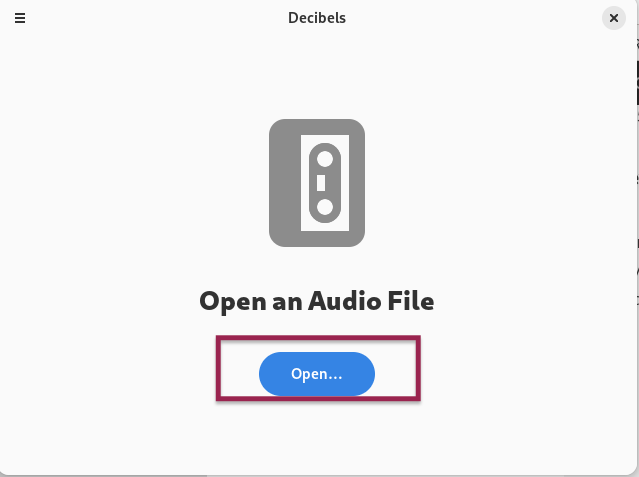

## Вступ

Decibels — програма, яка відтворює аудіофайли. Його зручний інтерфейс спрощує завантаження та відтворення ваших улюблених пісень, а також записів лекцій, проектних ідей та інших файлів.

## Припущення

У цьому посібнику передбачається, що ви маєте наступне:

- Rocky Linux
- Flatpak
- FlatHub

## Процес встановлення

Перейдіть на [Flathub.org](https://flathub.org), введіть «Decibels» в рядку пошуку та натисніть **Install**.



Потім виконайте таку команду у вашому терміналі:

`flatpak run.org.gnome.Decibels`

## Як використовувати

Щоб скористатися програмою, виконайте такі дії:

1. Натисніть _Open_
   
2. Виберіть потрібний файл і натисніть кнопку **Open**, яка з’явиться у верхньому правому куті екрана
   

!!! note "Примітка"

```
Втомилися клацати мишею? Ось кілька способів використання клавіатури для відтворення аудіофайлів і взаємодії з ними

- ++ctrl++ + ++shift++ + ++o++ = Відкрити файл
- ++space++ = Відтворити або призупинити
- ++left++ = Перемістити звук на 10 секунд назад
- ++right++ = Перемістити аудіо на 10 секунд вперед
```

## Висновок

Ви прагнете дізнатися більше про цю програму чи маєте більше ідей для неї? [Надішліть ідею в репозиторій Decibel на GitLab](https://gitlab.gnome.org/GNOME/Incubator/decibels/-/issues).
