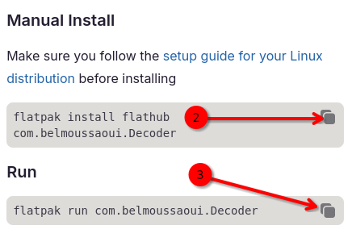

## Einleitung

Benötigen Sie einen QR-Code für Ihre Website, Anwendung oder Social-Media-Profile? Schauen Sie sich Decoder an! Mit der Anwendung können Sie QR-Codes erstellen, speichern und exportieren.

## Voraussetzungen

Für diese Anleitung benötigen Sie Folgendes:

- Rocky Linux
- Flatpak
- FlatHub

## Installations-Ablauf

1. Gehen Sie zu [Flathub.org] (https://flathub.org), geben Sie `Decoder` in die Suchleiste ein und klicken Sie auf **Install**. 

   

2. Kopieren Sie das manuelle Installationsskript und führen Sie es in einem Terminal aus:

   ```bash
   flatpak install flathub com.belmoussaoui.Decoder
   ```

3. Kopieren Sie abschließend den Ausführungsbefehl und rufen Sie ihn in Ihrem Terminal auf:

   ```bash
   flatpak run com.belmoussaoui.Decoder
   ```

## So erstellen Sie einen QR-Code

Es stehen zwei Arten von QR-Codes zur Verfügung. Wählen Sie die Option, die Ihren Anforderungen am besten entspricht:

- [Text](#text)
- [Wifi](#wifi)

### Text


1. Klicken Sie auf die Schaltfläche **Text**

2. Fügen Sie einen Link zu Ihrer gewünschten Website hinzu und schreiben Sie bei Bedarf eine Beschreibung dazu

3. Auf **Create** klicken

   

4. Auf **Save** klicken

5. Auf **Export** klicken

### Wifi


1. Klicken Sie auf die Schaltfläche **Wifi**
2. Fügen Sie den Netzwerknamen hinzu
3. Passwort hinzufügen
4. Wählen Sie aus, ob das Netzwerk ausgeblendet ist oder nicht
5. Wählen Sie den verwendeten Verschlüsselungsalgorithmus aus
6. Auf **Export** klicken
7. Auf **Save** klicken

### So scannen Sie einen QR-Code

Zusätzlich zum Erstellen und Generieren von QR-Codes können Sie mit Decoder auch QR-Codes scannen, die Sie auf Ihrem Computer gespeichert haben. Gehen Sie folgendermaßen vor:


1. Auf **Scan** klicken

   

2. Auf  **From a Screenshot** klicken

   

3. Wählen Sie die gewünschten Effekte aus und klicken Sie auf **Screenshot erstellen**

   

4. Auf **Share** klicken

5. Scannen Sie den QR-Code mit Ihrem Mobilgerät

!!! note "Anmerkung"

```
Um einen QR-Code direkt von Ihrem Computer aus zu scannen, müssen Sie der App Zugriff auf die Kamera Ihres Computers erlauben.
```

## Zusammenfassung

Ganz gleich, ob Sie das WLAN eines Restaurants mit Freunden teilen, Ihr Geschäft ausbauen oder sich auf einer Konferenz mit anderen Fachleuten vernetzen möchten – Decoder vereinfacht das Erstellen und Scannen von QR-Codes. Sie möchten mehr über diese Anwendung erfahren oder haben weitere Ideen dazu? [Senden Sie ein Issue an sein Repository bei GitLab](https://gitlab.gnome.org/World/decoder/-/issues).
