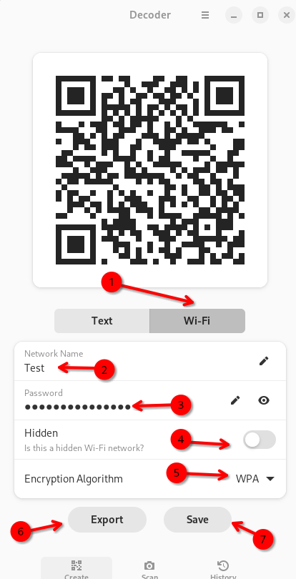
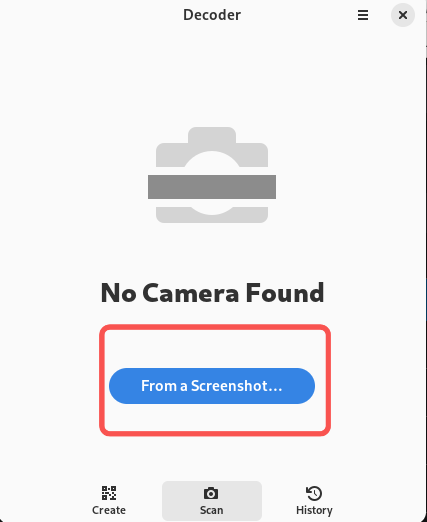
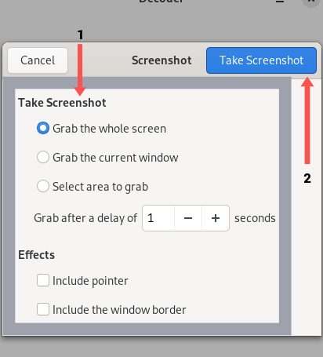
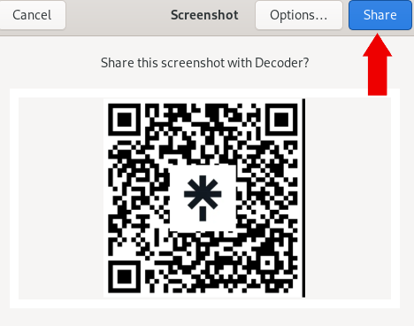

## Introduction

Besoin d'un code QR pour votre site Web, votre application ou vos profils de réseaux sociaux ? Découvrez `Decoder` ! C'est une application qui permet de créer, d'enregistrer et d'exporter des codes QR.

## Prérequis

Ce guide suppose que vous disposez de la configuration suivante :

 - Rocky Linux
 - Flatpak
 - FlatHub

## Processus d'Installation

1. Accédez au [site Web Flathub](https://flathub.org/), tapez `Decoder` dans la barre de recherche et cliquez sur **Install**. 

   

2. Copiez le script d'installation manuelle et exécutez-le dans un terminal :

   ```bash
   flatpak install flathub com.belmoussaoui.Decoder
   ```

3. Enfin, copiez la commande à lancer et exécutez-la dans votre terminal :

   ```bash
   flatpak run com.belmoussaoui.Decoder
   ```

## Comment créer un code QR

Deux types de codes QR sont disponibles. Choisissez l'option qui correspond le mieux à vos besoins :

 - [Text](#text)
 - [Wifi](#wifi)

### Text


1. Cliquez sur le bouton **Text**

2. Ajoutez un lien vers le site Web de votre choix et ajoutez une description si vous en souhaitez une

3. Cliquez sur **Create**.

   

4. Cliquez sur **Save**

5. Cliquez sur **Export**

### Wifi



1. Cliquez sur le bouton **Wifi**
2. Ajoutez le nom du réseau
3. Ajoutez le mot de passe
4. Sélectionnez si le réseau est masqué ou non
5. Sélectionnez l'algorithme de cryptage utilisé
6. Cliquez sur **Export**
7. Cliquez sur **Save**

### Comment scanner un code QR

En plus de créer et de générer des codes QR, vous pouvez utiliser `Decoder` pour scanner les codes QR que vous avez enregistrés sur votre ordinateur. Voici comment procéder :


1. Cliquez sur **Scan**

   

2. Cliquez sur **From a Screenshot**

   

3. Choisissez les effets souhaités et cliquez sur **Prendre une capture d'écran**

   

4. Cliquez sur **Share**

5. Scannez le code QR avec votre appareil mobile

!!! note "Remarque"

```
Pour scanner un code QR directement depuis votre ordinateur, assurez-vous d'accorder à l'application l'accès à l'appareil photo de votre ordinateur.
```

## Conclusion

Qu'il s'agisse de partager le Wi-Fi d'un restaurant avec des amis, de développer votre entreprise ou de réseauter avec d'autres professionnels lors d'une conférence, `Decoder` peut faciliter le processus de création et de numérisation de codes QR. Vous souhaitez en savoir plus ou avoir plus d'idées pour cette application ? [Soumettez un issue à son dépôt sur GitLab](https://gitlab.gnome.org/World/decoder/-/issues).
