## Introduction

Need a QR code for your website, app, and social media profiles? Check out  Decoder! :) It is an application that lets you can create, save, an export QR codes.

## Assumptions

This guide assumes you have the following:

- Rocky Linux
- Flatpak
- FlatHub

## Installation Process

1. Go to the Flathub website, type "Decoder" in the search bar, and click on **Install**.
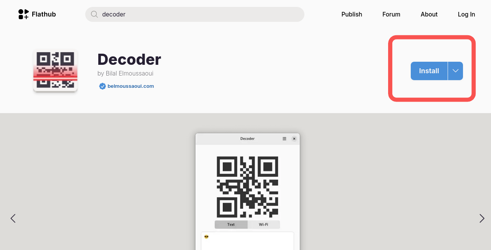

1. Then, run the following command in your terminal
`flatpak run com.belmoussaoui.Decoder`

## How to Create a QR Code

There are two types of QR codes you can create on Decoder. Choose the option that best suits your needs:

- [Text](#text)
- [Wifi](#wifi)

### Text

1. Click on the **Text** button
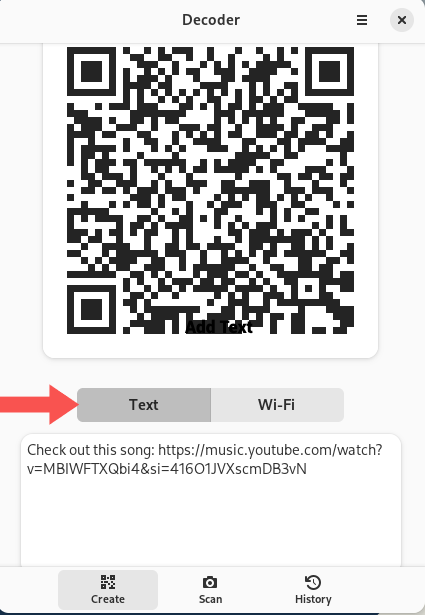
1. Add a link to your desired website and add a description
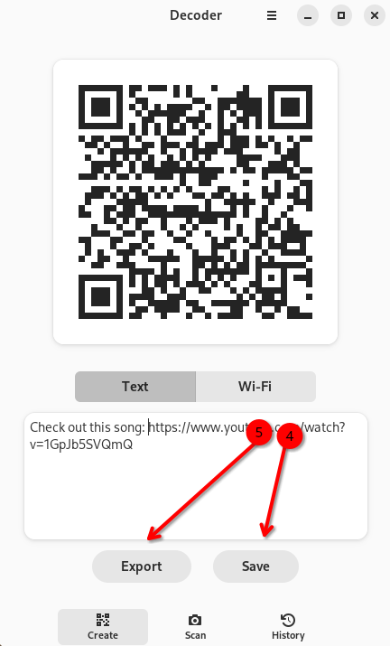
1. Click on **Create**

1. Click on **Save**
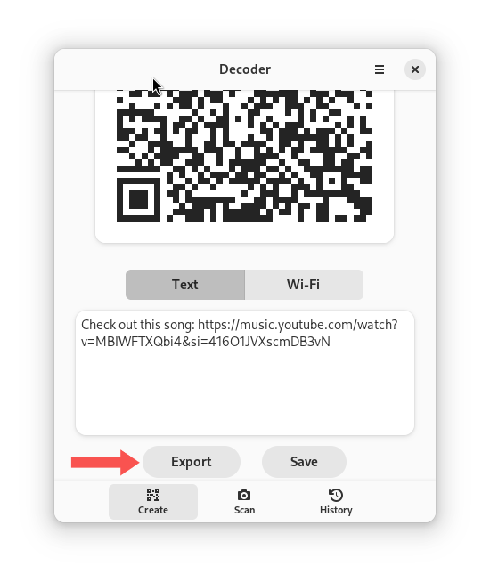
1. Click on **Export**
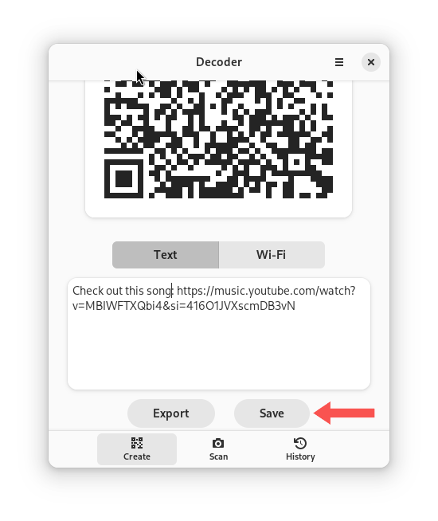

### Wifi

1. Click on the **Wifi** button
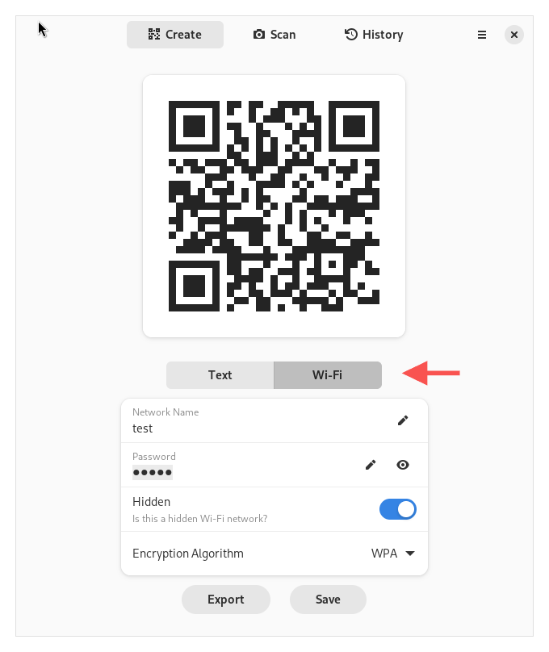
1. Add the name of your network, password, and pick its form of protection from the encryption algorithm dropdown menu
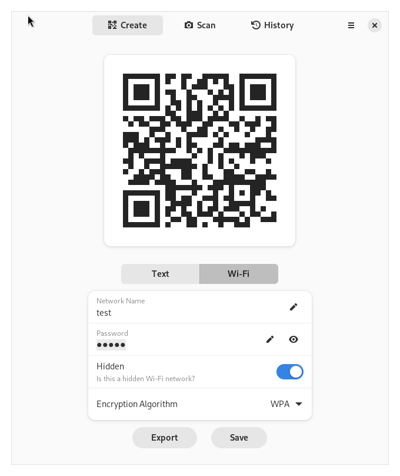
1. Click on **Export**
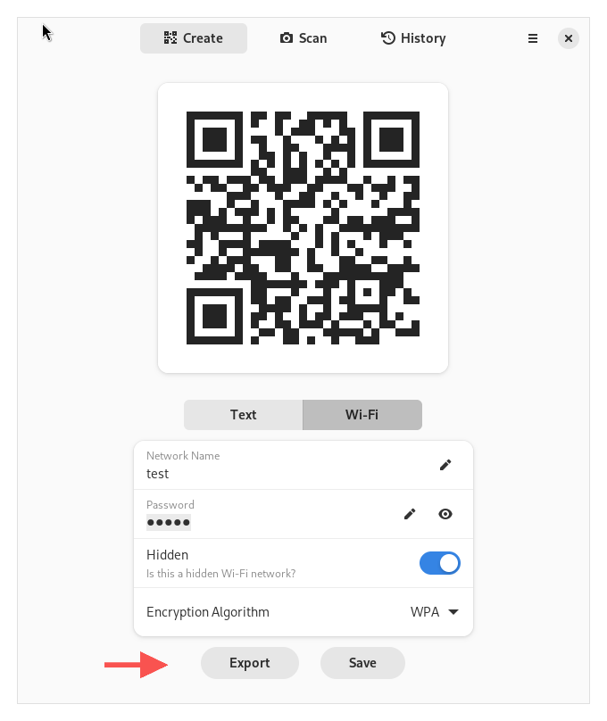
1. Click on **Save**
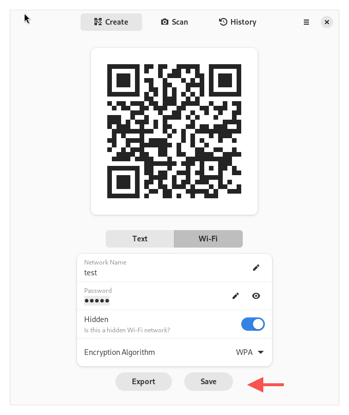

!!! tip

    If your wifi network is hidden, click on the **Hidden** button.

### How to Scan a QR code

In addition to creating and generating QR codes, you can use Decoder to scan QR codes you saved on you computer. Here's how:

1. Click on **Scan**
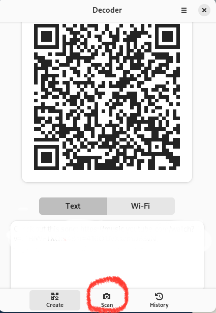
1. Click on  **From a Screenshot**
<!--- add a screenshot here --->
1. Pick your desired effects and click on **Take a Screenshot**

1. Click on **Share**
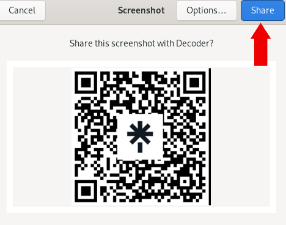
1. Scan the QR code with your mobile device

!!! note
 
    To scan a QR code straight from your computer, ensure that you grant the app access to your computer's camera.

## Conclusion

Whether it's to share a restaurant's Wi-Fi with friends, grow your business, or network with other professionals at a conference, Decoder can ease the process of creating and scanning QR codes. Eager to learn more about or have more ideas for this application? [Submit an issue to its repository at GitLab](https://gitlab.gnome.org/World/decoder/-/issues).
