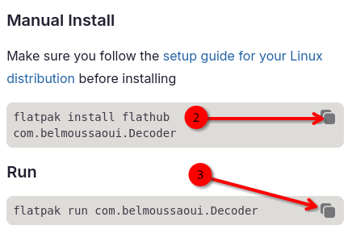
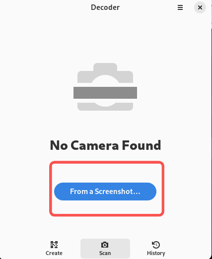
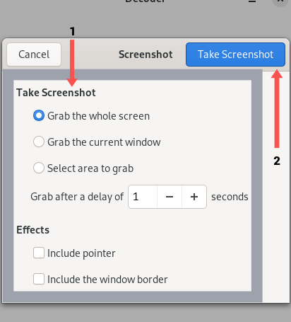

## Introduction

Do you need a QR code for your website, application, or social media profiles? Check out Decoder! The application lets you create, save, and export QR codes.

## Assumptions

This guide assumes you have the following:

- Rocky Linux
- Flatpak
- FlatHub

## Installation Process

1. Go to the [Flathub website](https://flathub.org/), type "Decoder" in the search bar, and click on **Install**. 

    

2. Copy the manual install script and run it in a terminal:

    ```bash
    flatpak install flathub com.belmoussaoui.Decoder
    ```

3. Finally, copy the run command and run that in your terminal:

    ```bash
    flatpak run com.belmoussaoui.Decoder
    ```

## How to Create a QR Code

Two types of QR codes are available. Choose the option that best suits your needs:

- [Text](#text)
- [Wifi](#wifi)

### Text


1. Click on the **Text** button
2. Add a link to your desired website and add a description if you want one
3. Click on **Create**

    

4. Click on **Save**
5. Click on **Export**

### Wifi


1. Click on the **Wifi** button
2. Add the network name
3. Add the password
4. Select if the network is hidden or not hidden
5. Select the encryption algorithm used
6. Click on **Export**
7. Click on **Save**

### How to Scan a QR code

In addition to creating and generating QR codes, you can use Decoder to scan QR codes you saved on your computer. Do the following:


1. Click on **Scan**

    

2. Click on  **From a Screenshot**

    

3. Pick your desired effects and click on **Take a Screenshot**

    

4. Click on **Share**
5. Scan the QR code with your mobile device

!!! note

    To scan a QR code directly from your computer, you must grant the app access to your computer's camera.

## Conclusion

Whether it is to share a restaurant's Wi-Fi with friends, grow your business, or network with other professionals at a conference, Decoder can ease creating and scanning QR codes. Are you eager to learn more about this application or have more ideas for it? [Submit an issue to its repository at GitLab](https://gitlab.gnome.org/World/decoder/-/issues).
