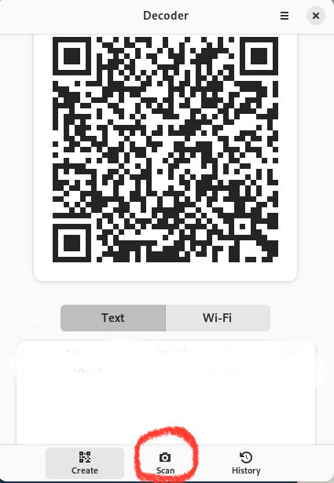

## Вступ

Потрібен QR-код для вашого веб-сайту, програми чи профілів у соціальних мережах? Перевірте декодер! Програма дозволяє створювати, зберігати та експортувати QR-коди.

## Припущення

У цьому посібнику передбачається, що ви маєте наступне:

- Rocky Linux
- Flatpak
- FlatHub

## Процес встановлення

1. Перейдіть на [веб-сайт Flathub](https://flathub.org/), введіть «Декодер» у рядку пошуку та натисніть **Встановити**. 

   

2. Скопіюйте сценарій встановлення вручну та запустіть його в терміналі:

    ```bash
    flatpak install flathub com.belmoussaoui.Decoder
    ```

3. Нарешті, скопіюйте команду запуску та запустіть її у своєму терміналі:

    ```bash
    flatpak run com.belmoussaoui.Decoder
    ```

## Як створити QR-код

Доступні два типи QR-кодів. Виберіть варіант, який найкраще відповідає вашим потребам:

- [Text](#text)
- [Wifi](#wifi)

### Text


1. Натисніть кнопку **Text**

2. Додайте посилання на потрібний веб-сайт і додайте опис, якщо хочете

3. Натисніть **Create**

   

4. Натисніть **Save**

5. Натисніть **Export**

### Wifi


1. Натисніть кнопку **Wifi**
2. Додайте назву мережі
3. Додайте пароль
4. Виберіть, прихована мережа чи ні
5. Виберіть використовуваний алгоритм шифрування
6. Натисніть **Export**
7. Натисніть **Save**

### Як сканувати QR-код

Окрім створення та генерування QR-кодів, ви можете використовувати Decoder для сканування QR-кодів, які ви зберегли на своєму комп’ютері. Зробіть наступне:



1. Натисніть **Scan**

   

2. Натисніть  **From a Screenshot**

   

3. Виберіть потрібні ефекти та натисніть **Take a Screenshot**

   

4. Натисніть **Share**

5. Відскануйте QR-код за допомогою мобільного пристрою

!!! note

    Щоб відсканувати QR-код безпосередньо з комп’ютера, потрібно надати програмі доступ до камери комп’ютера.

## Висновок

Декодер може спростити створення та сканування QR-кодів, якщо ви хочете поділитися Wi-Fi ресторану з друзями, розвивати свій бізнес або спілкуватися з іншими професіоналами на конференції. Ви прагнете дізнатися більше про цю програму чи маєте більше ідей для неї? [Надішліть проблему до свого репозиторію на GitLab](https://gitlab.gnome.org/World/decoder/-/issues).
