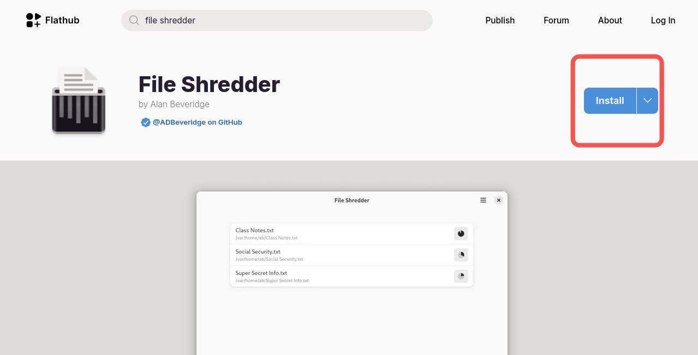
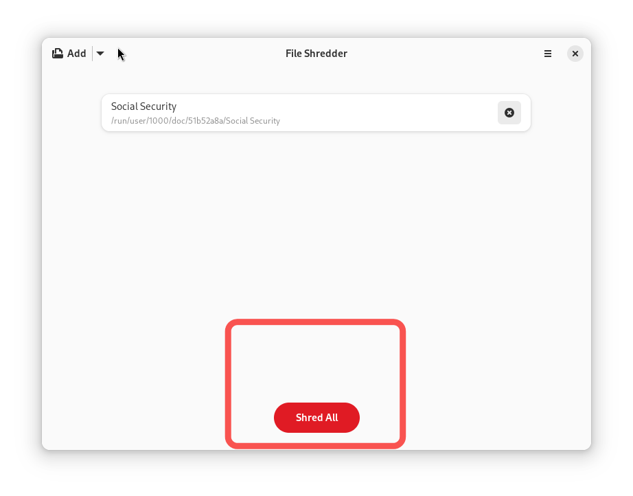

## Einleitung

Möchten Sie eine Postkarte oder eine PDF-Datei mit Informationen wie Ihrem Geburtstag entfernen? Probieren Sie `File Shredder` aus, eine Anwendung, die vertrauliche Online-Informationen dauerhaft löscht.

## Voraussetzungen

Für diese Anleitung benötigen Sie Folgendes:

 - Rocky Linux
 - Flatpak
 - FlatHub

## Installations-Ablauf



1. Gehen Sie zu [Flathub.org] (https://flathub.org), geben Sie `File Shredder` in die Suchleiste ein und klicken Sie auf **Install**

   

2. Kopieren Sie das manuelle Skript in Ihr Terminal:

   ```bash
   flatpak install flathub io.github.ADBeveridge.Raider
   ```

3. Führen Sie anschließend das manuelle Installationsskript in Ihrem Terminal aus:

   ```bash
   flatpak run flathub io.github.ADBeveridge.Raider
   ```

## Anwendungshinweise

Gehen Sie wie folgt vor, um `File Shredder` zu verwenden:

1. Ziehen oder klicken Sie auf **Add file**, um die Datei(en) auszuwählen, die Sie entfernen möchten

   

2. Auf **Shred All** klicken



## Zusammenfassung

Ob Sozialversicherungsakten oder Bankauszüge: Mit dem Tool `File Shredder` können Sie Dateien ganz einfach vernichten, ohne einen Aktenvernichter kaufen zu müssen. Sie möchten mehr über diese Anwendung erfahren oder haben weitere Ideen dazu? [Ein Issue im Repository von File Shredder bei GitHub anlegen](https://github.com/ADBeveridge/raider/issues).
