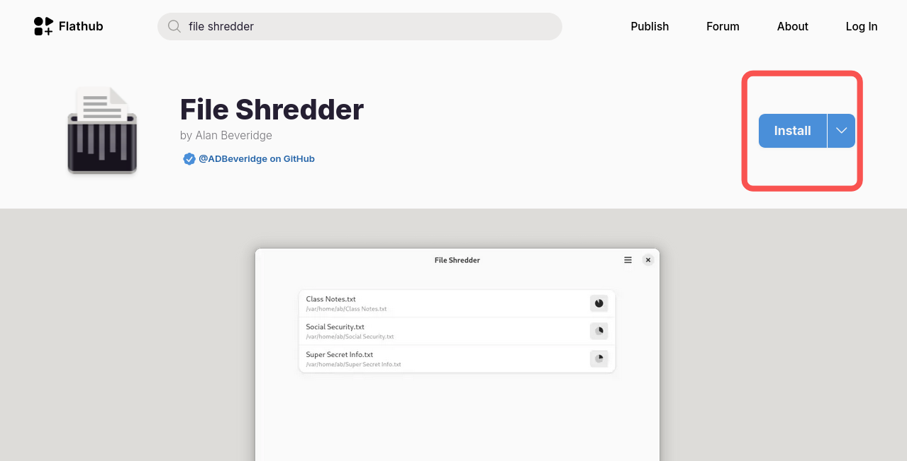
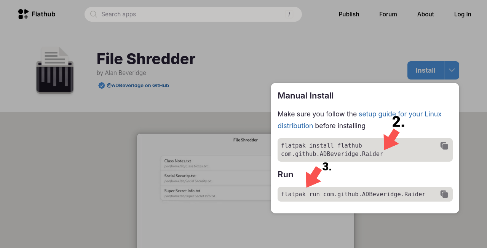
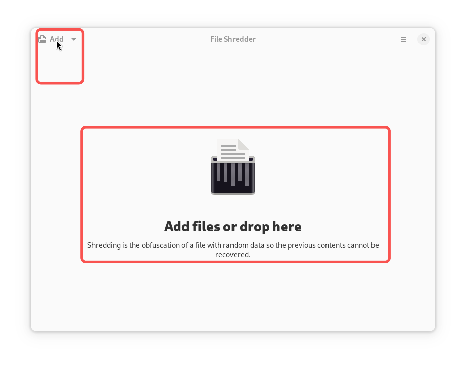
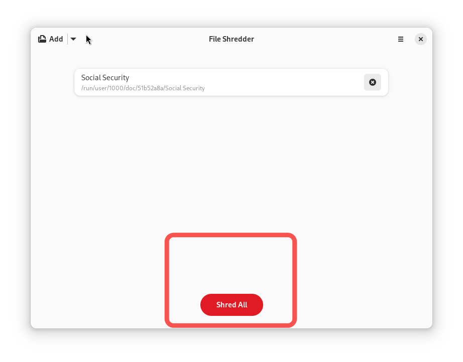

## Introduzione

Dovete rimuovere una cartolina o un file PDF contenente informazioni come il vostro compleanno? Scoprite File Shredder, un'applicazione che rimuove in modo permanente le informazioni sensibili online.

## Presupposti

Questa guida presuppone che si disponga di quanto segue:

 - Rocky Linux
 - Flatpak
 - FlatHub

## Processo di installazione



1. Andate sul [sito web di Flathub](https://flathub.org), digitate "File Shredder" nella barra di ricerca e cliccate su **Install**

   

2. Copiare lo script manuale nel terminale:

   ```bash
   flatpak install flathub io.github.ADBeveridge.Raider
   ```

3. Infine, eseguire lo script manuale nel terminale:

   ```bash
   flatpak run flathub io.github.ADBeveridge.Raider
   ```

## Istruzioni

Per utilizzare File Shredder, procedere come segue:

1. Trascinare o fare clic su **Aggiungi file** per scegliere il file o i file che si desidera rimuovere

   

2. Cliccare su **Shred All**



## Conclusione

Che si tratti di un file della previdenza sociale o di un estratto conto bancario, File Shredder è lo strumento che consente di distruggere facilmente i file senza dover acquistare un distruggidocumenti. Siete desiderosi di saperne di più su questa applicazione o avete altre idee in merito? [Submit an issue in File Shredder's repository at GitHub](https://github.com/ADBeveridge/raider/issues).
