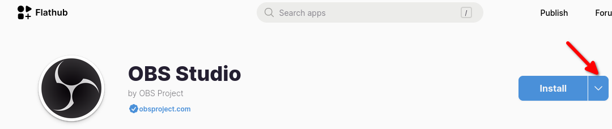

## Introduzione

Dalla pagina del progetto:

> Flatpak è un framework per distribuire applicazioni desktop su varie distribuzioni Linux. È stato creato da sviluppatori che hanno una lunga esperienza di lavoro sul desktop Linux, ed è gestito come un progetto open source indipendente.

Flatpak viene installato automaticamente quando si installa Rocky Linux con selezioni di software che comprendono GNOME ("Server con GUI" o "Postazione di lavoro"). È anche possibile l'installazione manuale. (vedere la procedura inclusa) è un modo eccellente per riempire il desktop environment con i tools che si desidera usare.

## Installazione Manuale

!!! note "Nota"

```
È possibile saltare questo passaggio se si sta già utilizzando l'ambiente Desktop GNOME descritto nell'introduzione.
```

Installare Flatpak con:

```bash
sudo dnf install flatpak
```

Aggiungere il repository Flatpak:

```bash
flatpak remote-add --if-not-exists flathub https://dl.flathub.org/repo/flathub.flatpakrepo
```

Riavviare il sistema:

```bash
sudo shutdown -r now
```

## Comandi Flatpak

Per visualizzare un elenco di tutti i comandi Flatpak disponibili:

```bash
flatpak --help
```

Questo produce quanto segue:

```text
Usage:
  flatpak [OPTION…] COMMAND

Builtin Commands:
 Manage installed applications and runtimes
  install                Install an application or runtime
  update                 Update an installed application or runtime
  uninstall              Uninstall an installed application or runtime
  mask                   Mask out updates and automatic installation
  pin                    Pin a runtime to prevent automatic removal
  list                   List installed apps and/or runtimes
  info                   Show info for installed app or runtime
  history                Show history
  config                 Configure flatpak
  repair                 Repair flatpak installation
  create-usb             Put applications or runtimes onto removable media

 Find applications and runtimes
  search                 Search for remote apps/runtimes

 Manage running applications
  run                    Run an application
  override               Override permissions for an application
  make-current           Specify default version to run
  enter                  Enter the namespace of a running application
  ps                     Enumerate running applications
  kill                   Stop a running application

 Manage file access
  documents              List exported files
  document-export        Grant an application access to a specific file
  document-unexport      Revoke access to a specific file
  document-info          Show information about a specific file

 Manage dynamic permissions
  permissions            List permissions
  permission-remove      Remove item from permission store
  permission-set         Set permissions
  permission-show        Show app permissions
  permission-reset       Reset app permissions

 Manage remote repositories
  remotes                List all configured remotes
  remote-add             Add a new remote repository (by URL)
  remote-modify          Modify properties of a configured remote
  remote-delete          Delete a configured remote
  remote-ls              List contents of a configured remote
  remote-info            Show information about a remote app or runtime

 Build applications
  build-init             Initialize a directory for building
  build                  Run a build command inside the build dir
  build-finish           Finish a build dir for export
  build-export           Export a build dir to a repository
  build-bundle           Create a bundle file from a ref in a local repository
  build-import-bundle    Import a bundle file
  build-sign             Sign an application or runtime
  build-update-repo      Update the summary file in a repository
  build-commit-from      Create new commit based on existing ref
  repo                   Show information about a repo

Help Options:
  -h, --help              Show help options

Application Options:
  --version               Print version information and exit
  --default-arch          Print default arch and exit
  --supported-arches      Print supported arches and exit
  --gl-drivers            Print active gl drivers and exit
  --installations         Print paths for system installations and exit
  --print-updated-env     Print the updated environment needed to run flatpaks
  --print-system-only     Only include the system installation with --print-updated-env
  -v, --verbose           Show debug information, -vv for more detail
  --ostree-verbose        Show OSTree debug information
```

Memorizzare l'elenco dei comandi non è necessario, ma sapere come raggiungere l'elenco e usare l'opzione `--help` è una buona idea.

!!! warning "Attenzione"

````
Se si utilizza una versione Rocky Linux 8.x, si riscontrerà questo bug. Quando si esegue il comando:

```bash
flatpak search [packagename]
```

Dove [packagename] è il pacchetto che si sta cercando, si otterrà:

```text
F: Failed to parse /var/lib/flatpak/appstream/flathub/x86_64/active/appstream.xml.gz file: Error on line 4065 char 29: <p> already set '
  Organic Maps is a free Android & iOS offline maps app for travelers,
  tourists, hikers, drivers, and cyclists.
  It uses crowd-sourced OpenStreetMap data and is developed with love by
  ' and tried to replace with ' ('
No matches found
```

Non esiste una soluzione a questo problema. Per evitare l'errore, utilizzare la risorsa Flathub in questo documento per ottenere e installare il pacchetto desiderato.
````

## Flathub

Flathub è una risorsa web per ottenere o inviare pacchetti desktop.

Per navigare Flathub, visitare <https://flathub.org/>. Qui esiste un enorme elenco di pacchetti desktop curati, ben suddivisi in categorie.

## Utilizzo di Flathub con Flatpak

A titolo di esempio, il processo di installazione di OBS Studio è il seguente:

1. Aprire la sezione "Audio e video" su Flathub

2. Selezionare "OBS Studio" dall'elenco

3. Cliccare sulla freccia rivolta verso il basso accanto al pulsante "Installa"

  

  

4. Assicuratevi di aver completato tutti i prerequisiti per l'installazione di Rocky Linux (numero 1 nella seconda immagine, che è già stato completato sopra) e poi copiate il comando (numero 2 nella seconda immagine) e incollatelo in un terminale

  ```bash
  flatpak install flathub com.obsproject.Studio
  Looking for matches…
  Required runtime for com.obsproject.Studio/x86_64/stable (runtime/org.kde.Platform/x86_64/6.6) found in remote flathub
  Do you want to install it? [Y/n]: Y
  ```

5. Quando si risponde "Y" e si preme ++enter++, viene visualizzato il seguente messaggio:

  ```bash
  com.obsproject.Studio permissions:
  ipc                             network         pulseaudio              wayland
  x11                             devices         file access [1]         dbus access [2]
  system dbus access [3]

  [1] host, xdg-config/kdeglobals:ro, xdg-run/pipewire-0
  [2] com.canonical.AppMenu.Registrar, org.a11y.Bus, org.freedesktop.Flatpak, org.freedesktop.Notifications,
      org.kde.KGlobalSettings, org.kde.StatusNotifierWatcher, org.kde.kconfig.notify
  [3] org.freedesktop.Avahi

      ID                                                    Branch         Op         Remote          Download
  1.     com.obsproject.Studio.Locale                          stable         i          flathub          < 47.0 kB (partial)
  2.     org.kde.KStyle.Adwaita                                6.6            i          flathub           < 8.0 MB
  3.     org.kde.Platform.Locale                               6.6            i          flathub         < 380.6 MB (partial)
  4.     org.kde.PlatformTheme.QGnomePlatform                  6.6            i          flathub           < 9.7 MB
  5.     org.kde.WaylandDecoration.QAdwaitaDecorations         6.6            i          flathub           < 1.2 MB
  6.     org.kde.Platform                                      6.6            i          flathub         < 325.0 MB
  7.     com.obsproject.Studio                                 stable         i          flathub         < 207.7 MB

  Proceed with these changes to the system installation? [Y/n]:
  ```

6. Rispondendo "Y" e premendo ++enter++ si modificheranno i permessi di sistema come indicato e si installerà l'applicazione.

7. Se tutto va bene, dovreste ricevere:

  ```text
  Installation complete.
  ```

8. Dal menu "Attività" è ora possibile cercare ed eseguire OBS Studio.

## Lista dei pacchetti

Per vedere le installazioni di Flatpak presenti sul vostro sistema, aprite un terminale e usate questo comando:

```bash
flatpak list
```

che mostrerà un risultato come questo:

```text
Name                                    Application ID                                  Version   Branch       Installation
OBS Project                             com.obsproject.Studio                           30.1.2    stable       system
FileZilla                               org.filezillaproject.Filezilla                  3.66.1    stable       system
Freedesktop Platform                    org.freedesktop.Platform                        22.08.24  22.08        system
Freedesktop Platform                    org.freedesktop.Platform                        23.08.16  23.08        system
Mesa                                    org.freedesktop.Platform.GL.default             24.0.4    22.08        system
Mesa (Extra)                            org.freedesktop.Platform.GL.default             24.0.4    22.08-extra  system
Mesa                                    org.freedesktop.Platform.GL.default             24.0.5    23.08        system
Mesa (Extra)                            org.freedesktop.Platform.GL.default             24.0.5    23.08-extra  system
Intel                                   org.freedesktop.Platform.VAAPI.Intel                      22.08        system
Intel                                   org.freedesktop.Platform.VAAPI.Intel                      23.08        system
openh264                                org.freedesktop.Platform.openh264               2.1.0     2.2.0        system
openh264                                org.freedesktop.Platform.openh264               2.4.1     2.4.1        system
The GIMP team                           org.gimp.GIMP                                   2.10.36   stable       system
GNOME Application Platform version 46   org.gnome.Platform                                        46           system
Adwaita theme                           org.kde.KStyle.Adwaita                                    6.6          system
KDE Application Platform                org.kde.Platform                                          6.6          system
QGnomePlatform                          org.kde.PlatformTheme.QGnomePlatform                      6.6          system
QAdwaitaDecorations                     org.kde.WaylandDecoration.QAdwaitaDecorations             6.6          system
```

## Aggiornare i pacchetti

Per aggiornare un pacchetto all'ultima versione, utilizzare l'"Application ID" dall'output di `flatpak list`:

```bash
flatpak update com.obsproject.Studio
```

## Rimuovere i pacchetti

Per disinstallare un pacchetto, utilizzare l'"Application ID" dall'output di `flatpak list`:

```bash
flatpak uninstall com.obsproject.Studio
```

## Conclusione

È possibile utilizzare Flathub e Flatpak per popolare il desktop di GNOME con applicazioni, dai giochi agli strumenti di produttività.
