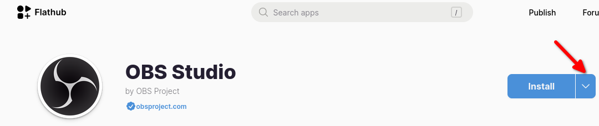
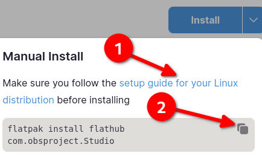

## Вступ

З веб-сторінки проекту:

> Flatpak — це платформа для розповсюдження настільних програм у різних дистрибутивах Linux. Він був створений розробниками, які мають довгу історію роботи на робочому столі Linux, і виконується як незалежний проект з відкритим кодом.

Flatpak встановлюється за замовчуванням під час встановлення Rocky Linux із програмним забезпеченням, яке включає GNOME («Сервер із графічним інтерфейсом» або «Робоча станція»). Також можлива ручна установка. (див. включену процедуру) Це чудовий спосіб заповнити середовище робочого столу інструментами, які ви хочете використовувати.

## Ручне встановлення

!!! note "Примітка"

```
Ви можете пропустити цей крок, якщо ви вже використовуєте повне робоче середовище GNOME, описане у вступі.
```

Встановіть Flatpak за допомогою:

```bash
sudo dnf install flatpak
```

Додайте репозиторій Flatpak:

```bash
flatpak remote-add --if-not-exists flathub https://dl.flathub.org/repo/flathub.flatpakrepo
```

Перезапустіть систему:

```bash
sudo shutdown -r now
```

## Команди Flatpak

Щоб переглянути список усіх доступних команд Flatpak:

```bash
flatpak --help
```

Це виводить наступне:

```text
Usage:
  flatpak [OPTION…] COMMAND

Builtin Commands:
 Manage installed applications and runtimes
  install                Install an application or runtime
  update                 Update an installed application or runtime
  uninstall              Uninstall an installed application or runtime
  mask                   Mask out updates and automatic installation
  pin                    Pin a runtime to prevent automatic removal
  list                   List installed apps and/or runtimes
  info                   Show info for installed app or runtime
  history                Show history
  config                 Configure flatpak
  repair                 Repair flatpak installation
  create-usb             Put applications or runtimes onto removable media

 Find applications and runtimes
  search                 Search for remote apps/runtimes

 Manage running applications
  run                    Run an application
  override               Override permissions for an application
  make-current           Specify default version to run
  enter                  Enter the namespace of a running application
  ps                     Enumerate running applications
  kill                   Stop a running application

 Manage file access
  documents              List exported files
  document-export        Grant an application access to a specific file
  document-unexport      Revoke access to a specific file
  document-info          Show information about a specific file

 Manage dynamic permissions
  permissions            List permissions
  permission-remove      Remove item from permission store
  permission-set         Set permissions
  permission-show        Show app permissions
  permission-reset       Reset app permissions

 Manage remote repositories
  remotes                List all configured remotes
  remote-add             Add a new remote repository (by URL)
  remote-modify          Modify properties of a configured remote
  remote-delete          Delete a configured remote
  remote-ls              List contents of a configured remote
  remote-info            Show information about a remote app or runtime

 Build applications
  build-init             Initialize a directory for building
  build                  Run a build command inside the build dir
  build-finish           Finish a build dir for export
  build-export           Export a build dir to a repository
  build-bundle           Create a bundle file from a ref in a local repository
  build-import-bundle    Import a bundle file
  build-sign             Sign an application or runtime
  build-update-repo      Update the summary file in a repository
  build-commit-from      Create new commit based on existing ref
  repo                   Show information about a repo

Help Options:
  -h, --help              Show help options

Application Options:
  --version               Print version information and exit
  --default-arch          Print default arch and exit
  --supported-arches      Print supported arches and exit
  --gl-drivers            Print active gl drivers and exit
  --installations         Print paths for system installations and exit
  --print-updated-env     Print the updated environment needed to run flatpaks
  --print-system-only     Only include the system installation with --print-updated-env
  -v, --verbose           Show debug information, -vv for more detail
  --ostree-verbose        Show OSTree debug information
```

Запам'ятовувати список команд непотрібно, але знати, як отримати доступ до списку та скористатися опцією `--help` - це гарна ідея.

!!! warning "Важливо"

````
Якщо ви використовуєте версію Rocky Linux 9.x, ви зіткнетеся з цією помилкою. Під час виконання команди:

```bash
flatpak search [packagename]
```

Якщо [назва пакета] — це пакет, який ви шукаєте, ви отримаєте:

```text
F: Failed to parse /var/lib/flatpak/appstream/flathub/x86_64/active/appstream.xml.gz file: Error on line 4065 char 29: <p> already set '
  Organic Maps is a free Android & iOS offline maps app for travelers,
  tourists, hikers, drivers and cyclists.
  It uses crowd-sourced OpenStreetMap data and is developed with love by
  ' and tried to replace with ' ('
No matches found
```

Для цього немає обхідного шляху. Щоб уникнути помилки, скористайтеся ресурсом Flathub у цьому документі, щоб отримати та встановити потрібний пакет.
````

## Flathub

Flathub — це веб-ресурс для отримання або надсилання пакетів для робочого столу.

Щоб переглянути Flathub, відвідайте https://flathub.org/. Величезний список підібраних пакетів для робочого столу красиво поділено на категорії.

## Використання Flathub із Flatpak

Як приклад, процес інсталяції OBS Studio такий:

1. Відкрийте розділ «Аудіо та відео» на Flathub

2. Виберіть зі списку «OBS Studio».

3. Натисніть стрілку вниз поруч із кнопкою «Встановити»

   

   

4. Переконайтеся, що ви виконали всі передумови встановлення для Rocky Linux (номер 1 на другому зображенні, яке вже виконано вище), а потім скопіюйте команду (номер 2 на другому зображенні) і вставте її в термінал

   ```bash
   flatpak install flathub com.obsproject.Studio
   Looking for matches…
   Required runtime for com.obsproject.Studio/x86_64/stable (runtime/org.kde.Platform/x86_64/6.6) found in remote flathub
   Do you want to install it? [Y/n]: Y
   ```

5. Коли ви відповісте «Y» і натиснете ++enter++, ви побачите таке:

   ```bash
   com.obsproject.Studio permissions:
   ipc                             network         pulseaudio              wayland
   x11                             devices         file access [1]         dbus access [2]
   system dbus access [3]

   [1] host, xdg-config/kdeglobals:ro, xdg-run/pipewire-0
   [2] com.canonical.AppMenu.Registrar, org.a11y.Bus, org.freedesktop.Flatpak, org.freedesktop.Notifications,
       org.kde.KGlobalSettings, org.kde.StatusNotifierWatcher, org.kde.kconfig.notify
   [3] org.freedesktop.Avahi

       ID                                                    Branch         Op         Remote          Download
   1.     com.obsproject.Studio.Locale                          stable         i          flathub          < 47.0 kB (partial)
   2.     org.kde.KStyle.Adwaita                                6.6            i          flathub           < 8.0 MB
   3.     org.kde.Platform.Locale                               6.6            i          flathub         < 380.6 MB (partial)
   4.     org.kde.PlatformTheme.QGnomePlatform                  6.6            i          flathub           < 9.7 MB
   5.     org.kde.WaylandDecoration.QAdwaitaDecorations         6.6            i          flathub           < 1.2 MB
   6.     org.kde.Platform                                      6.6            i          flathub         < 325.0 MB
   7.     com.obsproject.Studio                                 stable         i          flathub         < 207.7 MB

   Proceed with these changes to the system installation? [Y/n]:
   ```

6. Якщо відповісти «Y» і натиснути ++enter++, системні дозволи будуть змінені, як зазначено, і встановлено програму.

7. Якщо все піде добре, ви повинні отримати:

   ```text
   Installation complete.
   ```

8. Тепер у меню «Activities» ви зможете шукати та запускати OBS Studio.

## Лістинг пакетів

Щоб переглянути інсталяції Flatpak у вашій системі, відкрийте термінал і скористайтеся цією командою:

```bash
flatpak list
```

який покаже вам такі результати:

```text
Name                                    Application ID                                  Version   Branch       Installation
OBS Project                             com.obsproject.Studio                           30.1.2    stable       system
FileZilla                               org.filezillaproject.Filezilla                  3.66.1    stable       system
Freedesktop Platform                    org.freedesktop.Platform                        22.08.24  22.08        system
Freedesktop Platform                    org.freedesktop.Platform                        23.08.16  23.08        system
Mesa                                    org.freedesktop.Platform.GL.default             24.0.4    22.08        system
Mesa (Extra)                            org.freedesktop.Platform.GL.default             24.0.4    22.08-extra  system
Mesa                                    org.freedesktop.Platform.GL.default             24.0.5    23.08        system
Mesa (Extra)                            org.freedesktop.Platform.GL.default             24.0.5    23.08-extra  system
Intel                                   org.freedesktop.Platform.VAAPI.Intel                      22.08        system
Intel                                   org.freedesktop.Platform.VAAPI.Intel                      23.08        system
openh264                                org.freedesktop.Platform.openh264               2.1.0     2.2.0        system
openh264                                org.freedesktop.Platform.openh264               2.4.1     2.4.1        system
The GIMP team                           org.gimp.GIMP                                   2.10.36   stable       system
GNOME Application Platform version 46   org.gnome.Platform                                        46           system
Adwaita theme                           org.kde.KStyle.Adwaita                                    6.6          system
KDE Application Platform                org.kde.Platform                                          6.6          system
QGnomePlatform                          org.kde.PlatformTheme.QGnomePlatform                      6.6          system
QAdwaitaDecorations                     org.kde.WaylandDecoration.QAdwaitaDecorations             6.6          system
```

## Оновлення пакетів

Щоб оновити пакет до останньої версії, скористайтеся «Ідентифікатором програми» з виводу `flatpak list`:

```bash
flatpak update com.obsproject.Studio
```

## Видалення пакетів

Щоб видалити пакет, скористайтеся «Application ID» зі списку `flatpak`:

```bash
flatpak uninstall com.obsproject.Studio
```

## Висновок

Ви можете легко використовувати Flathub і Flatpak, щоб наповнити робочий стіл GNOME програмами, від ігор до інструментів продуктивності.
