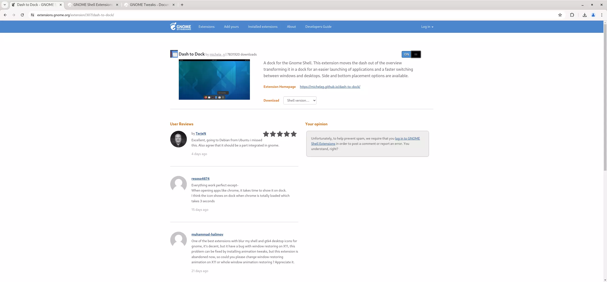
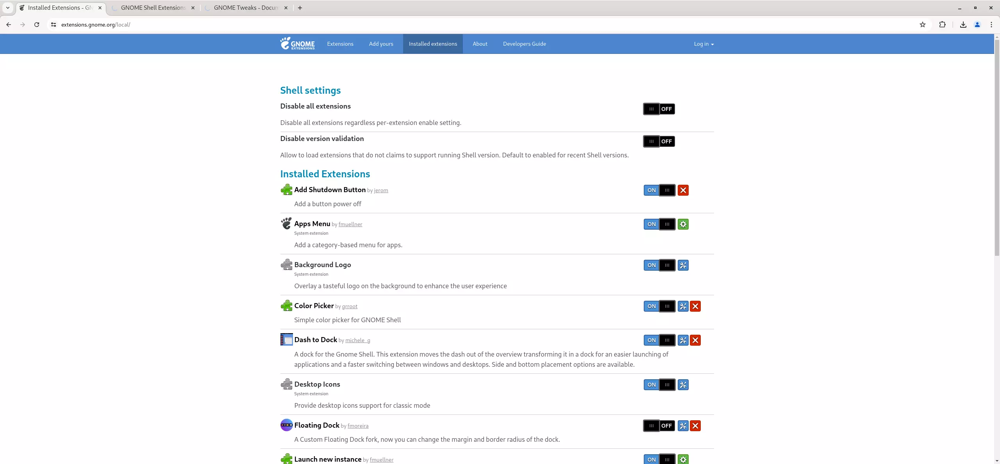

## Introduction

Extrait du [site de GNOME](https://extensions.gnome.org/about/){:target="_blank"}:

> GNOME Shell fournit des fonctions d'interface utilisateur de base pour GNOME, comme la gestion de fenêtres et le lancement d'applications. Les éléments de l'interface utilisateur fournis par GNOME Shell incluent le panneau en haut de l'écran, l'aperçu des activités et la barre de messages en bas de l'écran."
> Les extensions GNOME Shell sont des petits morceaux de code écrits par des développeurs tiers qui modifient le fonctionnement de GNOME. (Si vous connaissez les extensions Chrome ou les Firefox Add-ons, les extensions GNOME Shell leur sont similaires.) Vous pouvez trouver et installer des extensions GNOME Shell à l’aide de ce site Web.
> La création d'extensions a lieu en dehors du processus normal de conception et de développement de GNOME, elle est prise en charge par leurs auteurs, plutôt que par la communauté GNOME. Certaines fonctionnalités initialement implémentées sous forme d'extensions peuvent se retrouver dans les futures versions de GNOME.

## Prérequis

- Un poste de travail ou un serveur Rocky Linux avec une interface graphique qui utilise GNOME.

## Installation d'Extensions de GNOME

Les extensions GNOME sont fournies à partir du paquet `gnome-shell` disponible dans le référentiel `appstream`. Installez avec la commande suivante :

```bash
sudo dnf install gnome-shell
```

L’installation inclut toutes les dépendances nécessaires.

## Installation de l'Intégration du Navigateur

Gnome Extensions dispose d'une bibliothèque de logiciels disponible sur leur site Web `gnome.extensions.org` à partir duquel vous pouvez directement installer des extensions. Pour y parvenir, votre navigateur et les extensions gnome doivent faciliter la connexion.

```bash
sudo dnf install chrome-gnome-shell
```

[guide d'installation](https://gnome.pages.gitlab.gnome.org/gnome-browser-integration/pages/installation-guide.html){target="_blank"}

## Déterminer la Version de GNOME Shell

L'extension de navigateur utilisée pour faciliter l'installation d'extensions à partir du site `extensions.gnome.org` devrait automatiquement détecter la version du shell GNOME que votre système exécute actuellement.

Si vous souhaitez effectuer une installation locale, vous devrez télécharger l'extension avec la version correcte du shell GNOME.

```bash
gnome-shell --version
```

## Installation d\`une Extension

Pour cet exemple, nous installerons l’extension populaire `Dash to Dock`.

1. Rendez-vous sur [page Web de l'extension Dash to Dock](https://extensions.gnome.org/extension/307/dash-to-dock/){target="_blank"}
2. Passer l'extension de "off" à "on"
   
3. Lorsque vous êtes invité à installer l’extension, cliquez sur `yes`.

## Gestion des Extensions Installées

Les extensions GNOME sont installées et gérées à partir de gnome.extensions.org.

Pour gérer vos extensions GNOME, rendez-vous d'abord sur https://extensions.gnome.org/local/



Sur cette page, vous trouverez une liste des extensions installées. Vous pouvez activer ou désactiver chacun de ces éléments. Vous pouvez également configurer les paramètres du shell en utilisant le bouton pour basculer sur l'une des deux options de menu disponibles « Désactiver toutes les extensions » « Désactiver la validation de version ».

## Conclusion

Les extensions GNOME sont un outil bien utile pour ajouter des fonctionnalités supplémentaires et personnaliser votre environnement de bureau GNOME.
