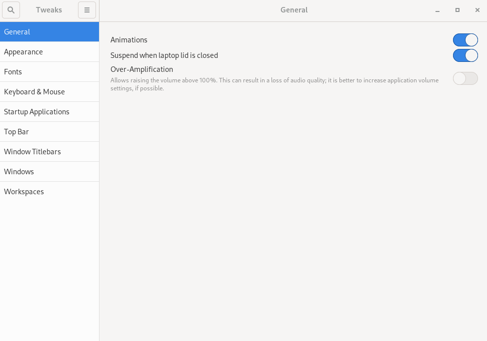

## Einleitung

GNOME Tweaks ist ein Tool zum Anpassen von Desktop-Eigenschaften, einschließlich Standardschriftarten, Fenstern, Arbeitsbereichen und mehr.

## Voraussetzungen

- Eine Rocky Linux-Workstation oder ein Server mit GUI-Installation, die GNOME verwendet.

## GNOME tweaks Installation

GNOME Tweaks ist im Repository „appstream“ verfügbar und erfordert keine zusätzliche Repository-Konfiguration. Wird wie folgt installiert:

```bash
sudo dnf install gnome-tweaks 
```

Die Installation umfasst alle benötigten Abhängigkeiten.

## Bildschirminhalte und Funktionen


Um `Tweaks` zu starten, geben Sie in der Suche im Menü „Aktivitäten“ „Tweaks“ ein und klicken Sie auf „Tweaks“.


<!-- Please, add here a screen where you click Tweaks -->

_General_ ermöglicht das Ändern des Standardverhaltens von Animationen, Unterbrechungen und Überverstärkung.



_Appearance_ ermöglicht das Ändern der Design-Standardeinstellungen sowie der Hintergrund- und Sperrbildschirmbilder.


_Fonts_ ermöglicht das Ändern von Standard-schriftarten und -größen.


_Keyboard & Mouse_ permet de modifier le comportement par défaut du clavier et de la souris.


Wenn Sie Anwendungen haben, die Sie beim Start der GNOME-Shell starten möchten, können Sie dies unter _Startup Applications_ einrichten.


Passen Sie hier die Standardeinstellungen der _Top Bar_ (Uhr, Kalender, Akku) an.


_Window Titlebars_ ermöglicht das Ändern des Standardverhaltens von Titelleisten.


_Windows_ ermöglicht das Ändern des Standardverhaltens von Fenstern.


Mit _Workspaces_ können Sie ändern, wie Arbeitsbereiche erstellt werden (dynamisch oder statisch) und wie diese Arbeitsbereiche angezeigt werden sollen.


!!! note "Anmerkung"

```
Sie können alles auf die Standardeinstellungen zurücksetzen, indem Sie das Drei-Balken-Menü neben „Tweaks“ in der linken Ecke verwenden.
```

## Zusammenfassung

GNOME Tweaks ist ein ausgezeichnetes Werkzeug zum Anpassen Ihrer GNOME-Desktopumgebung.
