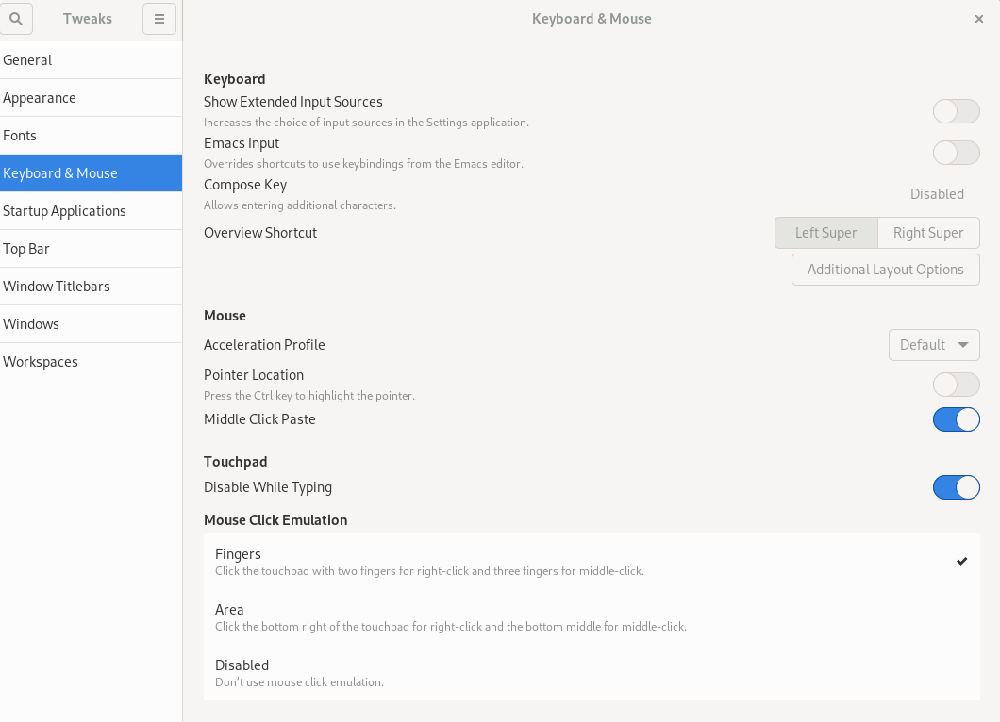
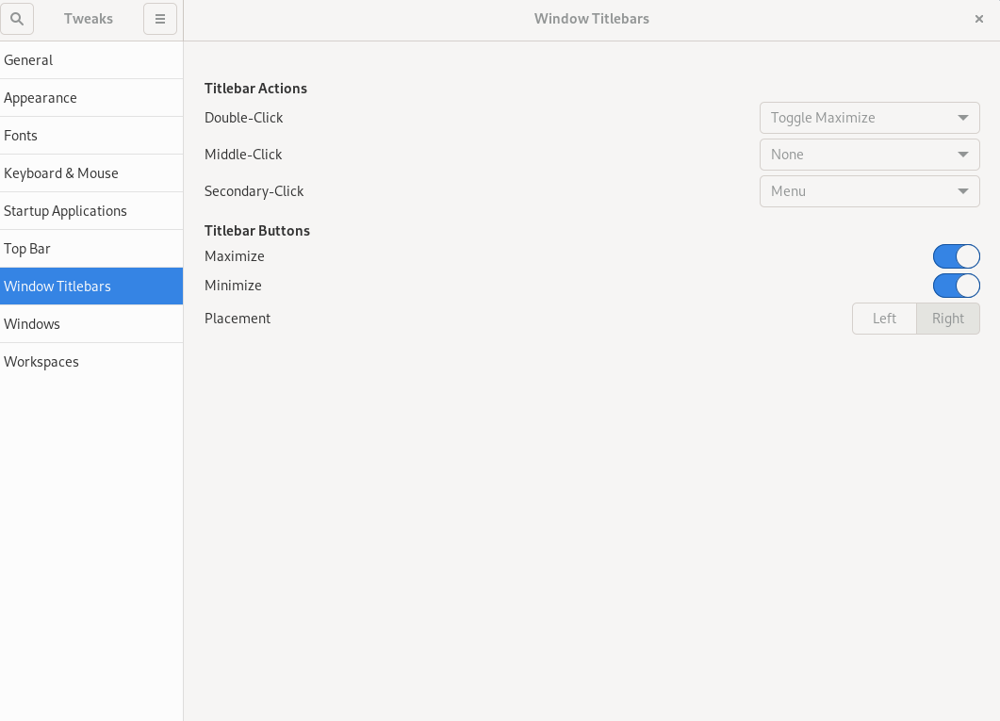

## Introduction

GNOME Tweaks ist ein Tool zum Anpassen von Desktop-Eigenschaften, einschließlich Standardschriftarten, Fenstern, Arbeitsbereichen und mehr.

## Prérequis

- Eine Rocky Linux-Workstation oder ein Server mit GUI-Installation, die GNOME verwendet.

## Installation de GNOME tweaks

GNOME Tweaks est disponible depuis le référentiel « appstream », ne nécessitant aucune configuration de référentiel supplémentaire. Installieren avec la commande suivante :

```bash
sudo dnf install gnome-tweaks 
```

L’installation inclut toutes les dépendances nécessaires.

## Écrans et fonctionnalités


Pour lancer 'tweaks', dans la recherche du menu Activités, tapez « tweaks » et cliquez sur « Tweaks ».


<!-- Please, add here a screen where you click Tweaks -->

_General_ permet de modifier le comportement par défaut des animations, de la suspension et de la suramplification.


_Appearance_ permet de modifier les paramètres par défaut du thème ainsi que les images d'arrière-plan et de verrouillage.


_Fonts_ permet de modifier les polices et les tailles par défaut.


_Keyboard & Mouse_ permet de modifier le comportement par défaut du clavier et de la souris.



Si vous souhaitez lancer des applications au démarrage du shell GNOME, vous pouvez les configurer dans _Startup Applications_.


Personnalisez ici les paramètres par défaut de la _Top Bar_ (horloge, calendrier, batterie).


_Window Titlebars_ permet de modifier le comportement par défaut des barres de titre.



_Windows_ permet de changer le comportement par défaut des fenêtres.


_Workspaces_ vous permet de modifier la façon dont les espaces de travail sont créés (dynamiquement ou statiquement) et la manière dont vous souhaitez que ces espaces de travail apparaissent.


!!! note "Remarque"

```
Vous pouvez tout réinitialiser aux valeurs par défaut en utilisant le menu à trois barres à côté de « Tweaks » dans le coin gauche.
```

## Conclusion

GNOME Tweaks est un excellent outil pour personnaliser votre environnement de bureau GNOME.
