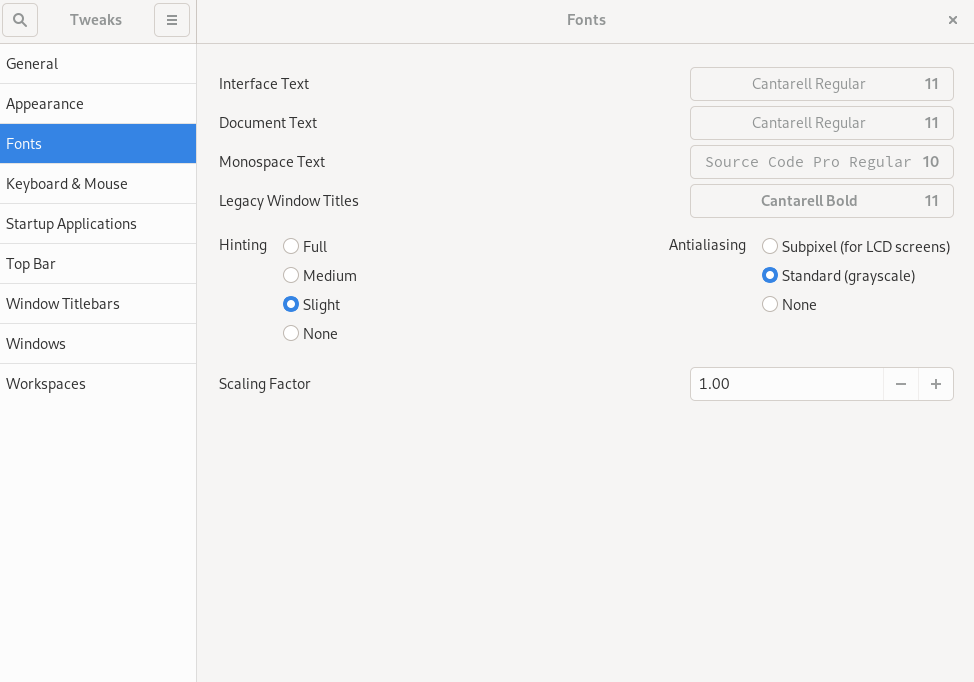

## Introduzione

GNOME Tweaks è uno strumento per personalizzare l'esperienza del desktop, compresi i font predefiniti, le finestre, gli spazi di lavoro e altro ancora.

## Presupposti

 - Una workstation o un server Rocky Linux con installazione dell'interfaccia grafica che utilizza GNOME.

## Installare GNOME tweaks

GNOME Tweaks è disponibile nel repository "appstream" e non richiede alcuna configurazione aggiuntiva del repository. Installare con:

```bash
sudo dnf install gnome-tweaks 
```

L'installazione include tutte le dipendenze necessarie.

## Schermate e funzioni


Per avviare i tweak, digitate "tweak" nella ricerca del menu Attività e fate clic su "Tweak".


<!-- Please, add here a screen where you click Tweaks -->

_General_ permette di modificare il comportamento predefinito delle animazioni, delle sospensioni e della sovraamplificazione.


_Appearance_ consente di modificare le impostazioni predefinite del tema e le immagini dello sfondo e della schermata di blocco.


_Fonts_ permette di cambiare i font e le dimensioni predefinite.



_Tastiera e mouse_ consente di modificare il comportamento predefinito della tastiera e del mouse.


Se si desidera che le applicazioni vengano avviate all'avvio della shell di GNOME, è possibile impostarle in _Applicazioni di avvio_.


Personalizzare le impostazioni predefinite della _Barra superiore_ (orologio, calendario, batteria).


_Barre dei titoli delle finestre_ consente di modificare il comportamento predefinito delle barre dei titoli.


_Windows_ consente di modificare il comportamento predefinito delle finestre.


_Workspaces_ consente di modificare la modalità di creazione degli spazi di lavoro (dinamicamente o staticamente) e l'aspetto di tali spazi.


!!! note "Nota"

```
È possibile ripristinare le impostazioni predefinite utilizzando il menu a tre barre accanto a "Tweaks" nell'angolo sinistro.
```

## Conclusione

GNOME Tweaks è un buon strumento per personalizzare l'ambiente desktop GNOME.
