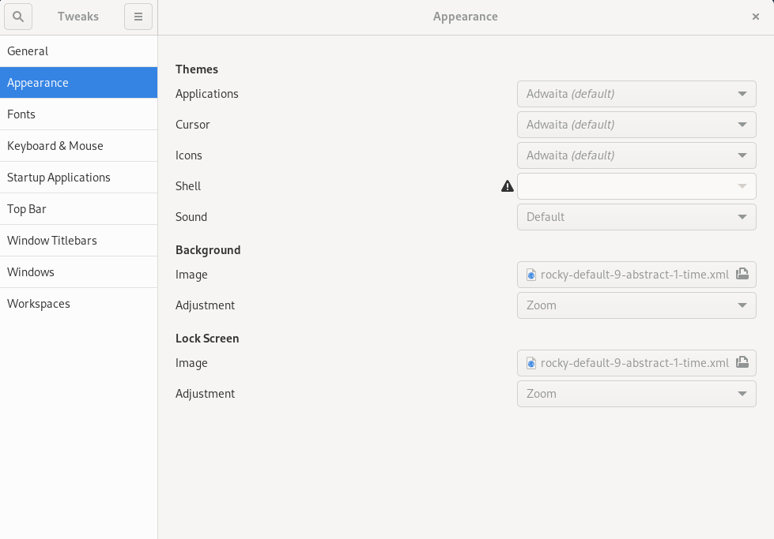
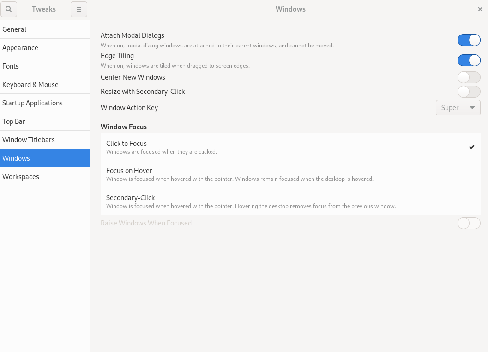

## Introduction

GNOME Tweaks is a tool for customizing desktop experiences, including default fonts, windowing, workspaces, and more.

## Assumptions

* A Rocky Linux Workstation or Server with GUI installation that uses GNOME.

## Install GNOME Tweaks

GNOME tweaks is available from the "appstream" repository, requiring no additional repository configuration. Install with:

```bash
sudo dnf install gnome-tweaks 
```

Installation includes all needed dependencies.

## Screens and functions

To start tweaks, from the Activities menu's search, type "tweaks" and click on "Tweaks."


*General* allows changing the default behavior of animations, suspension, and over-amplification.



*Appearance* allows changing theme defaults and the background and lock screen images.


*Fonts* allows the changing of default fonts and sizes.


*Keyboard & Mouse* allows changing default keyboard and mouse behavior.


If you have applications you want to start when the GNOME shell starts, you can set them up in *Startup Applications*.


Customize the *Top Bar* (clock, calendar, battery) defaults here.


*Window Titlebars* allows changing the default behavior of titlebars.



*Windows* allows changing the default behavior of windows.


*Workspaces* allow you to change how workspaces are created (dynamically or statically) and how you want them to appear.

!!! note

    You can reset everything back to defaults using the three-bar menu next to "Tweaks" in the left-hand corner.

## Conclusion

GNOME Tweaks is a good tool for customizing your GNOME desktop environment.
