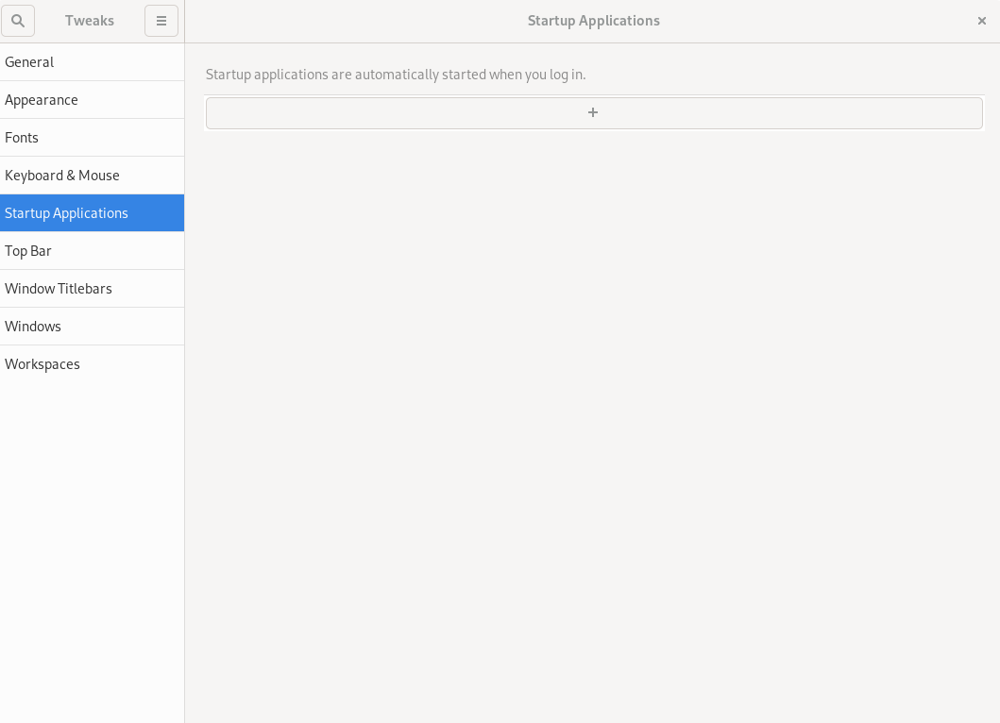
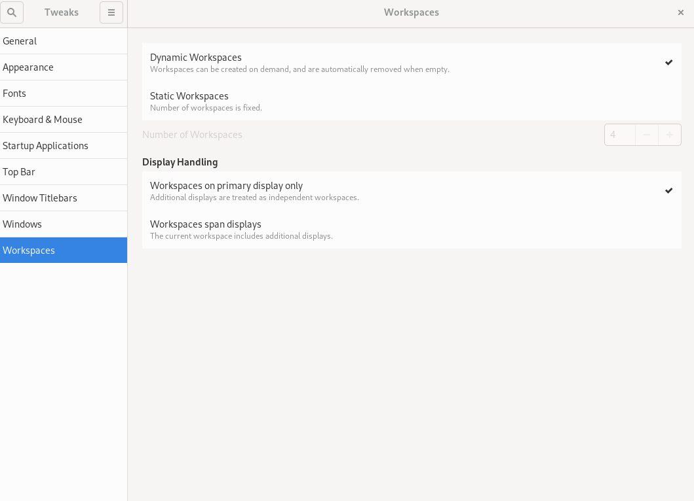

## Introduction

GNOME Tweaks is a tool for customizing desktop experiences, including default fonts, windowing, workspaces, and more.

## Assumptions

* A Rocky Linux Workstation or Server with GUI installation that uses GNOME.

## Install GNOME tweaks

GNOME Tweaks is available from the "appstream" repository, requiring no additional repository configuration. Install with:

```bash
sudo dnf install gnome-tweaks 
```

Installation includes all needed dependencies.

## Screens and functions

To start tweaks, from the Activities menu's search, type "tweaks" and click on "Tweaks."

<!-- Please, add here a screen where you click Tweaks -->

*General* allows changing the default behavior of animations, suspension, and over-amplification.


*Appearance* allows the changing of theme defaults and the background and lock screen images.


*Fonts* allows the changing of default fonts and sizes.


*Keyboard & Mouse* allows changing default keyboard and mouse behavior.


If you have applications you want to start when the GNOME shell starts, you can set that up in *Startup Applications*.



Customize the *Top Bar* (clock, calendar, battery) defaults here.


*Window Titlebars* allows changing the default behavior of titlebars.


*Windows* allows changing the default behavior of windows.


*Workspaces* allows you to change how workspaces are created (dynamically or statically) and how you want those workspaces to appear.



!!! note

    You can reset everything back to defaults by using the three-bar menu next to "Tweaks" in the left-hand corner.

## Conclusion

GNOME Tweaks is a good tool for customizing your GNOME desktop environment.
