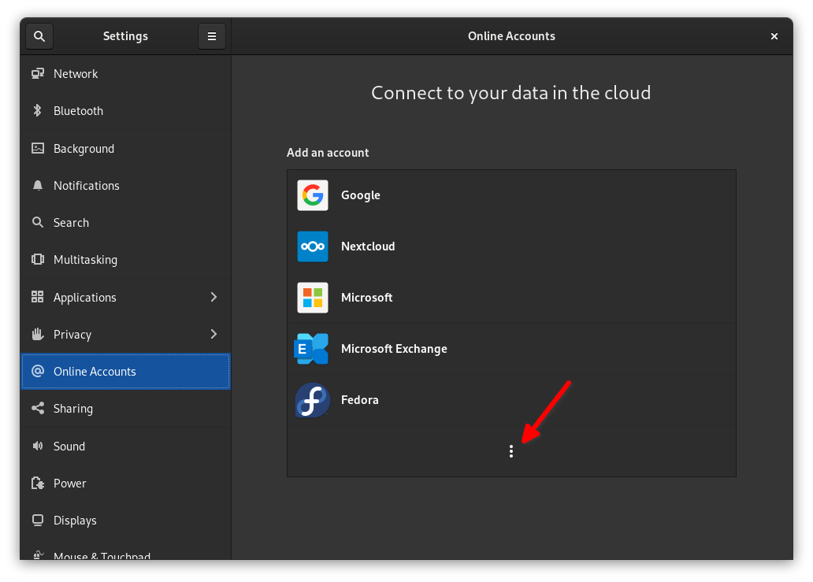

## Einleitung

Auf den ersten Blick erscheint die Funktion für Online-Konten von GNOME bescheiden, ist aber recht leistungsstark. Damit können Sie innerhalb weniger Minuten von Ihren Desktop-Apps auf Ihre E-Mails, Aufgaben, Dateien im Cloud-Speicher, Online-Kalender und mehr zugreifen.

In dieser Kurzanleitung erfahren Sie, wie Sie loslegen können.

## Voraussetzungen

Für diese Anleitung benötigen Sie Folgendes:

- Eine Rocky Linux-Installation mit der grafischen Desktopumgebung GNOME.

## So fügen Sie Ihre Online-Konten hinzu

Öffnen Sie die GNOME-Aktionsübersicht in der oberen linken Ecke (oder verwenden Sie die Taste ++meta++ oder ++win++) und suchen Sie nach `Online Accounts`. Alternativ können Sie das Einstellungsfenster öffnen und auf der linken Seite nach Online-Konten suchen.

Wie dem auch sei, Sie landen hier:


!!! note "Anmerkung"

```
Sie müssen möglicherweise auf das Symbol mit den drei vertikalen Punkten klicken, um auf alle hier aufgeführten Optionen zuzugreifen:


```

Klicken Sie auf eine der Optionen, um ein Konto hinzuzufügen. Für Ihr Google-Konto werden Sie aufgefordert, sich mit Ihrem Browser bei Google anzumelden und GNOME Zugriff auf alle Ihre Daten zu gewähren. Für Dienste wie Nextcloud sehen Sie ein Anmeldeformular, das dem folgenden ähnelt:


Geben Sie die relevanten Informationen ein und GNOME erledigt den Rest.

## Von GNOME unterstützte Kontotypen

Wie Sie in den Screenshots sehen können, werden Google, Nextcloud, Microsoft, Microsoft Exchange, Fedora, IMAP/SMTP und Kerberos in gewissem Umfang unterstützt. Allerdings sind diese Integrationen nicht gleichwertig.

Google-Konten verfügen über die meisten Funktionen, obwohl Microsoft Exchange und Nextcloud nicht allzu weit dahinter liegen.

Damit Sie leichter genau wissen, was unterstützt wird und was nicht, finden Sie hier eine Tabelle, die der Autor schamlos aus der offiziellen GNOME-Dokumentation ausgeliehen hat:

| **Provider**       | **Mail** | **Kalender** | **Kontakte** | **Karten** | **Photos** | **Dateien** | **Ticketsystem** |
| ------------------ | -------- | ------------ | ------------ | ---------- | ---------- | ----------- | ---------------- |
| Google             | ✅️       | ✅️           | ✅️           |            | ✅️         | ✅️          |                  |
| Microsoft          | ✅️       |              |              |            |            |             |                  |
| Microsoft Exchange | ✅️       | ✅️           | ✅️           |            |            |             |                  |
| Nextcloud          |          | ✅️           | ✅️           |            |            | ✅️          |                  |
| IMAP und SMTP      | ✅️       |              |              |            |            |             |                  |
| Kerberos           |          |              |              |            |            |             | ✅️               |

!!! note "Anmerkung"

```
Obwohl `tasks` in der obigen Tabelle nicht aufgeführt sind, *scheinen* sie unterstützt zu werden, zumindest für Google. Das Testen dieses Handbuchs hat gezeigt, dass Ihre Aufgaben automatisch importiert werden, wenn Sie den Endeavour-Task-Manager (verfügbar über Flathub) unter Rocky Linux installieren und bereits über ein mit GNOME verbundenes Google-Konto verfügen.
```

## Zusammenfassung

Während Sie in einigen Fällen sicherlich die Web-Varianten einiger dieser Dienste oder Clients von Drittanbietern verwenden können, erleichtert GNOME die Integration vieler der wichtigsten Funktionen direkt in Ihren Desktop. Einfach anmelden und loslegen.

Wenn ein Dienst zu fehlen scheint, schauen Sie in den [GNOME-Community-Foren](https://discourse.gnome.org) nach und teilen Sie dies mit.
