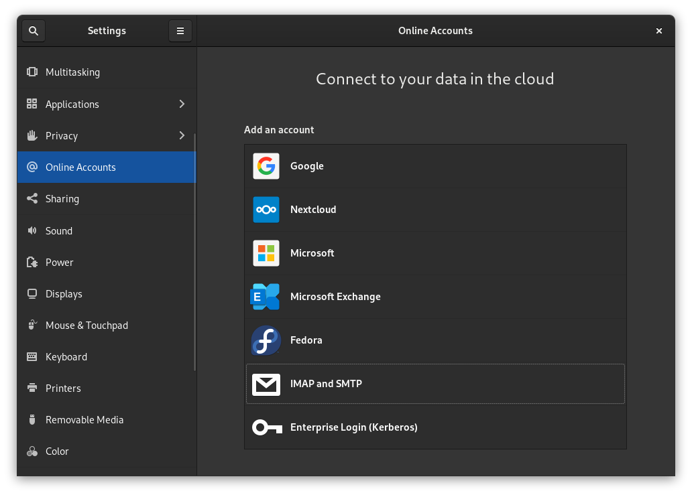
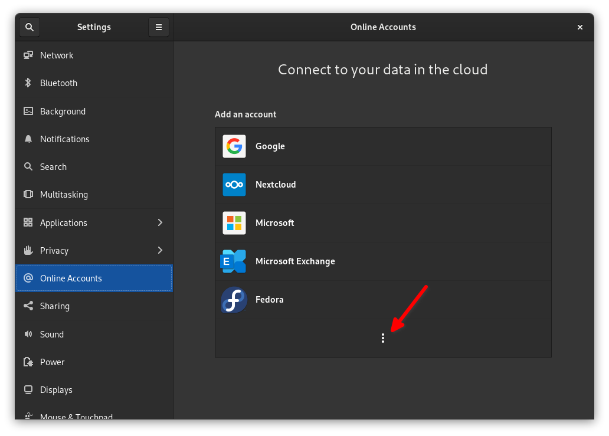
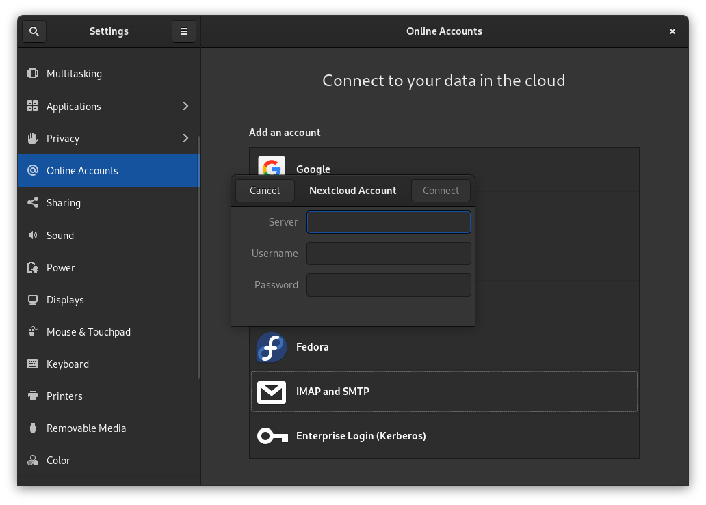

## Introduction

GNOME's Online Accounts feature seems unassuming at first, but it is actually quite powerful. If you want to be access your email, tasks, files in cloud storage, online calendars, and more all from your desktop apps within minutes, the Online Accounts feature is exactly the way to get that done.

In this very, very short guide we will show you how to get started.

## Assumptions

For this guide, we assume you have the following.

* Rocky Linux with the GNOME desktop environment installed.

That is literally all you need.

## How to add your online accounts

Open up the GNOME Activities overview (in the top-left corner or with the ++Meta++ key), and search for Online Accounts. Alternatively, you can open up the Settings panel, and find Online Accounts on the left-hand side.

Either way, you will end up here:

!!! Note

    You may have to click on a three-vertical-dots icon to access all the options, like so:

    

To add an account, just click on one of the options. For your Google account, you will receive a prompt to log in to Google via your browser, and authorize GNOME to access all of your data. For services like Nextcloud, you willll see a login form like the one below:

Just fill in the relevant information, and GNOME will take care of the rest.

## Account types supported by GNOME

As you can see in the screenshots above, Google, Nextcloud, Microsoft, Microsoft Exchange, Fedora, IMAP/SMTP, and Kerberos are all supported to one extent or another. However, these integrations are not made equal.

Google accounts get the most functionality, though Microsoft Exchange and Nextcloud are not too far behind.

To make it easy to know exactly what is and is not supported, here is a table that the author shamelessly stole from GNOME's official documentation.

| **Provider**       | **Mail** | **Calendar** | **Contacts** | **Maps** | **Photos** | **Files** | **Ticketing** |
| ------------------ | -------- | ------------ | ------------ | -------- | ---------- | --------- | ------------- |
| Google             | yes      | yes          | yes          |          | yes        | yes       |               |
| Microsoft          | yes      |              |              |          |            |           |               |
| Microsoft Exchange | yes      | yes          | yes          |          |            |           |               |
| Nextcloud          |          | yes          | yes          |          |            | yes       |               |
| IMAP and SMTP      | yes      |              |              |          |            |           |               |
| Kerberos           |          |              |              |          |            |           | yes           |

!!! Note

    While "tasks" are not listed in the table above, they *are* seemingly supported... at least for Google. Testing for this guide revealed that if you install the Endeavour to-do manager (available via Flathub) on Rocky Linux, and already have a Google account connected to GNOME, your tasks will be imported automatically.

## Conclusion

While you can certainly use the web app versions of some of these services, or use third-party clients in some cases, GNOME makes it easy to simply integrate a lot of the most important features straight into your desktop. Just sign up and go.

And if there are any services you feel are missing, feel free to check out the [GNOME community forums](https://discourse.gnome.org) and let them know.