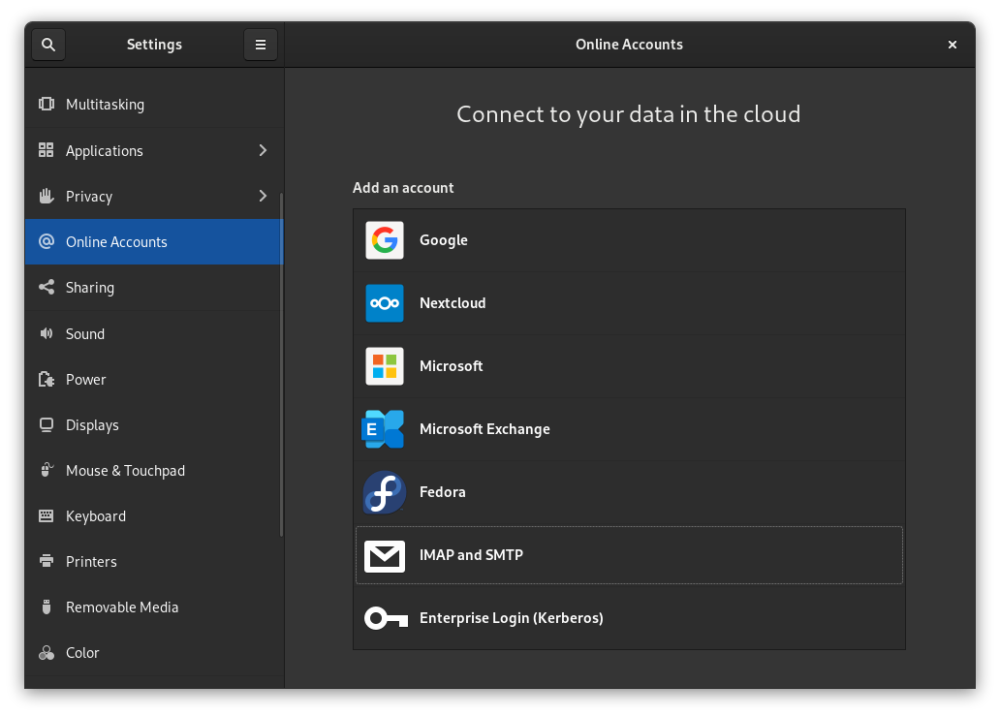

## Вступ

На перший погляд функція онлайн-облікових записів GNOME здається скромною, але вона досить потужна. Функція онлайн-облікових записів дає вам доступ до своєї електронної пошти, завдань, файлів у хмарному сховищі, онлайн-календарів тощо з настільних програм за лічені хвилини.

У цьому короткому посібнику ви побачите, як почати.

## Припущення

У цьому посібнику передбачається, що ви маєте наступне:

- Rocky Linux із встановленим робочим середовищем GNOME.

Це все, що вам потрібно.

## Як додати облікові записи онлайн

Відкрийте огляд дій GNOME у верхньому лівому куті (або за допомогою клавіші ++meta++ чи ++win++) і знайдіть Облікові записи в мережі. Крім того, ви можете відкрити панель налаштувань і знайти онлайн-облікові записи зліва.

У будь-якому випадку ви опинитеся тут:



!!! Note "Примітка"

```
Можливо, вам доведеться натиснути піктограму з трьома вертикальними крапками, щоб отримати доступ до всіх наведених тут параметрів:


```

Щоб додати обліковий запис, натисніть один із варіантів. Для вашого облікового запису Google ви отримаєте підказку ввійти в Google за допомогою свого браузера та дозволити GNOME доступ до всіх ваших даних. Для таких служб, як Nextcloud, ви побачите форму входу, подібну до наведеної нижче:


Заповніть відповідну інформацію, а GNOME подбає про решту.

## Типи облікових записів, які підтримуються GNOME

Як ви можете бачити на знімках екрана, Google, Nextcloud, Microsoft, Microsoft Exchange, Fedora, IMAP/SMTP і Kerberos певною мірою підтримуються. Однак ці інтеграції не є рівноправними.

Облікові записи Google отримують найбільшу функціональність, хоча Microsoft Exchange і Nextcloud не надто відстають.

Щоб було легше точно знати, що підтримується, а що ні, ось таблиця, яку автор безсоромно вкрав з офіційної документації GNOME:

| **Постачальник**   | **Пошта** | **Календар** | **Контакти** | **Карти** | **Фотографії** | **Файли** | **Квитки** |
| ------------------ | --------- | ------------ | ------------ | --------- | -------------- | --------- | ---------- |
| Google             | √         | √            | √            |           | √              | √         |            |
| Microsoft          | √         |              |              |           |                |           |            |
| Microsoft Exchange | √         | √            | √            |           |                |           |            |
| Nextcloud          |           | √            | √            |           |                | √         |            |
| IMAP та SMTP       | √         |              |              |           |                |           |            |
| Kerberos           |           |              |              |           |                |           | √          |

!!! Note "Примітка"

```
Хоча «завдання» не перераховані в таблиці вище, вони *здається* підтримуються, принаймні для Google. Тестування цього посібника показало, що якщо ви інсталюєте менеджер справ Endeavour (доступний через Flathub) на Rocky Linux і вже маєте обліковий запис Google, підключений до GNOME, ваші завдання буде імпортовано автоматично.
```

## Висновок

Хоча ви, звичайно, можете використовувати версії веб-додатків деяких із цих служб або використовувати сторонні клієнти в деяких випадках, GNOME дозволяє легко просто інтегрувати багато найважливіших функцій прямо на робочий стіл. Просто зареєструйтесь і йдіть.

Якщо якась служба відсутня, перегляньте [форуми спільноти GNOME](https://discourse.gnome.org) і повідомте їм.
