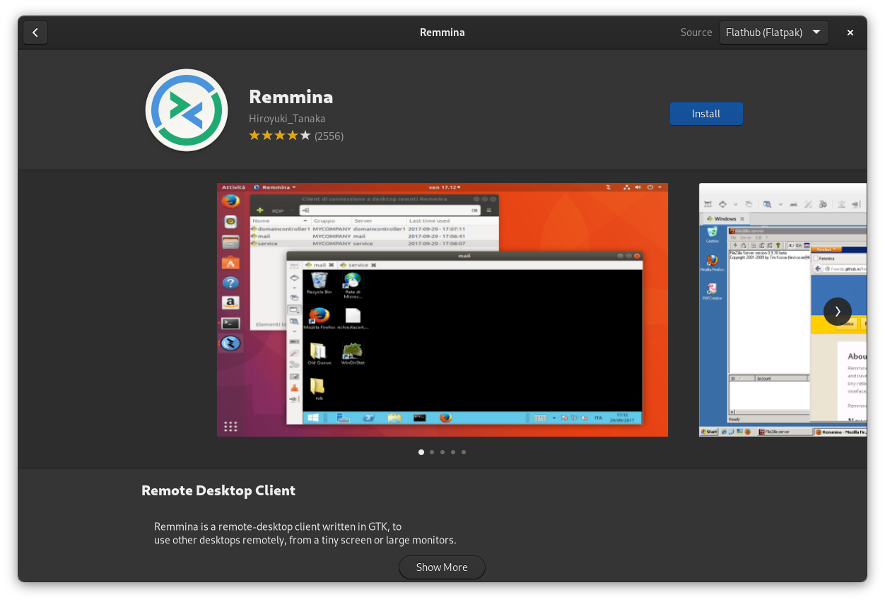
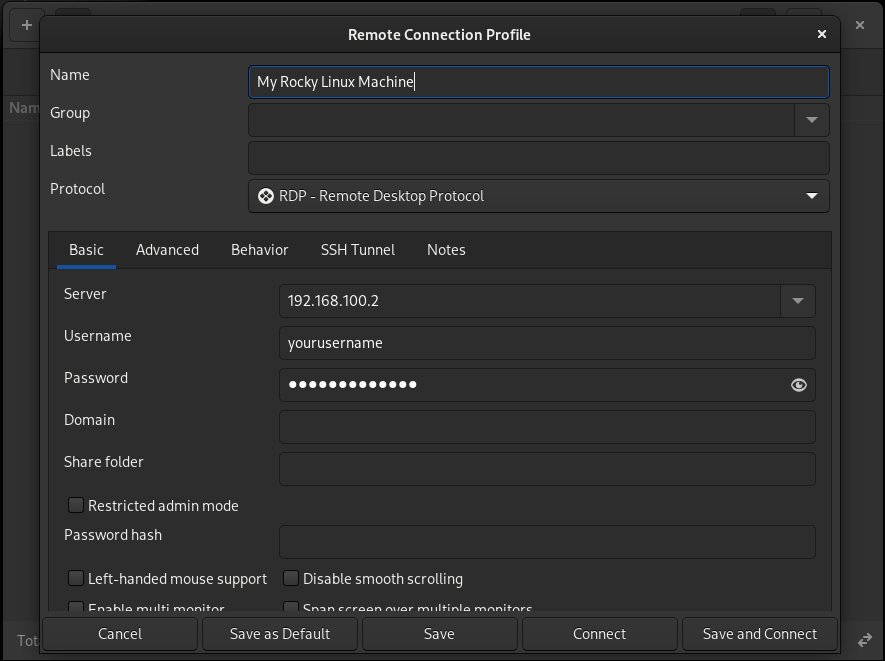
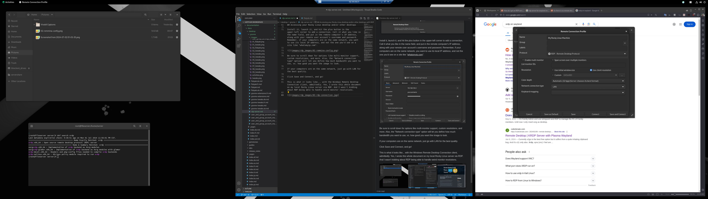

## Introduction

If you're looking to share your (Gnome) desktop on Rocky Linux, or access other shared desktops, this is the guide for you, and it's actually fairly simple.

For the beginners, we're going to be using RDP. RDP stands for Remote Desktop Protocol, and it does exactly what that implies: it lets you view and interact with computers from afar, all via a graphical interface. However, you will have to dive into the command line a little to set it up.

!!! note
    
    By default, Rocky Linux comes with the ability to share your desktop via another protocol called VNC. VNC is serviceable enough, RDP offers a much smoother experience, usually, and can handle weird monitor resolutions.

## Assumptions

For this guide, we assume that you have the following set up already:

* Rocky Linux with Gnome
* Flatpak and Flathub installed and working
* A non-root user account
* Admin/sudo access, and a willingness to paste commands into the terminal
* The X server (for sharing your desktop)

!!! info
    
    There are currently a few projects underway to make the Wayland display server and RDP play nice, and more recent versions of Gnome come with a built-in RDP server that does the trick. However, Rocky Linux's version of Gnome doesn't have that feature, so it's a lot easier to power your RDP session with x11.

## Sharing your Rocky Linux Gnome desktop with RDP

To make your Rocky Linux desktop accessible remotely, you need an RDP server. For our purposes, 'xrdp' will more than suffice. You'll need to use the terminal for it, though, as it's a CLI-only program.

```bash
sudo dnf install xrdp
```

Once you have that installed, you need to enable the service:

```bash
sudo systemctl enable --now xrdp
```

If all goes well, the RDP server should be installed, enabled, and running. But you can't connect just yet, you need to open up the right port on your firewall first.

If you want to learn more about how Rocky Linux's firewall app, `firewalld`, works, then please see our [beginner's guide to `firewalld`](../../guides/security/firewalld-beginners.md). If you just want to get move along, run these commands:

```bash
sudo firewall-cmd --zone=public --add-port=3389/tcp --permanent
sudo firewall-cmd --reload
```
For beginners: those commands open up the RDP port in your firewall so you can accept incoming RDP connections, and restart the firewall to apply the changes. At this point, if you feel so inclined, you can reboot your PC just to be safe.

If you don't want to reboot, you might want to log out. RDP uses your user account credentials for security, and you can't be logged in to your desktop locally and access it remotely at the same time. At least, not on the same user account.

!!! info

    You can also use the Firewall app to manage `firewalld` and open any ports you want. Watch this space for a link to my guide to installing and using the Firewall app.

## Accessing your Rocky Linux desktop and/or other desktops with RDP

You've seen how to install an RDP server, and now you need an RDP client application. On Windows, the Remote Desktop Connection app does the trick quite nicely. If you want to access your Rocky Linux machine from another Linux machine, you'll need to install a third party option.

On Gnome, Remmina gets my highest recommendation. It's easy to use, it's stable, and it generally just works.

If you have Flatpak/Flathub installed, just open up the Software app and search for Remmina.



Install it, launch it. Note: this is the process for adding an RDP connection in Remmina, specifically, but it's pretty similar for almost every other RDP client app you're likely to fine. 

Anyway, hit the plus button in the upper-left corner to add a connection. Call it what you like in the name field, and put in the remote computer's IP address, along with your remote user account's username and password. Remember, if your computers are on the same network, you want to use its local IP address, and not the one you'd see on a site like "whatsmyip.com".



And if your computers aren't on the same network, then I really hope you know how to do port forwarding, or that the remote computer has a static IP of some sort. That's all beyond the scope of this document.

Be sure to scroll down for options like multi-monitor support, custom resolutions, and more. Also, the "Network connection type" option will let you define how much bandwidth you want to use, vs. how good you want the image to look in your RDP client.

If your computers are on the same network, just go with LAN for the best quality.

Then, click Save and Connect, and go!

This is what it looks like... with the Windows Remote Desktop Connection client, admittedly. Yes, I wrote this whole document on my local Rocky Linux server via RDP, and I wasn't kidding about RDP being able to handle weird monitor resolutions.



## Conclusion

And there you have it! That's all of what you need to know to get RDP up and running on Rocky Linux, and share your desktop to your heart's content. If all you need is to access some files and apps remotely, this'll do the trick.

Mind you, I might update this guide sooner or later once I figure out how to get the sound working.