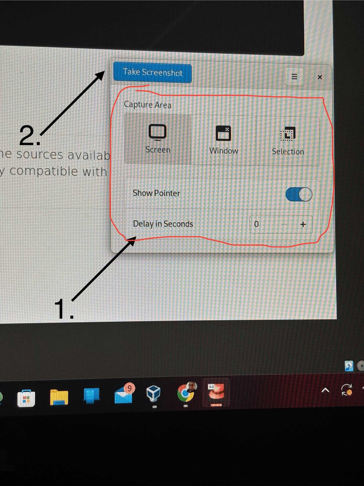

## Einleitung

Sind Sie es leid, mit der Tastatur Bilder auf Ihrem Computerbildschirm aufzunehmen? Lernen Sie `Screenshot` kennen, eine Anwendung, die Ihnen hilft, schnell Bildschirmbilder aufzunehmen.

## Voraussetzungen

Für diese Anleitung benötigen Sie Folgendes:

 - Rocky Linux

!!! note "Anmerkung"

```
Laut [der GNOME-Website](https://apps.gnome.org/) ist diese Anwendung auf Ihrem Desktop vorinstalliert.
```

## Anwendungshinweise

Gehen Sie wie folgt vor, um `Screenshot` zu verwenden:



1. Wählen Sie das Bildschirmbild aus, von dem Sie einen Screenshot machen möchten, gehen Sie zur Anwendung und wählen Sie die Methode, mit der Sie Ihr Bild aufnehmen möchten.

2. Auf **Take a Screenshot** klicken

   

3. Wenn Sie mit dem Screenshot zufrieden sind, benennen Sie die Datei um und klicken Sie auf **Save**.

!!! tip "Hinweis"

```
Möchten Sie Speicherplatz auf Ihrem Computer sparen? Klicken Sie auf **Copy**, um Ihren Screenshot schnell zu Ihrer Arbeit hinzuzufügen.
```

## Zusammenfassung

Ganz gleich, ob es sich um ein Bild für Ihre Online-Collage, den Hintergrund Ihres Computers oder ein Tutorial handelt, das Sie für Ihr Lieblingsprodukt erstellen, GNOMEs Screenshot ist das Tool, das Ihnen dabei hilft, die gewünschten Screenshots zu erstellen. Sie möchten mehr über diese Anwendung erfahren oder haben weitere Ideen dazu? [Ein Issue in dem Screenshots Repository bei GitLab anlegen](https://gitlab.gnome.org/gnumdk/screenshot/-/issues).
