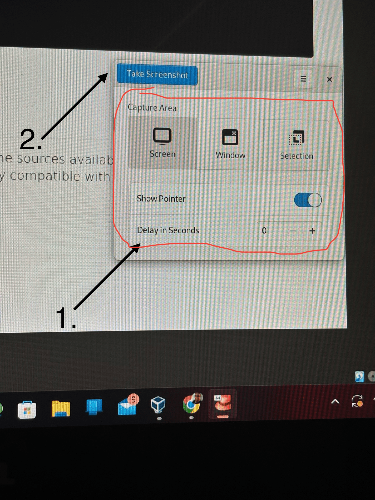

## Introduction

Tired of using your keyboard to take images on your computer screen? Meet Screenshot! It is an application that helps you quickly take onscreen images.

## Assumptions

This guide assumes you have the following:

- Rocky Linux

!!! note

    According [to GNOME's website](https://apps.gnome.org/), this application is pre-installed on your desktop. 

## How to Use

To use Screenshot,  do the following:

1. Pick the onscreen image you want to screenshot, go to the application, choose the method that you want to use to take your picture.

2. Click **Take a Screenshot**

    

3. Once you're satisfied with the screenshot, rename the file, and click on **Save**.

   !!! tip

    Want to save your computer's storage? Click on **Copy** to quickly add your screenshot to your work. 

## Conclusion

Whether it’s a picture for your online collage, computer's background, or a tutorial that you are creating for your favorite product, GNOME's Screenshot is the tool help you get the screenshots you want. Eager to learn more about or have more ideas for this application? [Submit an issue to Screenshot’s repository at GitLab](https://gitlab.gnome.org/gnumdk/screenshot/-/issues).
