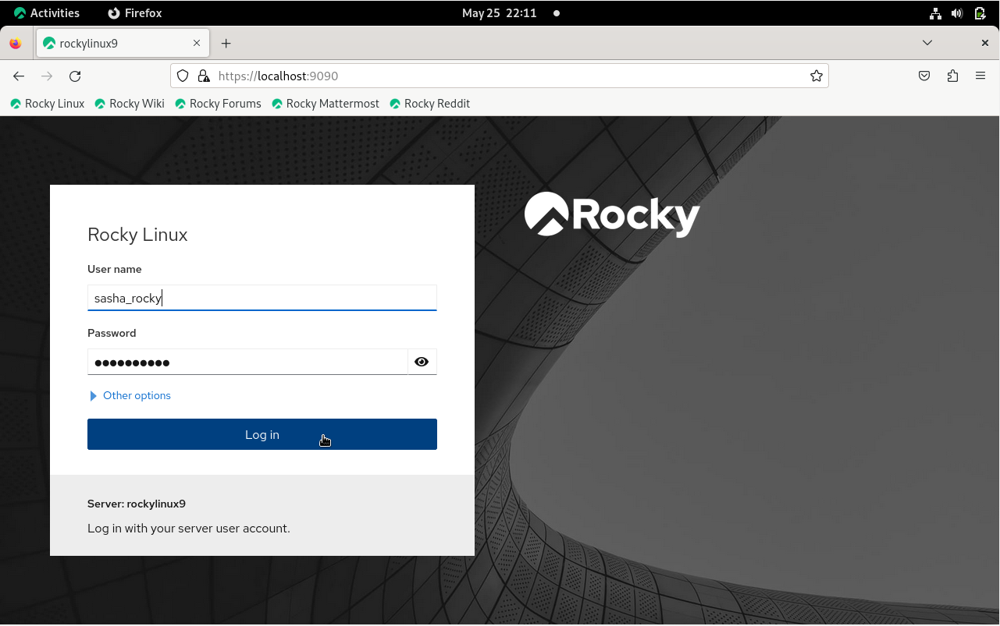
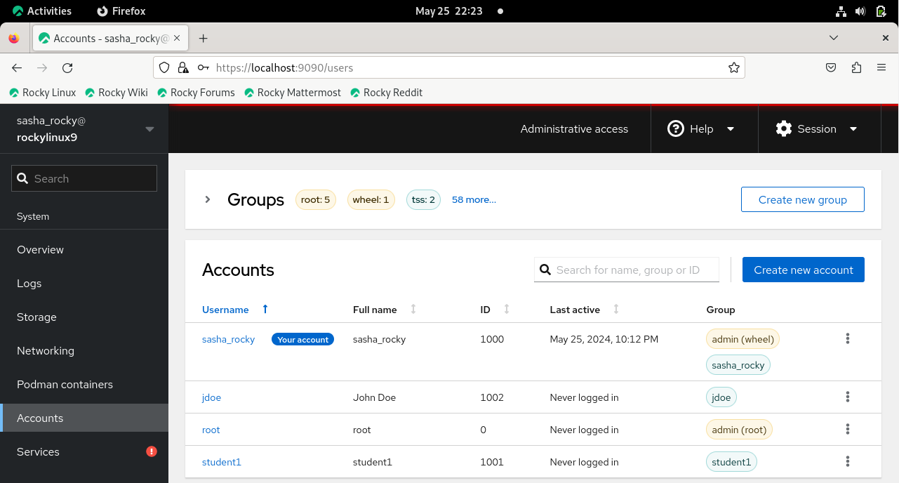

## Einleitung

In diesem Handbuch erfahren Sie, wie Sie Benutzer- und Gruppenkonten unter Rocky Linux 9.4 mit Cockpit verwalten, einem webbasierten Verwaltungstool mit grafischer Oberfläche für Linux-Server.

## Voraussetzungen

- Zugriff auf das Betriebssystem Rocky Linux 9 mit grafischer Benutzeroberfläche
- Administratorberechtigung
- Cockpit-Paket installiert und aktiviert

## Cockpit

Cockpit ist ein webbasiertes Verwaltungstool mit grafischer Oberfläche für Linux-Server. Obwohl es viele Anwendungsfälle gibt, werden wir Cockpit zum Verwalten von Benutzer- und Gruppenkonten verwenden. Zu den Vorteilen der Verwendung von Cockpit gehören Benutzerfreundlichkeit, Remote-Verwaltung, Integration, Echtzeit-Feedback und Multiserver-Dashboards.

### Im Cockpit anmelden

- Öffnen Sie Ihren Webbrowser und geben Sie https://localhost:9090 in die Adressleiste ein

  > **Hinweis**: Sie können dieselbe Adresse auch in der Befehlszeile eingeben

  ```text
  https://localhost:9090
  ```

- Geben Sie Ihren Benutzernamen und Ihr Passwort ein und klicken Sie auf die Schaltfläche **Log In**

  

- Klicken Sie auf die Schaltfläche **Limited access** und geben Sie Ihr Passwort ein, um den Administratorzugriff zu aktivieren

  

## Benutzer- und Gruppenverwaltung

### Benutzerkonten verwalten

- Klicken Sie im linken Menü auf die Registerkarte **Accounts** und dann auf die Schaltfläche **Create new account**

  

- Geben Sie den Namen des Benutzers in das Textfeld **Full Name** ein
  > _Beachten Sie, dass der Benutzername automatisch mit dem vollständigen Namen ausgefüllt wird. Sie können jedoch bei Bedarf auch die Felder „Benutzername“ und „ID“ bearbeiten._

- Geben Sie ein Passwort für den neuen Benutzer ein

- Klicken Sie auf die Schaltfläche **Create**

  

#### CLI-Methode: Benutzerkonten verwalten

```text
sudo useradd username -md /home/username -u 1002 -s /bin/bash 
```

```text
sudo passwd username 
```

Beobachten Sie, wie der neue Benutzer zur Liste der Benutzer hinzugefügt wird, Liste die auf der Registerkarte **Accounts** angezeigt wird.



#### CLI-Methode: Anzeigen der Datei `passwd`

```text
cat /etc/passwd
```

### Benutzerkonto ändern

- Klicken Sie auf das vertikale Auslassungssymbol für den neuen Benutzer und dann auf **Edit user**

  

Hier können Sie die Einstellungen des Benutzerkontos ändern, beispielsweise:

- Vor- und Nachname
- Gruppen-Mitgliedschaft
- Passwort-Einstellungen
- Shell

  

Um einen Benutzer zu einer Gruppe hinzuzufügen, gehen Sie wie folgt vor:

- Klicken Sie auf das vertikale Auslassungssymbol neben dem neuen Benutzer und klicken Sie auf **Edit user**

- Klicken Sie auf das Textfeld **Groups** und geben Sie den Namen der Gruppe ein.\
  Alternativ können Sie im Dropdown-Menü nach unten scrollen und auf den Namen der Gruppe klicken, die Sie hinzufügen möchten

  

#### CLI-Methode: Einen Benutzer zu einer Gruppe hinzufügen

```text
sudo usermod -aG groupname username
```

Einen Benutzer aus einer Gruppe entfernen:

- Klicken Sie auf das **x** neben dem Gruppennamen

  

#### CLI-Methode: Einen Benutzer aus einer Gruppe entfernen

```text
sudo gpasswd -d username groupname
```

### Benutzerkonto entfernen

Konto löschen:

- Klicken Sie auf das vertikale Auslassungssymbol für den Benutzer und dann auf **Delete account**

  

oder

- Klicken Sie auf den blau markierten Benutzernamen und wählen Sie das Feld **Delete**

  

  

#### CLI-Methode: Benutzerkonto löschen

```text
sudo userdel -d username groupname
```

### Erstellen, Löschen und Verwalten von Gruppenkonten

- Klicken Sie in der linken Menüspalte auf die Registerkarte **Accounts** und dann auf die Schaltfläche **Create new group**

  

- Geben Sie den Gruppennamen in das Textfeld ein

> _Hinweis: Sie können die Standard-Gruppen-ID akzeptieren oder sie in den gewünschten numerischen Wert ändern (z. B. 5001)_

- Klicken Sie auf die Schaltfläche **Select**

  

#### CLI-Methode: Einen Gruppennamen hinzufügen

```text
sudo groupadd groupname
```

So überprüfen Sie, ob die Gruppe erstellt wurde:

- Geben Sie den Gruppennamen in das Suchfeld in der Tabelle **Groups** ein

oder

- Klicken Sie auf das Dropdown-Menü neben **Groups**

  

#### CLI-Methode: Gruppennamen überprüfen

```text
cat /etc/group | grep groupname
```

Gruppe löschen:

- Klicken Sie auf die vertikalen Auslassungspunkte für den neuen Benutzer und klicken Sie auf **Delete group**

  

#### CLI-Methode: Gruppe löschen

```text
sudo groupdel groupname
```

```text
getent group | grep groupname
```

## Fazit

Zusammenfassend: dieses Handbuch hat Ihnen das Wissen vermittelt, Benutzer- und Gruppenkonten unter Rocky Linux 9.4 mit Cockpit erfolgreich zu verwalten. Dank der benutzerfreundlichen, webbasierten grafischen Benutzeroberfläche von Cockpit wird die Ausführung administrativer Aufgaben einfacher und effizienter, sodass Sie die benutzerfreundlichen Funktionen für eine reibungslose Systemverwaltung voll ausnutzen können.

---

## REFERENZEN

Cockpit Installation: https://ciq.com/blog/how-to-administer-rocky-linux-with-cockpit/
