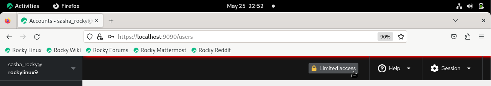
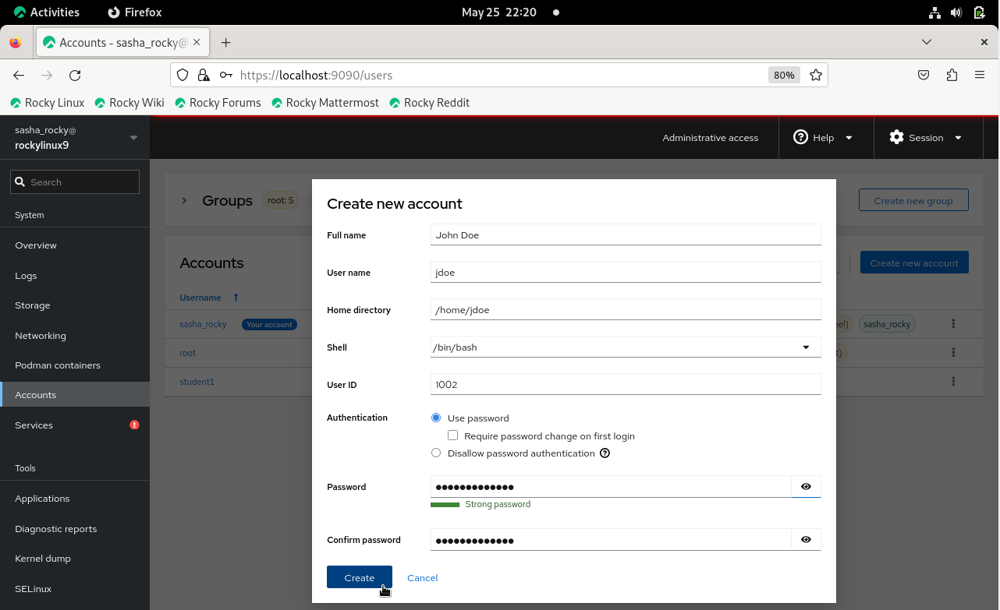

## Introduction

Ce guide vous apprendra à gérer les comptes d'utilisateurs et les groupes correspondants sur Rocky Linux 9.4 à l'aide de Cockpit, un outil d'administration d'interface graphique Web pour les serveurs Linux.

## Prérequis

- Accès au système d'exploitation Rocky Linux 9 avec l'interface graphique
- Privilèges Administratifs
- Les paquets de Cockpit installés et activés

## Cockpit

Cockpit est un outil d'administration avec un interface graphique Web pour les serveurs Linux. Bien qu'il présente de nombreux cas d'utilisation, nous utiliserons Cockpit pour gérer les comptes d'utilisateurs et de groupes. Les avantages de travailler avec Cockpit incluent la facilité d'utilisation, la gestion à distance, l'intégration, le retour d'information en temps réel et les tableaux de bord multiserveurs.

### Se connecter à Cockpit

- Ouvrez votre navigateur Web et saisissez https://localhost:9090 dans la barre d'adresse

  > **Remarque** : Vous pouvez également saisir la même adresse sur la ligne de commande

  ```text
  https://localhost:9090
  ```

- Entrez votre nom d'utilisateur et votre mot de passe et cliquez sur le bouton **Log In**

  

- Cliquez sur le bouton **Limited access** et saisissez votre mot de passe pour activer l'accès administratif

  

## Gestion des comptes d'utilisateurs et leurs groupes

### Gestion des comptes des utilisateurs

- Dans le menu de gauche, cliquez sur l'onglet **Accounts**, puis cliquez sur le bouton **Create new account**

  

- Saisissez le nom de l'utilisateur dans la zone de texte **Full name**
  > _Notez que le nom d'utilisateur sera automatiquement renseigné en fonction du nom complet. Toutefois, vous pouvez également modifier les champs Nom d'utilisateur et ID utilisateur si nécessaire._

- Saisir un mot de passe pour le nouvel utilisateur

- Cliquez sur le bouton **Create**

  

#### Méthode CLI : gestion des comptes d'utilisateurs

```text
sudo useradd username -md /home/username -u 1002 -s /bin/bash 
```

```text
sudo passwd username 
```

Observez l'ajout du nouvel utilisateur à la liste des utilisateurs affichée sous l'onglet **Accounts**.


#### Méthode CLI : affichage du fichier `passwd`

```text
cat /etc/passwd
```

### Modification du compte d'utilisateur

- Cliquez sur l'icône de points de suspension verticaux du nouvel utilisateur, puis cliquez sur **Edit user**

  

C'est ici que vous pouvez modifier les paramètres du compte utilisateur, tels que :

- Nom complet
- Appartenance au groupe
- Réglages du mot de passe
- Le Shell

  

Pour ajouter un utilisateur à un groupe, procédez comme suit :

- Cliquez sur l'icône de points de suspension verticaux à côté du nouvel utilisateur, puis cliquez sur **Edit user**

- Cliquez sur la zone de texte **Groups** et commencez à saisir le nom du groupe.\
  Vous pouvez également faire défiler le menu déroulant et cliquer sur le nom du groupe que vous souhaitez ajouter

  

#### Méthode CLI : ajouter un utilisateur à un groupe

```text
sudo usermod -aG groupname username
```

Supprimer un utilisateur d'un groupe :

- Cliquez sur **x** à côté du nom du groupe

  

#### Méthode CLI : supprimer un utilisateur d'un groupe

```text
sudo gpasswd -d username groupname
```

### Suppression de compte d'utilisateur

Supprimer un compte d'utilisateur :

- Cliquez sur l'icône de points de suspension verticaux de l'utilisateur, puis cliquez sur **Delete account**

  

ou

- Cliquez sur le nom d'utilisateur surligné en bleu et sélectionnez la case **Supprimer**

  

  

#### Méthode CLI : supprimer un compte d'utilisateur

```text
sudo userdel -d username groupname
```

### Création, suppression et gestion des groupes

- Dans la colonne du menu de gauche, cliquez sur l'onglet **Accounts**, puis cliquez sur le bouton **Create new group**

  

- Saisissez le nom du groupe dans la zone de texte

> _Remarque : Vous pouvez accepter l'ID de groupe par défaut ou le remplacer par la valeur numérique de votre choix (par exemple 5001)_

- Cliquez sur le bouton **Select**

  

#### Méthode CLI : ajouter un nom de groupe

```text
sudo groupadd groupname
```

Pour vérifier que le groupe a bien été créé :

- Saisissez le nom du groupe dans le champ de recherche du tableau **Groups**

ou

- Cliquez sur le menu déroulant à côté de **Groups**

  

#### Méthode CLI : vérifier le nom du groupe

```text
cat /etc/group | grep groupname
```

Suppression d'un groupe :

- Cliquez sur les points de suspension verticaux du nouvel utilisateur et cliquez sur **Delete group**

  

#### Méthode CLI : supprimer le groupe

```text
sudo groupdel groupname
```

```text
getent group | grep groupname
```

## Conclusion

En conclusion, ce guide vous a fourni les connaissances nécessaires pour gérer avec succès les comptes d'utilisateurs et de groupes sur Rocky Linux 9.4 à l'aide de Cockpit. L'interface graphique Web facile à utiliser de Cockpit rend l'exécution des tâches administratives plus accessible et efficace, vous permettant de profiter pleinement de ses fonctionnalités conviviales pour une gestion fluide du système.

---

## RÉFÉRENCES

Installation de Cockpit : https://ciq.com/blog/how-to-administer-rocky-linux-with-cockpit/
