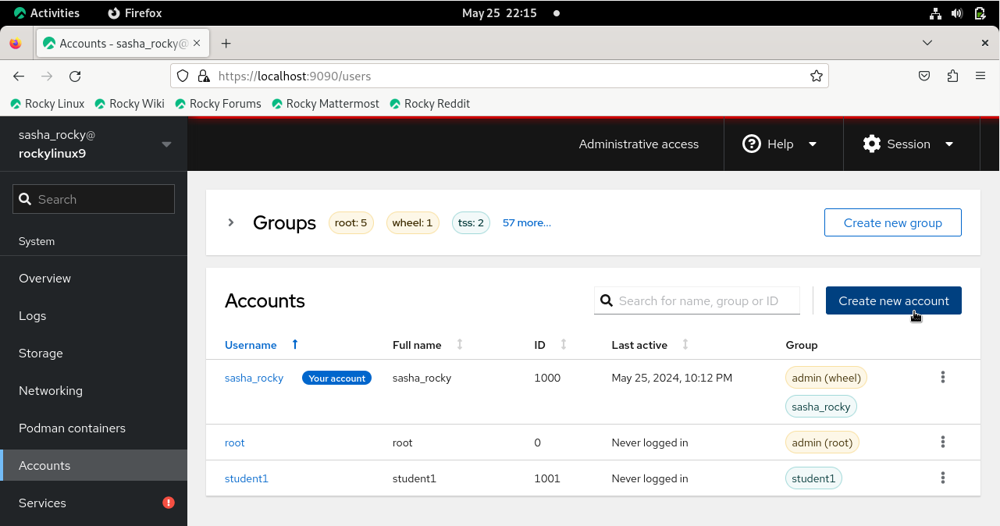
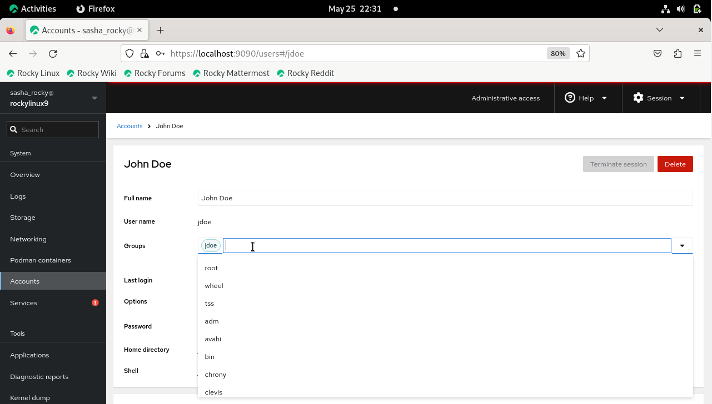
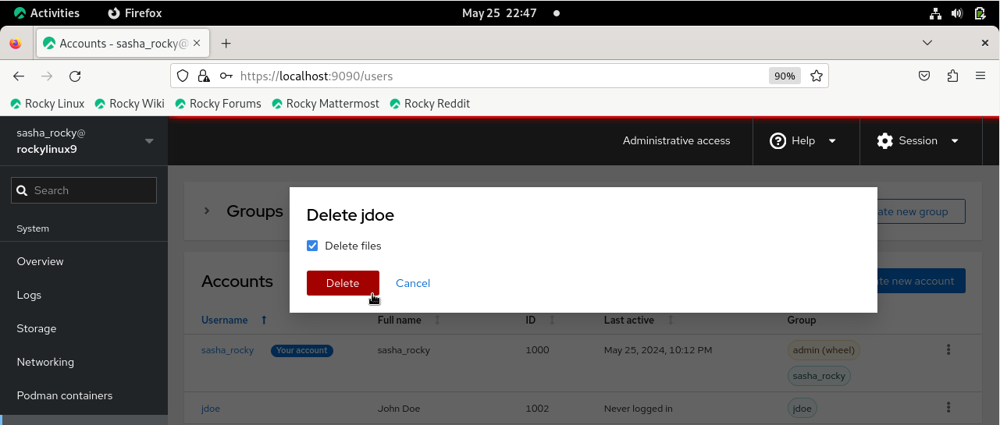
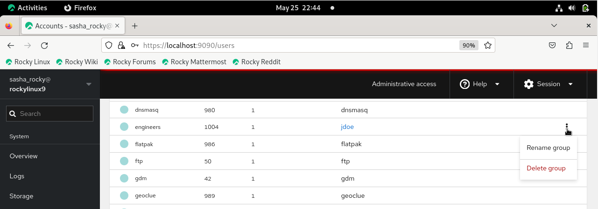

## Вступ

Цей посібник навчить вас керувати обліковими записами користувачів і груп у Rocky Linux 9.4 за допомогою Cockpit, адміністративного інструменту веб-інтерфейсу для серверів Linux.

## Передумови

- Доступ до операційної системи Rocky Linux 9 із графічним інтерфейсом
- Адміністративні привілеї
- Пакет Cockpit встановлено та ввімкнено

## Cockpit

Cockpit — це інструмент адміністрування графічного веб-інтерфейсу для серверів Linux. Хоча він має багато варіантів використання, ми використовуватимемо Cockpit для керування обліковими записами користувачів і груп. Переваги використання Cockpit включають простоту використання, віддалене керування, інтеграцію, зворотний зв’язок у реальному часі та багатосерверні інформаційні панелі.

### Вхід до Cockpit

- Відкрийте веб-браузер і в адресному рядку введіть https://localhost:9090

  > **Примітка**: Ви також можете ввести точну адресу в командному рядку

  ```text
  https://localhost:9090
  ```

- Введіть своє ім'я користувача та пароль і натисніть кнопку **Log In**

  

- Натисніть кнопку **Limited access** і введіть свій пароль, щоб увімкнути адміністративний доступ

  

## Керування користувачами та групами

### Управління обліковими записами користувачів

- У меню ліворуч натисніть вкладку **Accounts**, а потім натисніть кнопку **Create new account**

  

- Введіть ім’я користувача в текстове поле **Full name**
  > _Зверніть увагу, що ім’я користувача буде автоматично заповнено на основі повного імені. Однак за потреби ви також можете редагувати поля «Ім’я користувача» та «Ідентифікатор»._

- Введіть пароль для нового користувача

- Натисніть кнопку **Create**

  

#### Метод CLI: керування обліковими записами користувачів

```text
sudo useradd username -md /home/username -u 1002 -s /bin/bash 
```

```text
sudo passwd username 
```

Спостерігайте за додаванням нового користувача до списку користувачів, який відображається на вкладці **Accounts**.


#### Метод CLI: перегляд файлу `passwd`

```text
cat /etc/passwd
```

### Змінити обліковий запис користувача

- Натисніть піктограму з вертикальною крапкою для нового користувача, а потім натисніть **Edit user**

  

Тут ви можете змінити налаштування облікового запису користувача, наприклад:

- Ім'я та прізвище
- Членство в групі
- Налаштування паролів
- Оболонка

  

Щоб додати користувача до групи, виконайте такі дії:

- Натисніть піктограму з вертикальною крапкою біля нового користувача та натисніть **Edit user**

- Натисніть текстове поле **Groups** та введіть назву групи.\
  Крім того, ви можете прокрутити спадне меню та клацнути назву групи, яку хочете додати

  

#### Метод CLI: додавання користувача до групи

```text
sudo usermod -aG groupname username
```

Щоб видалити користувача з групи:

- Натисніть **x** біля назви групи

  

#### Метод CLI: видалити користувача з групи

```text
sudo gpasswd -d username groupname
```

### Видалити обліковий запис користувача

Щоб видалити обліковий запис користувача:

- Натисніть піктограму з вертикальною крапкою для нового користувача та натисніть **Delete account**

  

Або

- Натисніть ім’я користувача, виділене синім кольором, і виберіть поле **Delete**

  

  

#### Метод CLI: видалити обліковий запис користувача

```text
sudo userdel -d username groupname
```

### Створення, видалення та керування груповими обліковими записами

- У лівому стовпці меню натисніть вкладку **Accounts**, а потім натисніть кнопку **Create new group**

  

- Введіть назву групи в текстове поле

> _Примітка. Ви можете прийняти ідентифікатор групи за замовчуванням або змінити його на потрібне числове значення (наприклад, 5001)_

- Натисніть кнопку **Select**

  

#### Метод CLI: додайте назву групи

```text
sudo groupadd groupname
```

Щоб перевірити, чи створена група:

- Введіть назву групи в поле пошуку в таблиці **Groups**

Або

- Натисніть спадне меню біля **Групи**

  

#### Метод CLI: перевірте назву групи

```text
cat /etc/group | grep groupname
```

Щоб видалити групу:

- Клацніть вертикальну крапку для нового користувача та натисніть **Delete group**

  

#### Метод CLI: видалити групу

```text
sudo groupdel groupname
```

```text
getent group | grep groupname
```

## Висновки

На закінчення, цей посібник надав вам знання для успішного керування обліковими записами користувачів і груп у Rocky Linux 9.4 за допомогою Cockpit. Простий у використанні веб-графічний інтерфейс Cockpit робить виконання адміністративних завдань більш доступним і ефективним, дозволяючи повністю використовувати його зручні функції для плавного керування системою.

---

## СПИСОК ЛІТЕРАТУРИ

Щоб встановити Cockpit: https://ciq.com/blog/how-to-administer-rocky-linux-with-cockpit/
