## 介绍

本指南将指导如何使用 Cockpit（一种用于Linux服务器的基于web的图形界面管理工具）在Rocky Linux 9.4上管理用户和组帐户。

## 先决条件

- 通过GUI访问Rocky Linux 9操作系统
- 管理员权限
- Cockpit 包已安装并启用

## Cockpit

Cockpit 是 Linux 服务器上基于 web 的图形界面管理工具. 虽然它有很多用例，但我们将使用Cockpit来管理用户和组帐户。 使用Cockpit的好处包括易用性、远程管理、集成、实时反馈和多服务器仪表板。

### 登录 Cockpit

- 打开你的浏览器并在地址栏输入 https://localhost:9090

  > **注意**: 你还可以在命令行中输入确切的地址

  ```text
  https://localhost:9090
  ```

- 输入你的用户名和密码并点击 **Log In** 登录按钮

  

- 点击 **Limited access** 访问受限按钮并输入你的密码来启用管理权限

  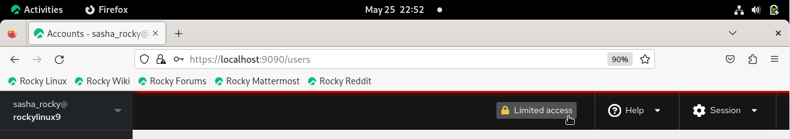

## 用户和组账号管理

### 管理用户账号

- 从左侧菜单中，点击 **Accounts** 帐户选项卡，然后点击 **Create new account** 创建新帐户按钮

  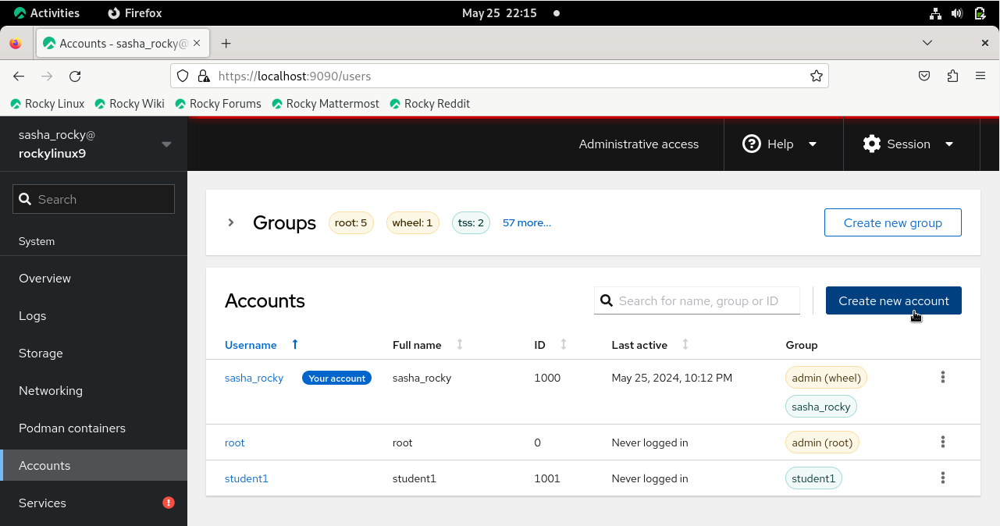

- 输入你的用户名在 **Full name** 输入框
  > \*请注意，用户名将根据全名自动填充。 同时，如果需要，你还可以编辑用户名和ID字段. \*

- 输入新用户的密码

- 点击 **Create** 创建按钮

  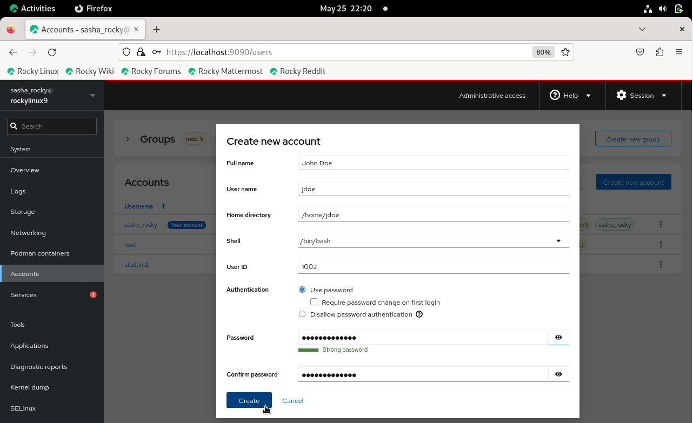

#### CLI 方式: 管理用户账号

```text
sudo useradd username -md /home/username -u 1002 -s /bin/bash 
```

```text
sudo passwd username 
```

观察新用户是否添加到 **Accounts** 帐户选项卡下显示的用户列表中。

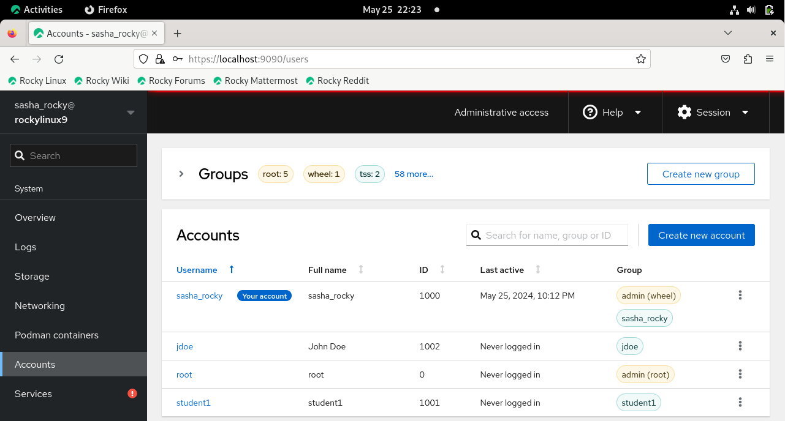

#### CLI 方式: 查看 `passwd` 文件

```text
cat /etc/passwd
```

### 修改用户账号

- 单击新用户的垂直省略号图标，然后单击 **Edit user**

  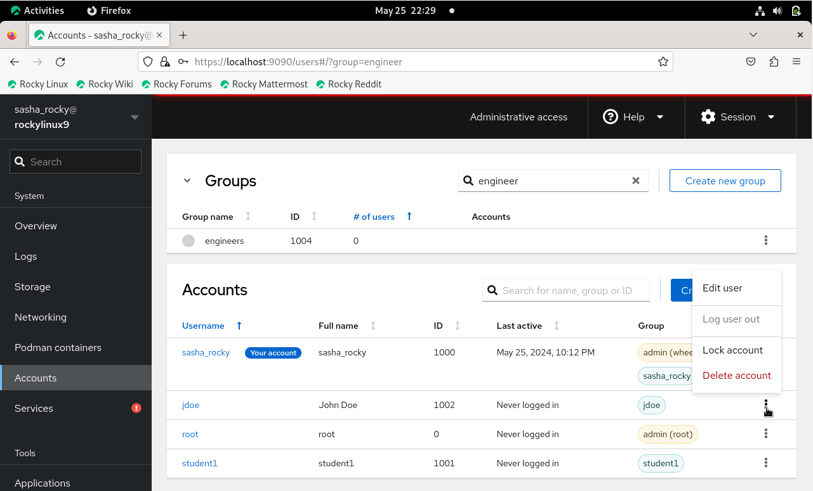

你可以在此处修改用户帐户设置，例如：

- Full name
- Group membership
- Password settings
- Shell

  

要将用户添加到组中，请执行以下操作：

- 点击新用户旁边的垂直省略号图标，然后单击 **Edit user**

- 点击 **Groups** 文本框，然后输入组的名称。\
  或者，还可以向下滚动下拉菜单，然后单击要添加的组的名称

  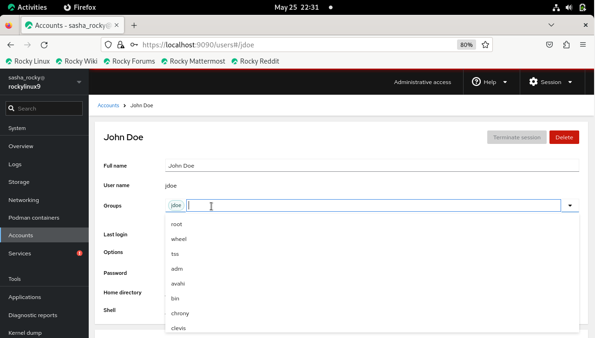

#### CLI 方式: 将一个用户添加到组里面

```text
sudo usermod -aG groupname username
```

从组里面移除一个账号

- 点击组名旁边的 **x**

  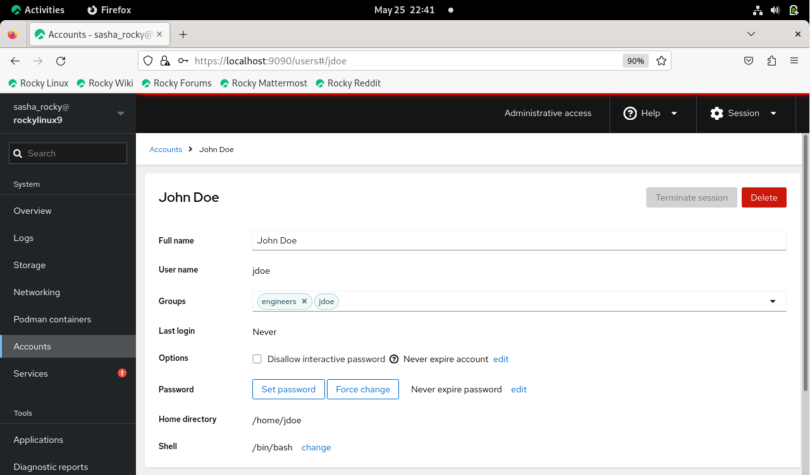

#### CLI 方式: 从组内移除一个用户

```text
sudo gpasswd -d username groupname
```

### 删除用户账号

删除用户账号过程:

- 点击新用户的垂直省略号图标，然后点击 **Delete account**

  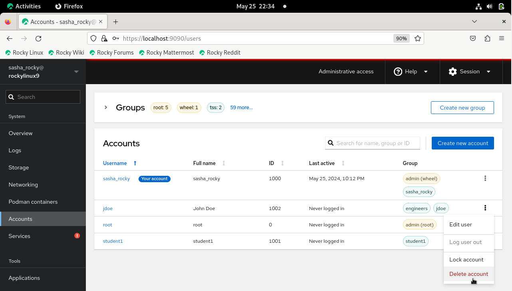

或

- 单击蓝色突出显示的用户名，然后选择 **Delete** 删除框

  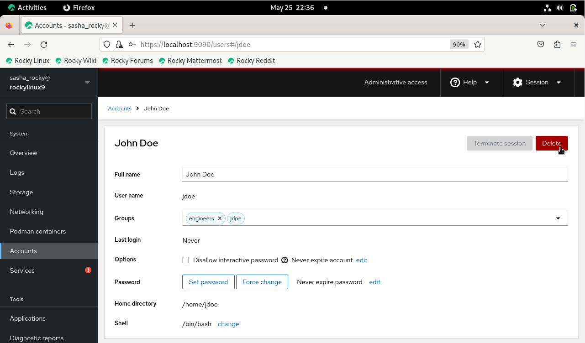

  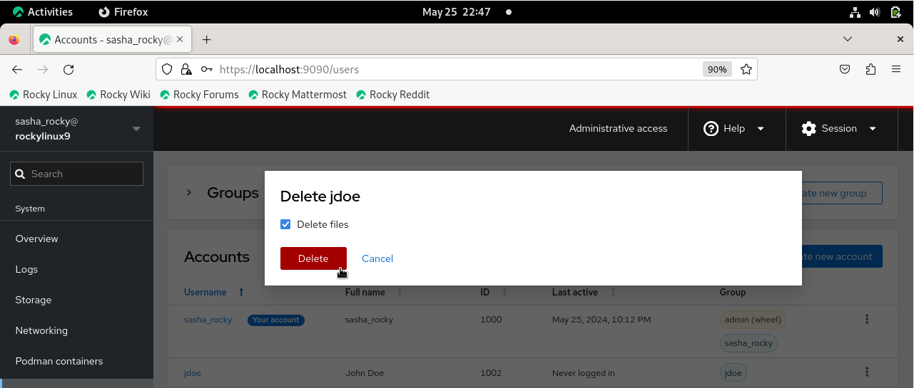

#### CLI 方式: 删除用户账号

```text
sudo userdel -d username groupname
```

### 创建、删除和管理组帐户

- 在左侧菜单栏中，点击 **Accounts** 帐户选项卡，然后点击 **Create new group** 创建新组按钮

  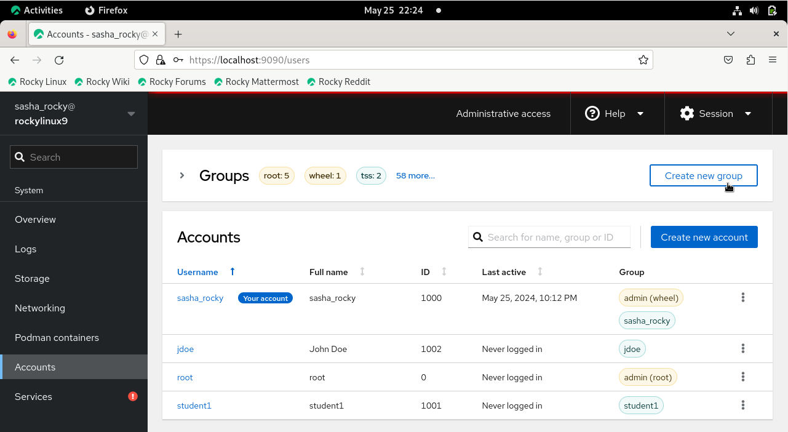

- 在输入框内输入组名

> _注意：你可以接受默认组ID或将其更改为所需的数值(例如: 5001)_

- 点击 **Select** 按钮

  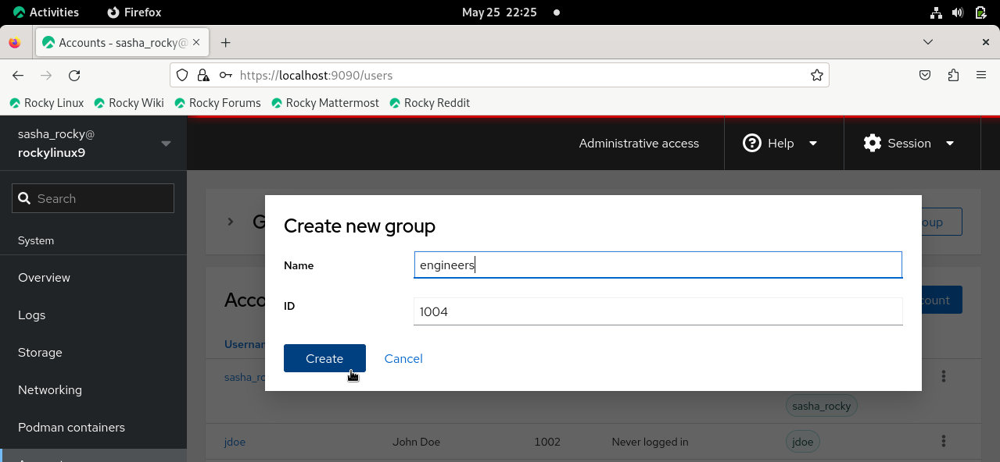

#### CLI 方式: 添加一个组名

```text
sudo groupadd groupname
```

要验证组是否已创建，请执行以下操作：

- 在 **Groups** 表格内搜索框中输入组名

或

- 单击 **Groups** 旁边的下拉菜单

  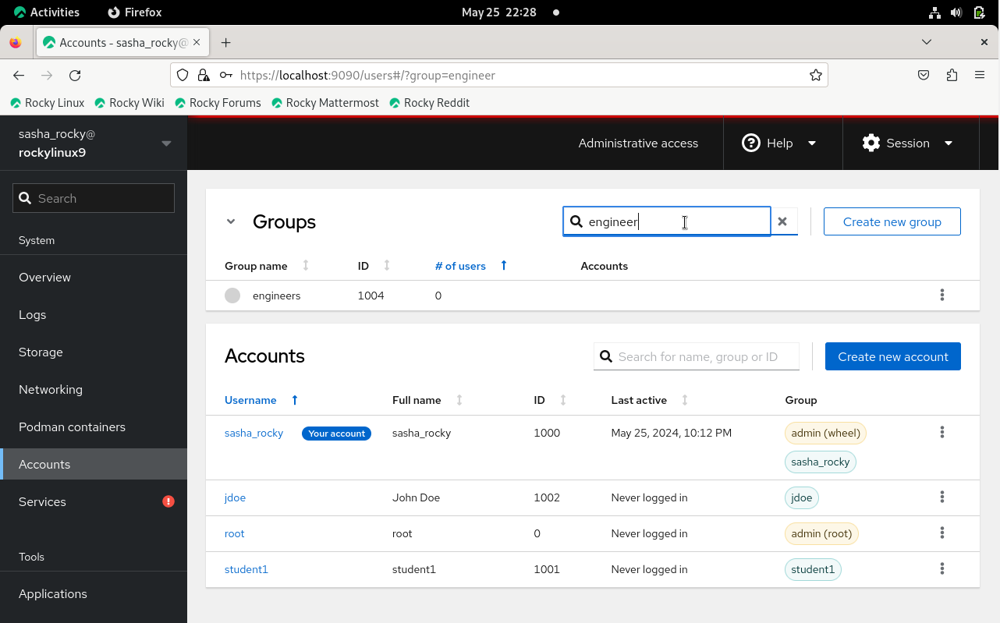

#### CLI 方式: 验证组名

```text
cat /etc/group | grep groupname
```

删除组名:

- 点击新用户的垂直省略号，然后点击 **Delete group**

  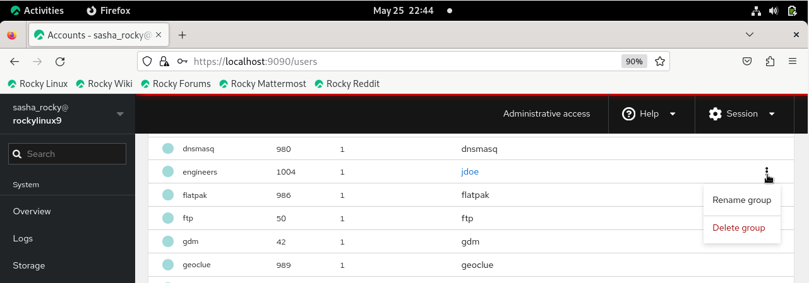

#### CLI 方式: 删除组

```text
sudo groupdel groupname
```

```text
getent group | grep groupname
```

## 结语

总之，本指南提供了使用Cockpit在Rocky Linux 9.4上成功管理用户和组帐户的知识。 Cockpit 基于网络的图形界面非常好用，使执行管理任务更加容易和高效，也使我们能够充分利用其用户友好的功能进行稳定的系统管理。

---

## 参考文献

要想安装 Cockpit: https://ciq.com/blog/how-to-administer-rocky-linux-with-cockpit/
