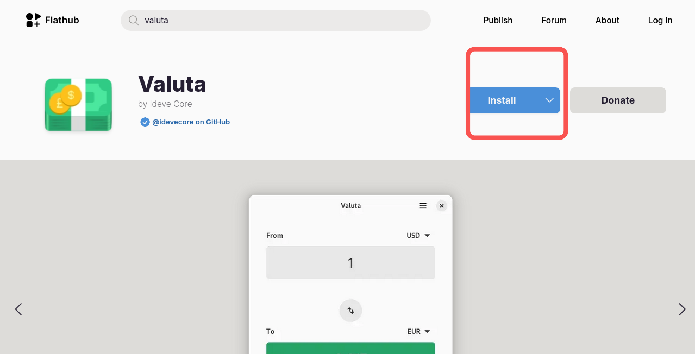
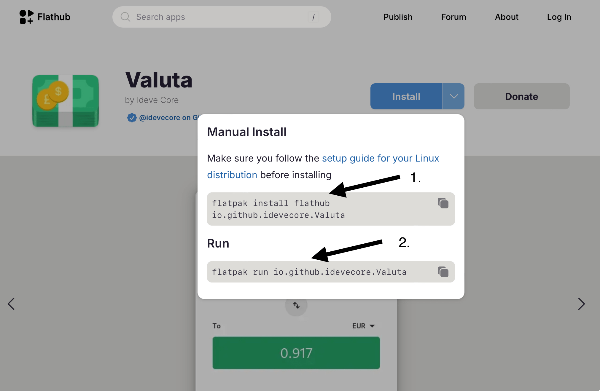
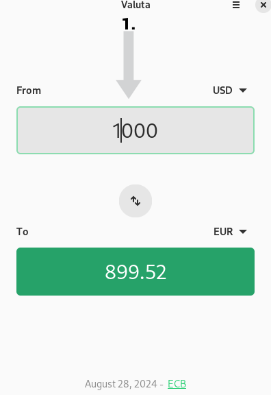
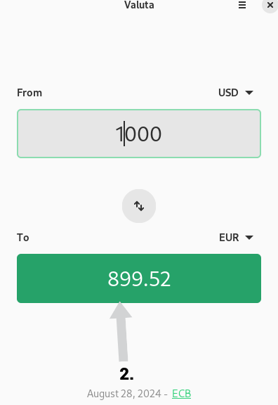

## Introduction

Si vous voyagez souvent ou déménagez à l’étranger, facilitez votre planification financière avec Valuta. Cette application convertit rapidement les devises entre deux pays.

## Prérequis

Ce guide suppose que vous disposez de la configuration suivante :

- Rocky Linux
- Flatpak
- FlatHub

## Processus d'Installation



1. Accédez à [Flathub.org](https://flathub.org), tapez `Valuta` dans la barre de recherche et cliquez sur **Install**

   

2. Copiez le script d'installation manuelle dans un terminal :

   ```bash
   flatpak install flathub io.github.idevecore.Valuta
   ```

3. Enfin, exécutez le script d'installation manuelle dans votre terminal :

   ```bash
   flatpak run flathub io.github.idevecore.Valuta
   ```

## Mode d'emploi

Pour utiliser le programme `Valuta`, procédez comme suit :

1. Choisissez le pays dans lequel vous vivez actuellement dans le menu déroulant et saisissez le montant en espèces que vous souhaitez dépenser.

   

2. Choisissez le pays vers lequel vous voyagez dans le menu déroulant. À partir de là, le montant converti apparaît automatiquement.



## Conclusion

Que ce soit pour des vacances ou un voyage d'affaires, `Valuta` simplifie la conversion de devises. Vous souhaitez en savoir plus ou partager des idées pour l'améliorer ? [Soumettez un issue dans le dépôt de Valuta sur GitHub](https://github.com/ideveCore/valuta/issues).
