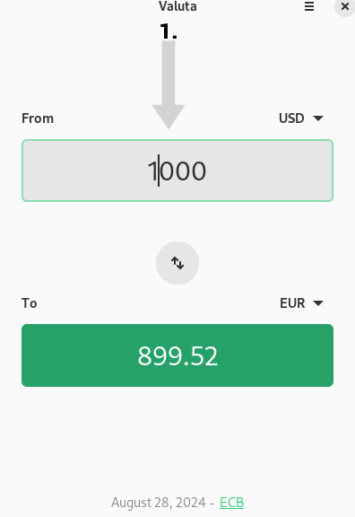
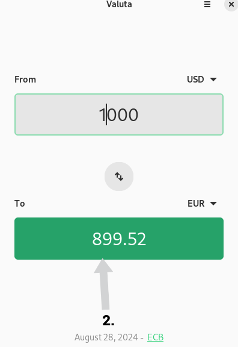

## Introduction

 If you often travel or are moving abroad, ease your finanical planning with Valuta. This application quickly converts currencies between two countries.

## Assumptions

This guide assumes you have the following:

- Rocky Linux
- Flatpak
- FlatHub


## Installation process


1. Go to [Flathub.org](https://flathub.org), type "Valuta" in the search bar and click  **Install**
 
  


2. Copy the manual script in your terminal:

    ```bash
    flatpak install flathub io.github.idevecore.Valuta
    ```


3. Finally, the manual script in your terminal:

    ```bash
    flatpak run flathub io.github.idevecore.Valuta
    ```

## How to Use

To use Valuta, do the following:

1. Choose the country that you currently live in from the dropdown menu and type the amount of cash you want to spend.

    

2. Choose the country you are traveling to from the dropdown menu.  From there, the converted amount automatically appears.



## Conclusion

Whether it’s for a vacation or a business trip, Valuta simplifies currency conversion. Want to learn more or share ideas to improve it? [Submit an issue in Valuta's repository at GitHub](https://github.com/ideveCore/valuta/issues).
