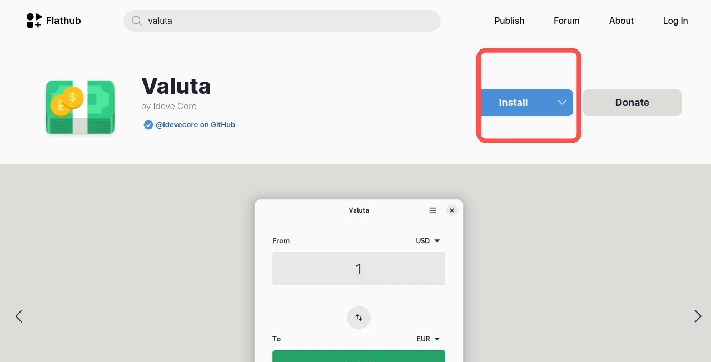

## Вступ

Якщо ви часто подорожуєте або переїжджаєте за кордон, спростіть своє фінансове планування з Valuta. Ця програма швидко конвертує валюти.

## Припущення

У цьому посібнику передбачається, що ви маєте наступне:

 - Rocky Linux
 - Flatpak
 - FlatHub

## Процес встановлення



1. Перейдіть на [Flathub.org](https://flathub.org), введіть «Valuta» в рядку пошуку та натисніть **Install**

   

2. Скопіюйте скрипт у свій термінал:

   ```bash
   flatpak install flathub io.github.idevecore.Valuta
   ```

3. Нарешті, скрипт у вашому терміналі:

   ```bash
   flatpak run flathub io.github.idevecore.Valuta
   ```

## Як використовувати

Щоб використовувати Valuta, виконайте такі дії:

1. Виберіть свою країну зі спадного меню та введіть суму готівки, яку хочете витратити.

   

2. Виберіть країну, до якої ви подорожуєте, зі спадного меню. Звідти автоматично з’являється конвертована сума.


## Висновок

Незалежно від того, під час відпустки чи відрядження, Valuta спрощує конвертацію валюти. Хочете дізнатися більше або поділитися ідеями щодо його покращення? [Надішліть проблему в репозиторій Valuta на GitHub](https://github.com/ideveCore/valuta/issues).
