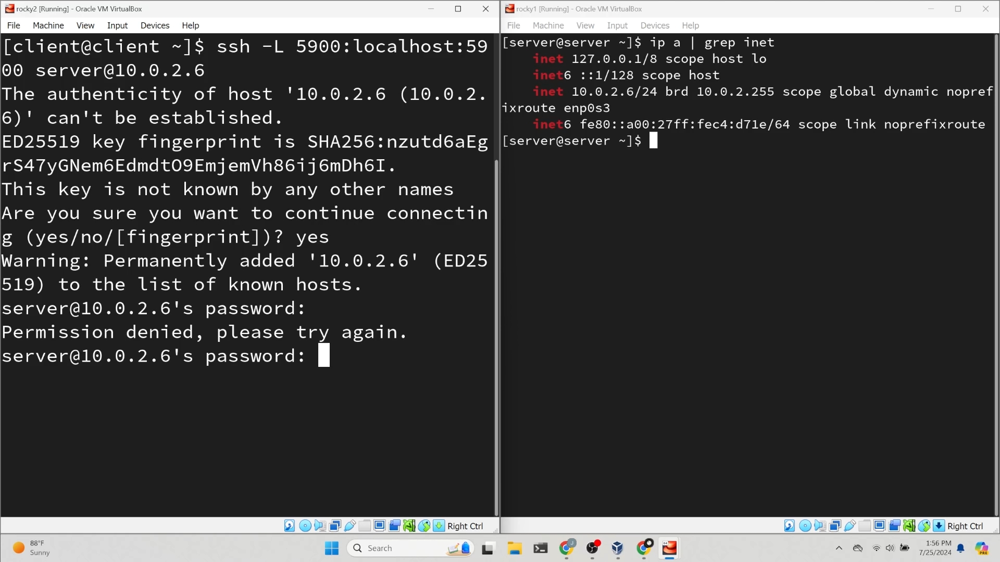
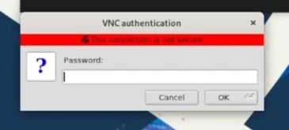
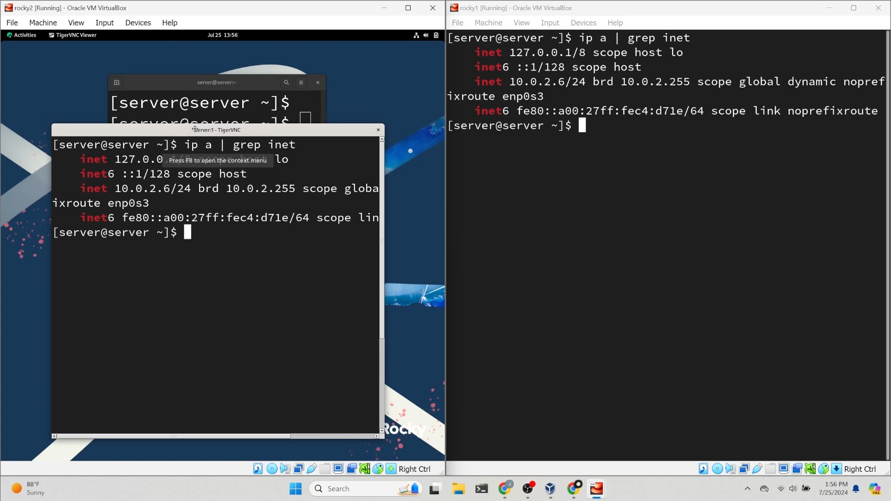

## Einleitung

x11vnc ist ein leistungsstarkes VNC-Programm, das sich dadurch auszeichnet, dass es die vorhandene X-Sitzung verwendet, anstatt eine neue zu starten. Diese Funktion macht es zu einem hervorragenden Tool für den Remote-Support, da es Ihnen ermöglicht, den Bildschirm oder die X-Sitzung eines Benutzers aus der Ferne zu steuern.

In diesem Handbuch erfahren Sie, wie Sie einen x11vnc-Server einrichten und eine Remote-Verbindung dazu herstellen.

!!! note "Anmerkung"

```
Einer der Hauptvorteile der Verwendung von x11vnc gegenüber SSH besteht darin, dass Sie keine zusätzlichen Ports auf Ihrem Computer öffnen müssen, wodurch die Angriffsfläche minimiert wird.
```

## Voraussetzungen

Für diese Anleitung wird davon ausgegangen, dass Sie Folgendes bereits eingerichtet haben:

- Rocky Linux Workstation
- `sudo`-Berechtigungen

## VNC-Server einrichten

Um Ihre X-Sitzung aufzuzeichnen, müssen Sie den x11vnc-Server auf Ihrer Rocky-Workstation installieren.

### Wayland deaktivieren

Zuerst müssen Sie Wayland deaktivieren. Öffnen Sie die Datei `custom.conf` mit einem Texteditor Ihrer Wahl:

```bash
sudo vim /etc/gdm/custom.conf
```

Kommentar-Zeichen entfernen, `WaylandEnable=false`:

```bash
# GDM configuration storage

[daemon]
WaylandEnable=false

[security]

[xdmcp]

[chooser]

[debug]
# Uncomment the line below to turn on debugging
#Enable=true
```

`gdm`-Dienst neu starten:

```bash
sudo systemctl restart gdm
```

## <code>x11vnc</code> Installieren und Konfigurieren

Installieren Sie das EPEL-Repository:

```bash
sudo dnf install epel-release
```

Erstellen Sie ein Passwort für x11vnc:

```bash
x11vnc -storepasswd ~/.x11vnc.pwd
```

Erstellen Sie eine neue Datei mit einem Texteditor Ihrer Wahl. Damit erstellen Sie einen Dienst zum Ausführen von x11vnc:

```bash
sudo vim /etc/systemd/system/x11vnc.service
```

Kopieren Sie den folgenden Text, fügen Sie ihn in die Datei ein, speichern Sie und beenden Sie das Programm:

!!! note "Anmerkung"

```
Ersetzen Sie den Pfad `rfbauth` durch den Pfad zur Passwortdatei, die Sie zuvor erstellt haben. Ersetzen Sie die Werte `User` und `Group` durch den Benutzer, dem Sie Remote-Support bereitstellen möchten.
```

```bash
[Unit]
Description=Start x11vnc at startup
After=display-manager.service

[Service]
Type=simple
Environment=DISPLAY=:1
Environment=XAUTHORITY=/run/user/1000/gdm/Xauthority
ExecStart=/usr/bin/x11vnc -auth /var/lib/gdm/.Xauthority -forever -loop -noxdamage -repeat -rfbauth /home/server/.x11vnc.pwd -rfbport 5900 -shared
User=server
Group=server

[Install]
WantedBy=multi-user.target
```

Aktivieren und starten Sie den x11vnc-Dienst:

```bash
sudo systemctl enable --now x11vnc.service
```

## Verbindung zum VNC-Server von Ihrer Rocky-Workstation aus herstellen

### Installieren Sie das EPEL-Repository:

```bash
sudo dnf install epel-release
```

### Installieren Sie einen VNC-Client

TigerVNC – Installation. Der Server wird nicht verwendet, Sie nutzen jedoch den Client:

```bash
sudo dnf install tigervnc
```

### SSH-Tunnel anlegen



Erstellen Sie einen SSH-Tunnel, um eine sichere Verbindung zum VNC-Server herzustellen:

```bash
ssh -L 5900:localhost:5900 REMOTEIP
```

### Starten Sie den VNC-Viewer

Öffnen Sie den VNC-Viewer mit folgendem Befehl:

```bash
vncviewer
```


Stellen Sie eine Verbindung zum VNC-Server her, indem Sie 127.0.0.1 oder localhost in TigerVNC eingeben und die Angabe bestätigen.



Geben Sie das zuvor erstellte x11vnc-Passwort ein.

## Zusammenfassung



Sie haben erfolgreich einen x11vnc-Server eingerichtet und über einen TigerVNC-Client eine Verbindung damit hergestellt. Diese Lösung ist ideal für den Remote-Support, da sie dieselbe X-Sitzung wie der Benutzer verwendet und so eine reibungslose Wartung gewährleistet.
