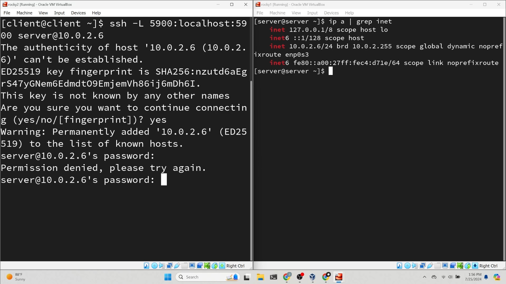
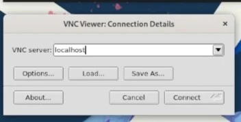
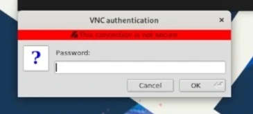
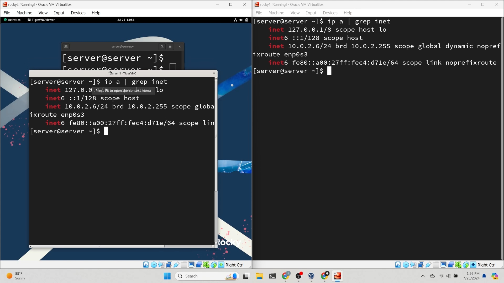

## Introduction

x11vnc is a powerful VNC program that distinguishes itself by utilizing the existing X session instead of creating a new one. This makes it an excellent tool for providing remote support, as it enables controlling remotely the user's screen or X session.

In this guide, you will learn how to stand up an x11vnc server and how to connect to it remotely.

!!! note

    One of the main benefits of using x11vnc over SSH is that it eliminates the need to open any additional ports on your machine, thereby minimizing the attack surface.

## Assumptions

For this guide, the assumption is that you have the following:

* Rocky Linux Workstation
* `sudo` privileges

## Setting up the VNC server

To capture a your X session, you will need to install x11vnc server on your Rocky workstation.

### Disable Wayland

First, you need to disable Wayland. Open the `custom.conf` file using your text editor of choice:

```bash
sudo vim /etc/gdm/custom.conf
```

Uncomment `WaylandEnable=false`:

```bash
# GDM configuration storage

[daemon]
WaylandEnable=false

[security]

[xdmcp]

[chooser]

[debug]
# Uncomment the line below to turn on debugging
#Enable=true
```

Restart `gdm` service:

```bash
sudo systemctl restart gdm
```

## Install and configure x11vnc

Enable the EPEL repository:

```bash
sudo dnf install epel-release
```

Create a password for x11vnc:

```bash
x11vnc -storepasswd ~/.x11vnc.pwd
```

Create a new file with your text editor of choice. You will use this to create a service to run x11vnc:

```bash
sudo vim /etc/systemd/system/x11vnc.service
```

Copy and paste the following text into the file, then write and quit:

!!! note

    Replace the `rfbauth` path with the path to the password file you created earlier. Replace `User` and `Group` values with the user you intend to provide remote support to.

```bash
[Unit]
Description=Start x11vnc at startup
After=display-manager.service

[Service]
Type=simple
Environment=DISPLAY=:1
Environment=XAUTHORITY=/run/user/1000/gdm/Xauthority
ExecStart=/usr/bin/x11vnc -auth /var/lib/gdm/.Xauthority -forever -loop -noxdamage -repeat -rfbauth /home/server/.x11vnc.pwd -rfbport 5900 -shared
User=server
Group=server

[Install]
WantedBy=multi-user.target
```

Enable and start the x11vnc service:

```bash
sudo systemctl enable --now x11vnc.service
```

## Connecting to the VNC server from your Rocky workstation

### Install the EPEL repository:

```bash
sudo dnf install epel-release
```

### Install a VNC client

Install TigerVNC. The server is not used, but you will use the client:

```bash
sudo dnf install tigervnc
```

### Create the SSH Tunnel 



Create an SSH tunnel to securely connect to the VNC server:

```bash
ssh -L 5900:localhost:5900 REMOTEIP
```

### Launch the VNC Viewer

Open your VNC viewer with the following command:

```bash
vncviewer
```



Connect to the VNC server by entering 127.0.0.1 or localhost into TigerVNC and connect.



Enter the x11vnc password you created earlier.

## Conclusion



At this point, you have successfully set up an x11vnc server and connected to it using a TigerVNC client. This solution is ideal for providing remote support, as it shares the same X session as the user, ensuring a seamless support experience.
