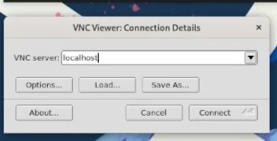

## Вступ

x11vnc — це потужна програма VNC, яка виділяється тим, що використовує наявний сеанс X, а не починає новий. Ця функція робить його чудовим інструментом для віддаленої підтримки, оскільки він дозволяє вам керувати екраном користувача або сеансом X на відстані.

Цей посібник навчить вас, як налаштувати сервер X11vnc і як віддалено до нього підключитися.

!!! note "Примітка"

```
Однією з головних переваг використання x11vnc через SSH є те, що він усуває необхідність відкривати будь-які додаткові порти на вашій машині, тим самим мінімізуючи поверхню атаки.
```

## Припущення

Для цього посібника передбачається, що у вас є:

- Робоча станція Rocky Linux
- привілеї `sudo`

## Налаштування сервера VNC

Ви повинні встановити сервер x11vnc на вашій робочій станції Rocky, щоб записати сеанс X.

### Вимкнути Wayland

По-перше, вам потрібно вимкнути Wayland. Відкрийте файл `custom.conf` за допомогою обраного вами текстового редактора:

```bash
sudo vim /etc/gdm/custom.conf
```

Розкоментуйте `WaylandEnable=false`:

```bash
# GDM configuration storage

[daemon]
WaylandEnable=false

[security]

[xdmcp]

[chooser]

[debug]
# Uncomment the line below to turn on debugging
#Enable=true
```

Перезапустіть службу `gdm`:

```bash
sudo systemctl restart gdm
```

## Встановлення та налаштування x11vnc

Увімкніть репозиторій EPEL:

```bash
sudo dnf install epel-release
```

Створіть пароль для x11vnc:

```bash
x11vnc -storepasswd ~/.x11vnc.pwd
```

Створіть новий файл за допомогою обраного вами текстового редактора. Це буде використано для створення служби для запуску x11vnc:

```bash
sudo vim /etc/systemd/system/x11vnc.service
```

Скопіюйте та вставте наступний текст у файл, потім напишіть і вийдіть:

!!! note "Примітка"

```
Замініть шлях `rfbauth` шляхом до файлу паролів, який ви створили раніше. Також замініть значення `User` і `Group` на користувача, якому ви збираєтеся надавати віддалену підтримку.
```

```bash
[Unit]
Description=Start x11vnc at startup
After=display-manager.service

[Service]
Type=simple
Environment=DISPLAY=:1
Environment=XAUTHORITY=/run/user/1000/gdm/Xauthority
ExecStart=/usr/bin/x11vnc -auth /var/lib/gdm/.Xauthority -forever -loop -noxdamage -repeat -rfbauth /home/server/.x11vnc.pwd -rfbport 5900 -shared
User=server
Group=server

[Install]
WantedBy=multi-user.target
```

Увімкніть і запустіть службу x11vnc:

```bash
sudo systemctl enable --now x11vnc.service
```

## Підключення до сервера VNC з робочої станції Rocky

### Встановіть репозиторій EPEL:

```bash
sudo dnf install epel-release
```

### Встановіть клієнт VNC

Встановіть TigerVNC. Сервер не використовується, але ви будете використовувати клієнта:

```bash
sudo dnf install tigervnc
```

### Створіть тунель SSH


Створіть тунель SSH для безпечного підключення до сервера VNC:

```bash
ssh -L 5900:localhost:5900 REMOTEIP
```

### Запустіть програму перегляду VNC

Відкрийте засіб перегляду VNC за допомогою такої команди:

```bash
vncviewer
```



Підключіться до сервера VNC, ввівши 127.0.0.1 або localhost у TigerVNC і підключіться.


Введіть пароль x11vnc, який ви створили раніше.

## Висновок


Ви успішно налаштували сервер x11vnc і підключилися до нього за допомогою клієнта TigerVNC. Це рішення ідеально підходить для віддаленої підтримки, оскільки воно використовує той самий сеанс X, що й користувач, що забезпечує безперебійну підтримку.
