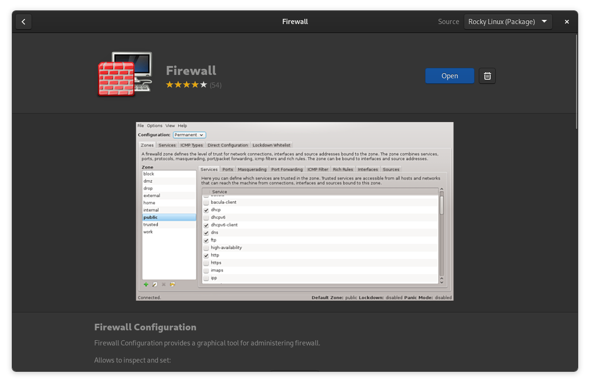
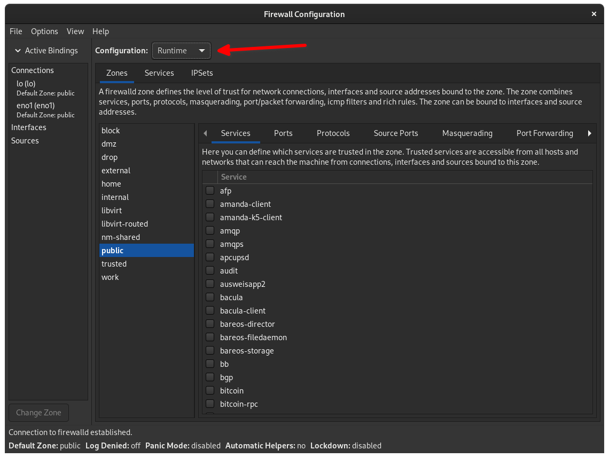
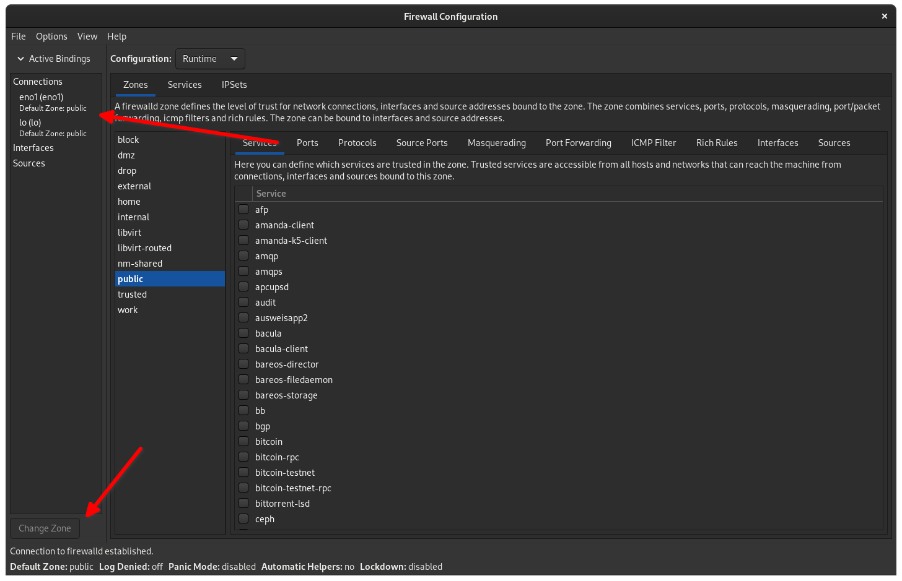
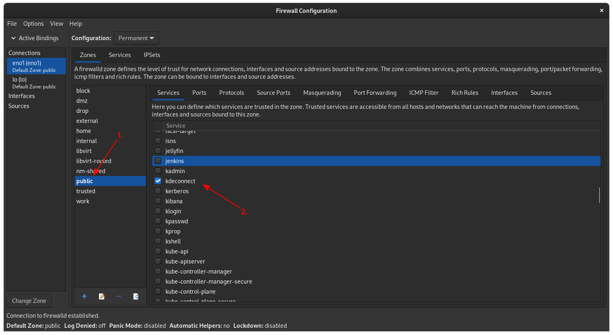
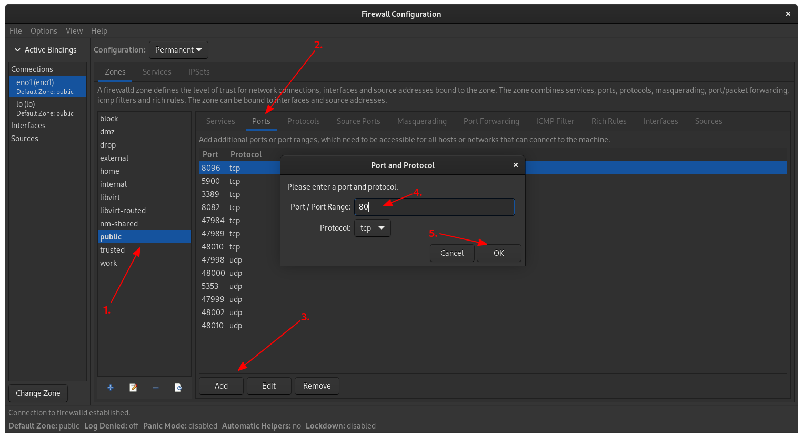

## Introduction

Vous souhaiteriez gérer votre pare-feu sans tout ce genre de choses en ligne de commande ? En fait, vous pouvez ! Il existe une excellente application spécialement conçue pour `firewalld`, le pare-feu utilisé dans Rocky Linux, et elle est disponible dans Flathub. Ce guide vous montrera comment la mettre en place et la faire fonctionner rapidement, ainsi que les bases de l'interface.

Nous n'aborderons pas tout ce que `firewalld` ou l'interface graphique peuvent accomplir, mais cela devrait suffire à vous permettre de démarrer.

## Prérequis

Pour ce guide, nous partons du principe que vous disposez déjà de la configuration suivante :

- Une installation Rocky Linux avec n'importe quel environnement de bureau graphique
- `sudo` ou privilèges administratifs
- Vous possédez aussi une compréhension des bases du fonctionnement de `firewalld`

!!! note "Remarque"

```
Gardez à l'esprit que même si cette application vous facilite la vie en utilisant une interface graphique, il indispensable de comprendre les concepts de base de `firewalld`. Vous devrez connaître les ports, les zones, les services, les sources, etc.

Si vous n'êtes pas sûr de tout cela, veuillez consulter le [Guide du débutant sur `firewalld`](../../guides/security/firewalld-beginners.md). Lisez en particulier ce qui concerne les zones pour avoir une idée de ce qu'elles font.
```

## Installer l'application

Accédez simplement à l'application Software Center et recherchez « Firewall ». Il s'agit d'un package natif dans le référentiel Rocky Linux, et il s'appellera littéralement « Firewall », il devrait donc être facile à trouver.



Pour les curieux, il s'agit de `firewall-config` dans le dépôt et peut être installé avec la commande habituelle :

```bash
sudo dnf install firewall-config
```

Lorsque vous ouvrirez l’application, elle vous demandera votre mot de passe. Elle demandera une confirmation également à nouveau avant d'effectuer des opérations sensibles.

## Modes de Configuration

La première chose à prendre en compte est le mode de configuration dans lequel vous vous trouvez, qui est sélectionnable dans le menu déroulant en haut de la fenêtre. Les choix possibles sont les suivants : `Runtime` et `Permanent`.



L'ouverture de ports, l'ajout de services autorisés et toute autre modification apportée en mode `Runtime` sont _temporaires_ et ne vous donnent pas accès à toutes les fonctionnalités. Lors du redémarrage ou du rechargement manuel du pare-feu, ces modifications disparaîtront. C'est idéal lorsque vous avez seulement besoin d'effectuer une modification rapide pour accomplir une seule tâche, ou si vous souhaitez tester vos modifications avant de les rendre permanentes.

Une fois que vous avez, par exemple, ouvert un port dans la zone Publique, vous pouvez aller dans « Options > Runtime To Permanent » pour enregistrer vos modifications.

Le mode permanent est plus risqué à utiliser, mais ouvre toutes les fonctionnalités. Il permet la création de nouvelles zones, la configuration individuelle des services, la gestion de vos interfaces réseau et l'ajout d'IPSets (en d'autres termes, des ensembles d'adresses IP autorisées ou non à contacter votre ordinateur ou serveur).

Après avoir apporté des modifications permanentes, accédez à « Options > Reload Firewalld » pour les activer correctement.

## Gestion des Interfaces/Connections

Le panneau tout à gauche, intitulé « Active Bindings », est l'endroit où vous trouverez vos connexions réseau et l'interface ajoutée manuellement. Si vous faites défiler vers le haut, vous verrez `my Ethernet connection` (eno1). Par défaut, la zone « public » inclut votre connexion réseau et est bien protégée.

En bas du panneau, vous trouverez le bouton « Change Zone », qui vous permet d'attribuer votre connexion à une autre zone si vous le souhaitez. En mode `Permanent`, vous pourrez également créer vos propres Zones personnalisées.



## Gestion des Zones

Dans le premier onglet du panneau de droite, vous trouverez le menu Zone. Ici, vous pouvez ouvrir et fermer des ports, activer ou désactiver des services, ajouter des adresses IP certifiées pour le trafic entrant (pensez aux réseaux locaux), activer la redirection de port, ajouter des règles riches, et bien plus encore.

Pour la plupart des utilisateurs de bureau de base, c'est ici que vous passerez la plupart de votre temps, et les sous-onglets les plus utiles de ce panneau seront ceux permettant de configurer les services et les ports.

!!! note "Remarque"

```
Si vous installez vos applications et services à partir du référentiel, certains d'entre eux (généralement ceux conçus pour une utilisation sur Desktop) activeront automatiquement les services concernés ou ouvriront les ports appropriés. Cependant, si cela ne se produit pas, vous pouvez suivre les étapes ci-dessous pour tout faire manuellement.
```

### Ajouter un Service à une Zone

Les services sont des applications communes et des services d'arrière-plan que `firewalld` prend en charge par défaut. Vous pouvez les activer rapidement et facilement en faisant défiler la liste et en cliquant sur la case à cocher correspondante.

Maintenant, si vous avez installé KDE Connect\* pour vous aider à synchroniser votre bureau avec d'autres appareils et que vous souhaitez l'autoriser à traverser votre pare-feu pour qu'il fonctionne réellement, vous devez :

1. Tout d’abord, sélectionnez la zone que vous souhaitez modifier. Pour cet exemple, utilisez simplement la zone publique par défaut.
2. Faites défiler la liste et sélectionnez `kdeconnect`.
3. Si vous êtes en mode de configuration Runtime, n'oubliez pas de cliquer sur `Runtime To Permanent` et `Reload Firewalld` dans le menu des options.

\* Disponible dans le dépôt d'EPEL.



D'autres services populaires de la liste incluent HTTP et HTTPS pour l'hébergement de sites Web, SSH pour permettre l'accès basé sur un terminal à partir d'autres appareils, Samba pour l'hébergement de partages de fichiers compatibles Windows, et bien d'autres.

Cependant, tous les programmes ne figurent pas dans la liste et vous devrez peut-être ouvrir un port manuellement.

### Ouverture de Ports sur une Zone

Ouvrir des ports pour des applications spécifiques est assez simple. Assurez-vous simplement de lire la documentation pour connaître les ports dont vous avez besoin et c'est parti.

1. Encore une fois, sélectionnez la zone que vous souhaitez modifier.
2. Accédez à l’onglet Ports dans le panneau de droite.
3. Cliquez sur le bouton ++"Add"++.
4. Remplissez le champ de texte avec le(s) port(s) que vous devez ouvrir. Vérifiez le protocole dont l'application a besoin et le protocole réseau qu'elle utilise (en d'autres termes, TCP/UDP, etc.)
5. Cliquez sur OK et utilisez les options `Runtime To Permanent` et `Reload Firewalld`.



## Conclusion

Eh bien, j’ai dit que nous garderions ce guide simple. Si vous voulez vraiment faire travailler votre cerveau, vous devriez essayer d'en lire davantage sur les principes fondamentaux de `firewalld`. Vous pouvez également utiliser l'onglet `Services` en haut du panneau de droite (à côté de `Zones`) pour configurer exactement le fonctionnement de vos services, ou contrôler l'accès des autres ordinateurs autorisés à communiquer avec le vôtre par l'intermédiaire les IPSets et les Sources.

Ou vous pouvez simplement ouvrir le port de votre serveur Jellyfin et poursuivre votre tâche. C'est de votre responsabilité. `firewalld` est un outil incroyablement puissant, et l'application Firewall peut vous aider à découvrir ses capacités d'une manière conviviale pour les débutants.

Have fun, and stay safe out there!
