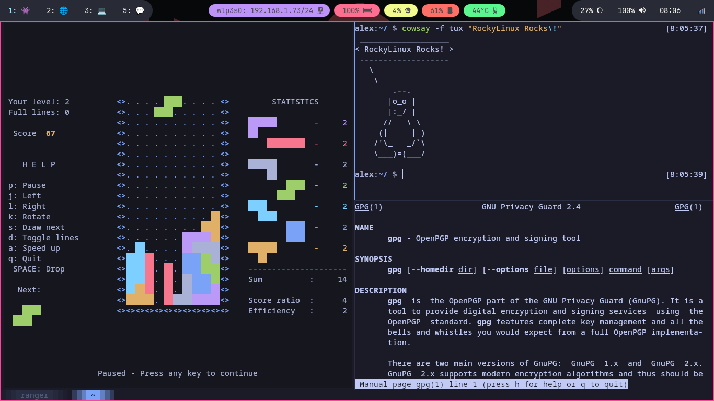

## Einleitung

**Kitty is a blazing fast terminal emulator on steroids**. Alles, was Sie sich vorstellen können, ist in Kitty anpassbar.
Sie können Tab-Verwaltung, Kacheln, Bildvorschauen und viele weitere Optionen direkt in diesem Terminal-Emulator nutzen.
Sie können sogar `tmux` oder einen Fenstermanager durch **Kitty** ersetzen (wenn Sie überwiegend in einem Terminal arbeiten).

## Voraussetzungen

- Sie haben eine Rocky Linux-Workstation oder einen Server mit GUI
- Sie sind ein Administrator mit `sudo`-Berechtigungen

## Kitty — Installation

\*\*Installieren Sie zuerst das EPEL-Repository (Extra Packages for Enterprise Linux): \*\*

```bash
dnf install -y epel-release
```

Installieren Sie als Nächstes **Kitty**:

```bash
dnf install -y kitty
```

Nach der Installation können Sie `Kitty` starten.

## Kurze Übersicht

### Konfigurationsdatei

Sobald Sie **Kitty** gestartet haben, können Sie die Kitty-Konfigurationsdatei mit ++ctrl+shift+f2++ öffnen.
Sie finden die Konfigurationsdatei auch unter `$HOME/.config/kitty`.

Dieses Dokument geht nicht näher auf die Konfigurationsdatei selbst ein. Beachten Sie bitte, dass Sie alle Standardverknüpfungen oder alles, was mit der Darstellung zu tun hat, in der Konfiguration ändern können.

### Registerkarten

Mit ++ctrl+shift+t++ können Sie eine neue Registerkarte erstellen.

Sie können eine Registerkarte mit ++ctrl+shift+w++ _oder_ ++ctrl+shift+q++ schließen.

Sie können Tabs mit ++ctrl+shift+left++ _oder_ ++ctrl+shift+right++ auswählen.


### Kacheln

Drücken Sie ++ctrl+shift+enter++, um einen neuen Bereich oder ein neues Fenster zu öffnen.
Sie können die Tastenkombination mehrmals drücken, um ein Kachel-Layout zu erstellen.

Sie können das Layout mit ++ctrl+shift+l++ wechseln.

Sie können Fenster oder Bereiche mit ++ctrl+shift+bracket-left++ oder ++ctrl+shift+bracket-right++ auswählen.
Wenn Sie möchten, können Sie einfach mit der Maus auf den Bereich oder das Fenster klicken.



## Zusammenfassung

Kitty bietet zahlreiche Features ohne zusätzliche Konfiguration.
Wenn Sie auf Ihrer Arbeitsstation bereits einen konfigurierten Fenstermanager, `zsh` oder `tmux`, haben, benötigen Sie Kitty wahrscheinlich nicht. Bedenken Sie, dass Sie `zsh`-Verknüpfungen, `tmux`-Kacheln und viele Fenstermanagerfunktionen in nur einem Terminalemulator kombinieren können.
Wenn Sie jedoch noch keines dieser Power-Tools ausprobiert haben, empfiehlt der **Autor** Ihnen unbedingt, mit Kitty zu versuchen.
