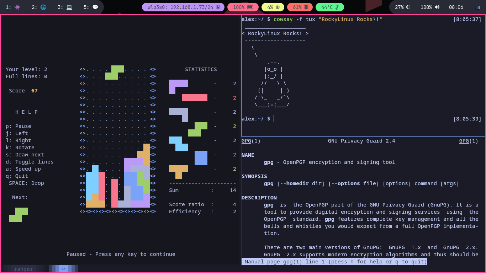

## Introduction

**Kitty est un émulateur de terminal ultra-rapide sous stéroïdes**, tout ce que vous pouvez imaginer est personnalisable dans Kitty.
Vous pouvez utiliser la gestion des onglets, la mosaïque, les aperçus d’image et bien d’autres options, uniquement dans cet émulateur de terminal.
Vous pouvez même remplacer `tmux` ou même un gestionnaire de fenêtres par **Kitty** (si vous travaillez principalement dans un terminal).

## Prérequis

- Vous disposez d'un poste de travail ou d'un serveur Rocky Linux avec GUI
- Vous avez accès au système avec des privilèges `sudo`

## Installation de Kitty

**Tout d’abord, installez le référentiel EPEL (Extra Packages for Enterprise Linux) :**

```bash
dnf install -y epel-release
```

Ensuite, installez **Kitty**:

```bash
dnf install -y kitty
```

Une fois installé, vous pouvez démarrer `Kitty`.

## Aperçu rapide

### Fichier de configuration

Une fois que vous avez démarré **Kitty**, vous pouvez ouvrir le fichier de configuration de Kitty avec ++ctrl+shift+f2++.
Vous pouvez également trouver le fichier de configuration dans `$HOME/.config/kitty`.

Ce document n'entrera pas dans les détails du fichier de configuration lui-même. Sachez simplement que vous pouvez modifier tous les raccourcis par défaut, ou tout ce qui concerne l'apparence, dans la configuration.

### Onglets

Vous pouvez créer un nouvel onglet avec ++ctrl+shift+t++.

Vous pouvez fermer un onglet avec ++ctrl+shift+w++ _ou_ ++ctrl+shift+q++.

Vous pouvez sélectionner des onglets avec ++ctrl+shift+left++ _ou_ ++ctrl+shift+right++.


### Tiling

Appuyez sur ++ctrl+shift+enter++ pour ouvrir un nouveau volet ou une nouvelle fenêtre.
Vous pouvez appuyer dessus plusieurs fois pour créer une disposition en mosaïque.

Vous pouvez changer de disposition avec ++ctrl+shift+l++.

Vous pouvez sélectionner des fenêtres ou des volets avec ++ctrl+shift+bracket-left++ ou ++ctrl+shift+bracket-right++.
Si vous préférez, vous pouvez simplement cliquer sur le volet ou la fenêtre avec votre souris.



## Conclusion

Kitty offre de nombreuses fonctionnalités sans configuration supplémentaire.
Si vous avez déjà un gestionnaire de fenêtres configuré, `zsh` ou `tmux` sur votre poste de travail, vous n'avez probablement pas besoin de Kitty. Considérez le fait que vous pouvez combiner les raccourcis `zsh`, la mosaïque `tmux` et de nombreuses fonctionnalités du gestionnaire de fenêtres, dans un seul émulateur de terminal.
Mais si vous n’avez pas encore essayé aucun de ces outils performants, l’**auteur** vous recommande vivement de commencer par `Kitty`.
