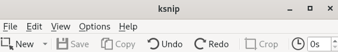

## Prérequis

- Rocky 9.4 Workstation
- Droits d'accès `sudo`

## Introduction

`Ksnip` est un utilitaire de capture d'écran riche en outils pour annoter les captures d'écran. Ce guide se concentre sur l'installation de `Ksnip` et de ses outils d'annotation.

## Installation de `Ksnip`

Ksnip nécessite le référentiel EPEL. Si l'EPEL n'est pas activé, vous pouvez le faire avec la commande suivante :

```bash
sudo dnf install epel-release
```

Effectuez ensuite une mise à jour du système :

```bash
sudo dnf update -y
```

Maintenant, installez `Ksnip` :

```bash
sudo dnf install ksnip -y
```

## Ouvrir une image

1. Lancer Ksnip
2. Cliquez `File > Open`
3. Sélectionnez l'image que vous souhaitez annoter




## Annoter une image avec `Ksnip`

`Ksnip` dispose d'outils pratiques et intuitifs pour annoter des captures d'écran.  Dans l'image, en bas à gauche se trouvent les options décrites ci-dessous.

L'outil `Select` permet de faire une sélection. Cliquez sur un élément pour le sélectionner ou cliquez et faites glisser pour effectuer une sélection.

L’outil `Duplicate` permet de dupliquer une sélection. Cliquez et faites glisser pour effectuer une sélection. Cliquez ensuite sur la sélection et faites-la glisser pour la déplacer ou la transformer davantage.

L'outil `Arrow` est utilisé pour créer des flèches. Cliquez et faites glisser pour créer une flèche.

L'outil `Double Arrow` (choisi en cliquant sur la flèche vers le bas à côté de la flèche) : utilisé pour créer des flèches double face. Cliquez et faites glisser pour créer une flèche double face.

L'outil `Line` est utilisé pour créer des lignes droites. Cliquez et faites glisser pour créer une ligne.

L'outil `Pen` est utilisé pour créer des traits qui ressemblent à un stylo. Cliquez et déplacez le curseur sur la capture d’écran pour utiliser le stylo. Des options de personnalisation existent pour modifier le style et le trait du stylo dans la barre d'outils supérieure.

L'outil `Marker Pen` est utilisé pour créer des traits qui ressemblent à un surligneur. Maintenez le clic et déplacez le curseur sur la capture d'écran pour utiliser le marqueur. Des personnalisations existent pour modifier l'opacité dans la barre d'outils supérieure.

L'outil `Marker Rectangle` est similaire à l'outil Marker Pen, mais lorsque vous cliquez et faites glisser votre curseur, l'outil Marker Rectangle remplira la sélection rectangulaire. Des personnalisations existent pour modifier l'opacité dans la barre d'outils supérieure.

L'outil `Marker Ellipse` est l'outil Marker Pen, mais lorsque vous cliquez avec le bouton gauche et faites glisser votre curseur, l'outil Marker Ellipse remplira l'ellipse créée à partir de la sélection. Des personnalisations existent pour modifier l'opacité dans la barre d'outils supérieure.

L'outil `Text` est utilisé pour annoter une capture d'écran avec du texte. Cliquez n'importe où sur l'image et commencez à taper pour utiliser l'outil Text Tool. Des personnalisations existent dans la barre d'outils supérieure pour modifier la bordure, la couleur, la famille de polices, la taille de la police, le style de police et l'opacité de votre texte.

L'outil `Text Pointer` est utilisé pour annoter une capture d'écran avec du texte attaché à un pointeur. Le pointeur doit attirer l'attention sur le texte, à l'instar de l'outil Text Arrow.

L'outil `Text Arrow` est utilisé pour annoter une capture d'écran avec du texte attaché à une flèche. Le pointeur doit attirer l'attention sur le texte, à l'instar de l'outil Text Pointer.

L'outil `Number` permet d'annoter une capture d'écran avec une forme numérotée. Cliquez n'importe où sur l'image pour placer une forme numérotée. Des personnalisations existent dans la barre d'outils supérieure pour modifier la couleur, la largeur et l'opacité.

L'outil `Number Pointer` est utilisé pour annoter une capture d'écran avec une forme numérotée attachée à un pointeur. Cliquez n'importe où sur l'image pour placer une forme numérotée attachée à un pointeur. Des personnalisations existent dans la barre d'outils supérieure pour modifier la couleur, la largeur et l'opacité.

L'outil `Number Arrow` est utilisé pour annoter une capture d'écran avec une forme numérotée attachée à un pointeur. Cliquez n'importe où sur l'image pour placer une forme numérotée attachée à une flèche. Des personnalisations existent dans la barre d'outils supérieure pour modifier la couleur, la largeur et l'opacité.

L'outil `Blur` permet de flouter une sélection. Cliquez avec le bouton gauche et faites glisser n'importe où sur la capture d'écran pour rendre floue une sélection.

L'outil `Pixelate` permet de pixeliser une sélection. Cliquez avec le bouton gauche et faites glisser n'importe où sur la capture d'écran pour pixeliser une sélection.

L'outil `Rectangle` permet de réaliser un rectangle à partir d'une sélection. Cliquez avec le bouton gauche et faites glisser n'importe où sur la capture d'écran pour effectuer une sélection rectangulaire. Des personnalisations existent dans la barre d'outils supérieure pour modifier la couleur, la largeur et l'opacité.

L'outil `Ellipse` permet de réaliser une ellipse à partir d'une sélection. Cliquez avec le bouton gauche et faites glisser n'importe où sur la capture d'écran pour placer une ellipse. Des personnalisations existent dans la barre d'outils supérieure pour modifier la couleur, la largeur et l'opacité.

L'outil `Sticker` est utilisé pour placer un sticker ou un émoji sur une capture d'écran. En sélectionnant l'outil et en cliquant, le sticker sera placé.

## Conclusion

Ksnip est un excellent utilitaire pour annoter des captures d'écran. L'utilitaire peut également prendre des captures d'écran, mais ce guide se concentre principalement sur les capacités et les outils d'annotation fournis par Ksnip.

Consultez [Ksnip GitHub Repo](https://github.com/ksnip/ksnip){target="_blank"} pour en savoir plus sur cet excellent utilitaire de capture d'écran.
