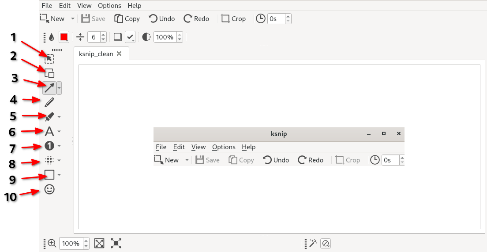

## Передумови та припущення

- Робоча станція Rocky 9.4
- привілеї `sudo`

## Вступ

Ksnip — це утиліта для знімків екрана, яка пропонує багато інструментів для анотування знімків екрана. У цьому посібнику йдеться про встановлення Ksnip та його інструментів анотації.

## Встановлення Ksnip

Для Ksnip потрібен репозиторій EPEL. Якщо у вас не ввімкнено EPEL, ви можете зробити це за допомогою:

```bash
sudo dnf install epel-release
```

Потім виконайте оновлення системи:

```bash
sudo dnf update -y
```

Тепер встановіть Ksnip:

```bash
sudo dnf install ksnip -y
```

## Відкриття зображення

1. Відкрийте Ksnip
2. Натисніть `File > Open`
3. Виберіть зображення, яке потрібно анотувати




## Анотування зображення за допомогою Ksnip

Ksnip має зручні та інтуїтивно зрозумілі інструменти для коментування скріншотів.  На зображенні ліворуч розташовано параметри, описані нижче.

| Опція | Інструмент           | Опис                                                                                                                                                                                                                                                                    |
| ----- | -------------------- | ----------------------------------------------------------------------------------------------------------------------------------------------------------------------------------------------------------------------------------------------------------------------- |
| 1     | `Вибрати`            | інструмент використовується для вибору. Натисніть елемент, щоб вибрати його, або натисніть і перетягніть, щоб зробити вибір.                                                                                                            |
| 2     | `Дублювати`          | інструмент використовується для дублювання виділення. Натисніть і перетягніть, щоб зробити вибір. Потім натисніть і перетягніть виділення, щоб перемістити або трансформувати його.                                     |
| 3a    | `Стрілка`            | інструмент зі стрілкою за замовчуванням, який дозволяє клацати та перетягувати, щоб створити стрілку від місця до нового                                                                                                                                                |
| 3b    | `Подвійна стрілка`   | друга стрілка доступна, клацнувши стрілку вниз поруч із інструментом зі стрілкою. Як підказують інструменти, він має стрілки в обох кінцевих точках.                                                                                    |
| 3c    | `Лінія`              | третій варіант доступний, натиснувши стрілку вниз поруч із інструментом зі стрілкою. Він замінює стрілки простою лінією.                                                                                                                |
| 4     | `Перо`               | робить штрихи, що нагадують перо. Клацніть і перемістіть курсор по знімку екрана, щоб скористатися пером. ^1^                                                                                                                           |
| 5a    | `Маркер`             | інструмент маркера за замовчуванням робить штрихи, схожі на маркер. Утримуйте, клацніть і перетягніть курсор по знімку екрана, щоб скористатися маркером. ^1^                                                                           |
| 5b    | `Прямокутний маркер` | другий параметр маркера доступний, натиснувши стрілку вниз поруч із інструментом маркера. Коли ви клацнете лівою кнопкою миші та перетягнете курсор, інструмент «Прямокутник маркера» заповнить прямокутник, створений з виділення. ^1^ |
| 5c    | `Маркер еліпс`       | третій параметр маркера доступний, натиснувши стрілку вниз поруч із інструментом маркера. Коли ви клацнете лівою кнопкою миші та перетягнете курсор, інструмент «Маркерний еліпс» заповнить еліпс, зроблений з виділення. ^1^           |
| 6a    | `Текст`              | текстовий інструмент за замовчуванням, який дозволяє додавати текст до знімка екрана. ^1^                                                                                                                                                               |
| 6b    | `Текстовий покажчик` | другий параметр тексту доступний, натиснувши стрілку вниз поруч із текстовим інструментом. Він прикріплює вказівник, щоб привернути увагу до тексту. ^1^                                                                                |
| 6c    | `Текстова стрілка`   | третій параметр тексту доступний, натиснувши стрілку вниз поруч із текстовим інструментом. Він прикріплює стрілку, щоб привернути увагу до тексту. ^1^                                                                                  |
| 7a    | `Номер`              | стандартний інструмент для чисел, додає число, щоб привернути увагу, і додає знімок екрана цифрами. ^1^                                                                                                                                                 |
| 7b    | `Цифровий покажчик`  | другий варіант доступний, натиснувши стрілку вниз поруч із інструментом чисел. Додає число з покажчиком для додаткового коментування знімка екрана. ^1^                                                                                 |
| 7c    | `Числова стрілка`    | третій варіант доступний, натиснувши стрілку вниз поруч із інструментом чисел. Додає число зі стрілкою для додаткового коментування знімка екрана. ^1^                                                                                  |
| 8a    | `Розмиття`           | інструмент розмивання за замовчуванням, який дозволяє розмивати частини знімка екрана, клацаючи лівою кнопкою миші та перетягуючи.                                                                                                                      |
| 8b    | `Пікселізація`       | другий параметр інструмента розмиття доступний, натиснувши стрілку вниз поруч із інструментом розмиття. Піксельуйте будь-де на екрані, клацнувши лівою кнопкою миші та перетягнувши.                                                    |
| 9a    | `Прямокутник`        | інструмент прямокутника за замовчуванням, дозволяє клацати та перетягувати, щоб створити прямокутник. ^1^                                                                                                                                               |
| 9b    | `Еліпс`              | друга опція інструмента прямокутника, доступна клацанням стрілки вниз поруч із інструментом прямокутника. Дозволяє клацати та перетягувати, щоб створити еліпс на екрані. ^1^                                                           |
| 10    | `Наклейка`           | розміщує наклейку або емодзі на знімку екрана. Вибравши інструмент і клацнувши, ви розмістите наклейку.                                                                                                                                 |

## Висновок

Ksnip — чудова утиліта для анотування скріншотів. Він також може робити знімки екрана, однак основна увага в цьому посібнику – це можливості та інструменти анотацій, які надає Ksnip.

Перегляньте [Ksnip GitHub Repo](https://github.com/ksnip/ksnip){target="_blank"}, щоб дізнатися більше про цю чудову утиліту для створення знімків екрана.

**1.** Кожен із інструментів, опис яких супроводжується ==цим надрядковим індексом== (^1^), має різні командні параметри, доступні у верхньому меню після вибору інструменту. Вони змінюють непрозорість, межу, шрифт, стиль шрифту та інші атрибути.
