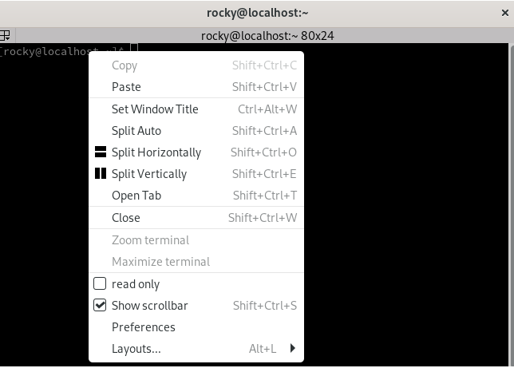

## Introduction

Terminator est un émulateur de terminal basé sur GNOME Terminal qui prend en charge des fonctionnalités avancées telles que de nombreux panneaux de terminaux, le regroupement de terminaux et l'enregistrement de vos dispositions préférées.

## Prérequis

- Vous disposez d'un poste de travail ou d'un serveur Rocky Linux avec GUI
- Vous avez accès au système avec des privilèges `sudo`

## Installation de Terminator

Terminator fait partie du référentiel Extra Packages for Enterprise Linux (EPEL), qui n'est pas immédiatement disponible sur une nouvelle installation. Donc tout d’abord, nous devons ajouter EPEL à Rocky Linux.

- Étape n°1 (facultative) : activer le référentiel CodeReady Builder (CRB)

```bash
sudo dnf config-manager --set-enabled crb
```

Bien que cela ne soit pas indispensable pour Terminator, CRB fournit des dépendances pour certains des packages d'EPEL, il peut donc être utile si vous envisagez de vous appuyer sur ce référentiel à l'avenir.

- Étape n°2 : ajouter le référentiel EPEL

```bash
sudo dnf install epel-release -y
```

- Étape n°3 (facultative, mais fortement recommandée) : mettre à jour votre système

```bash
sudo dnf update -y --refresh
```

- Étape n°4 : installer Terminator

```bash
sudo dnf install terminator -y
```

## Configuration

Par défaut, Terminator n’est pas très différent du terminal GNOME original. En fait, il semble _encore plus_ simple que celui par défaut.


Pour commencer à personnaliser votre nouveau terminal, ouvrez le menu contextuel en cliquant avec le bouton droit n'importe où sur l'arrière-plan.



À partir de ce menu, nous pouvons diviser la fenêtre, ouvrir de nouveaux onglets et changer de disposition. Il est également possible de personnaliser le thème depuis le sous-menu `Préférences`. Il peut être utile de prendre le temps de vous familiariser avec les options disponibles, car de nombreux paramètres dépassent le cadre de ce guide.

Il existe également plusieurs raccourcis clavier disponibles pour ceux qui préfèrent ne pas déplacer leur main péniblement entre le clavier et la souris. Par exemple, ++shift+ctrl+"O"++ partagera la fenêtre horizontalement en plusieurs terminaux. Le fractionnement de la fenêtre à plusieurs reprises et la réorganisation par glisser-déposer sont également pris en charge.


## Conclusion

Terminator est un émulateur de terminal efficace destiné aux utilisateurs réguliers comme aux utilisateurs expérimentés. Ces exemples ne représentent qu'une petite partie des capacités de Terminator. Bien que ce guide fournisse un aperçu des étapes d'installation de Rocky Linux, vous souhaiterez peut-être examiner la [documentation](https://gnome-terminator.readthedocs.io/en/latest/) pour une explication complète des fonctionnalités de Terminator.
