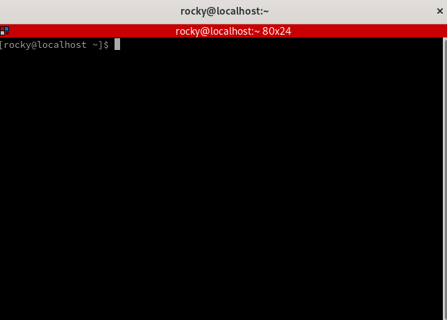

## Introduzione

Terminator è un emulatore di terminale basato su GNOME Terminal che supporta funzioni avanzate come multipli pannelli di terminale, raggruppamento di terminali e salvataggio dei layout preferiti.

## Prerequisiti

- Disporre di una workstation o di un server Rocky Linux con un'interfaccia grafica.
- Essere amministrazione con privilegi `sudo`.

## Installare Terminator

Terminator si trova nel repository Extra Packages for Enterprise Linux (EPEL), quindi non disponibile in una nuova installazione. Quindi, per prima cosa, dobbiamo aggiungere EPEL a Rocky Linux.

- Passo 1 (facoltativo): Abilitare il repository CodeReady Builder (CRB)

```bash
sudo dnf config-manager --set-enabled crb
```

Anche se non è strettamente necessario per Terminator, CRB fornisce le dipendenze per alcuni pacchetti di EPEL, che possono essere utili se si intende fare affidamento su quella repository in futuro.

- Passo 2: Aggiungere il repository EPEL

```bash
sudo dnf install epel-release -y
```

- Fase 3 (facoltativa ma altamente consigliata): Aggiornare il sistema

```bash
sudo dnf update -y --refresh
```

- Passo 4: Installare Terminator

```bash
sudo dnf install terminator -y
```

## Configurazione

Per impostazione predefinita, Terminator non ha un aspetto molto diverso dal Terminale GNOME predefinito. Sembra ancora più scarno di quello predefinito.



Per iniziare a personalizzare il nuovo terminale, aprire il menu contestuale facendo clic con il tasto destro del mouse su un punto qualsiasi dello sfondo.


Da questo menu è possibile splittare la finestra, attivare nuove schede e cambiare layout. Il sottomenu Preferenze permette anche di personalizzare il tema. Vale la pena di prendere un po' di tempo per familiarizzare con le opzioni disponibili, poiché ci sono molte impostazioni che esulano dallo scopo di questa guida.

Sono inoltre disponibili diverse combinazioni di tasti per coloro che preferiscono non spostare la mano avanti e indietro tra la tastiera e il mouse. Ad esempio, ++shift+ctrl+“O ”++ dividerà la finestra orizzontalmente in molti terminali. Sono inoltre supportati il frazionamento della finestra più volte e il riordino tramite trascinamento.


Infine, può essere utile impostare una scorciatoia da tastiera per aprire il nuovo terminale. Per farlo, si può iniziare aprendo il menu Impostazioni. È possibile accedere al menu in diversi modi; per questa guida, si farà clic con il tasto destro del mouse sul desktop e con il tasto sinistro del mouse su “Impostazioni”.


Da qui, utilizzare il menu di sinistra per spostarsi nella sezione “Keyboard”, quindi fare clic su “Customize Shortcuts” in basso.


Se è la prima volta che si imposta un collegamento personalizzato, si vedrà un pulsante intitolato "Add Shortcut". Altrimenti, verrà visualizzato un elenco di collegamenti con un segno più in basso. Fare clic su quello che si applica alla propria situazione per aprire la finestra di dialogo "Add Custom Shortcut". Nel campo _Name_, digitare un soprannome facile da ricordare per la scorciatoia. Nel campo _Command_, digitate il nome del nostro programma: `terminator`. Quindi fare clic su "Set Shortcut" per impostare la nuova combinazione di tasti.


Sebbene ++ctrl+alt+"T "++ sia una scelta tradizionale, potete scegliere la combinazione che preferite. È sempre possibile aggiornare il nome del collegamento e la combinazione di tasti in un secondo momento. Per salvare il collegamento, fare clic su "Add" in alto a destra nella finestra di dialogo Aggiungi collegamento personalizzato.


## Conclusione

Terminator è un potente emulatore di terminale per utenti normali ed esperti. Questi esempi rappresentano solo una piccola parte delle capacità di Terminator. Sebbene questa guida fornisca una panoramica dei passaggi di installazione per Rocky Linux, si consiglia di esaminare la [documentazione](https://gnome-terminator.readthedocs.io/en/latest/) per una spiegazione completa delle caratteristiche di Terminator.
