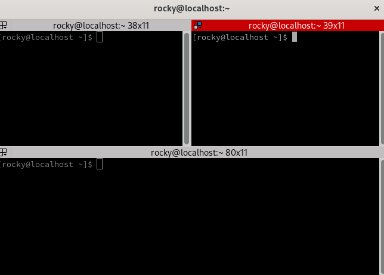

## Introduction

Terminator is a terminal emulator based on GNOME Terminal that supports advanced features such as multiple terminal panels, grouping terminals, and saving your preferred layouts.

## Assumptions

* You have a Rocky Linux workstation or server with GUI
* You are an administration with `sudo` privileges

## Installing Terminator

Terminator is in the Extra Packages for Enterprise Linux (EPEL) repository, which is not available on a new installation. So first, we need to add EPEL to Rocky Linux.

- Step 1 (optional): Enable the CodeReady Builder (CRB) repository

```bash
sudo dnf config-manager --set-enabled crb
```

While not strictly necessary for Terminator, CRB provides dependencies for some of the packages in EPEL so it can be useful to have if you plan on relying on that repository in the future.

- Step 2: Add the EPEL repository

```bash
sudo dnf install epel-release -y
```

- Step 3 (optional, but highly recommended!): Update your system

```bash
sudo dnf update -y --refresh
```

- Step 4: Install Terminator

```bash
sudo dnf install terminator -y
```

## Configuration

By default, Terminator doesn't look much different from the default GNOME Terminal. In fact, it looks *even more* bare-bones than the default!


To start customizing your new terminal open the context menu by right clicking anywhere on the background.


From this menu we can split the window, open new tabs, and switch layouts. It is also possible to customize the theme from the Preferences submenu. It may be worth taking some time to familiarize yourself with the available options as there are numerous settings that are beyond the scope of this guide. 

There are also several keybindings available for those who prefer not to move their hand back and forth between the keyboard and mouse. For example, `Shift+Ctrl+O` will split the window horizontally into multiple terminals. The window can be split multiple times, and drag-and-drop reordering is additionally supported.



## Conclusion

Terminator is a powerful terminal emulator for both regular users and power users alike. These examples only represent a small fraction of Terminator's capabilities.. While this guide provides an overview of the installation steps for Rocky Linux you may wish to take a look at the [documentation](https://gnome-terminator.readthedocs.io/en/latest/) for a full explanation of Terminator's features.

