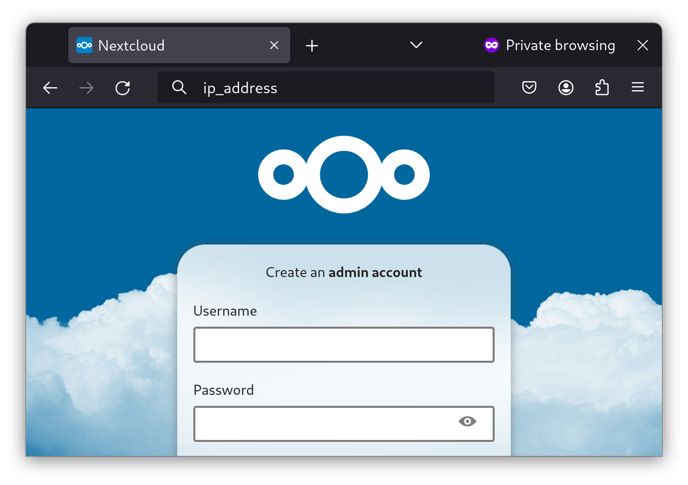

# Introduction

[Podman](https://podman.io/) is a Docker-compatible alternative container runtime that, unlike Docker, is included in the Rocky Linux repositories and can run containers as a `systemd` service.

## Install Podman

Use the `dnf` utility to install Podman:

```
dnf install podman
```

## Adding a container

Let us run a [Nextcloud](https://nextcloud.com/) self-hosted cloud platform as an example:

```
podman run -d -p 8080:80 nextcloud
```

You will receive a prompt to select the container registry to download from. In our example, we will use `docker.io/library/nextcloud:latest`.

Once you have downloaded the Nextcloud container, it will run.

Enter **ip_address:8080** in your web browser (assuming you opened the port in `firewalld`) and set up Nextcloud:



## Running containers as `systemd` services

As mentioned, you can run Podman containers as `systemd` services. Let us now do it with Nextcloud. Run:

```bash
podman ps
``

You will get a list of running containers:

```bash
04f7553f431a  docker.io/library/nextcloud:latest  apache2-foregroun...  5 minutes ago  Up 5 minutes  0.0.0.0:8080->80/tcp  compassionate_meninsky
```

To make a `systemd` container and enable it on reboot, run the following:

```bash
podman generate systemd --name compassionate_meninsky > /usr/lib/systemd/system/nextcloud.service
systemctl enable nextcloud
```

When your system reboots, Nextcloud will restart in Podman.
