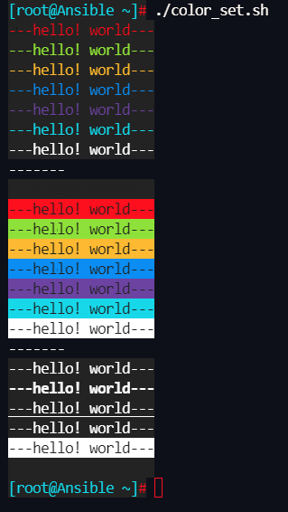

# Introduzione

Quando scarichiamo script bash che sono stati scritti da altri nel nostro lavoro quotidiano, a volte alcune stringhe chiave sono contrassegnate con colori speciali. Come si può ottenere questo effetto scrivendo in uno script?

## Colore carattere

| **codice colore** | **descrizione** |
|:-----------------:|:---------------:|
|        30         |      nero       |
|        31         |      rosso      |
|        32         |      verde      |
|        33         |     giallo      |
|        34         |       blu       |
|        35         |      viola      |
|        36         |   verde scuro   |
|        37         |     bianco      |

## Colore di sfondo del carattere

| **Codice del colore di sfondo** | **descrizione** |
|:-------------------------------:|:---------------:|
|               40                |      nero       |
|               41                |     crimson     |
|               42                |      verde      |
|               43                |     giallo      |
|               44                |       blu       |
|               45                |      viola      |
|               46                |   verde scuro   |
|               47                |     bianco      |

## Modalità display

| **codice** |            **descrizione**             |
|:----------:|:--------------------------------------:|
|     0      | Impostazioni predefinite del terminale |
|     1      |               Evidenzia                |
|     4      |              Sottolineato              |
|     5      |          Il cursore lampeggia          |
|     7      |        Visualizzazione inversa         |
|     8      |                Nascondi                |

## Modalità di esecuzione

* **\033[1;31;40m** "1" indica la modalità di visualizzazione, che è opzionale. "31" indica il colore del carattere. "40m" indica il colore di sfondo del carattere

* **\033[0m** Ripristina il colore predefinito del terminale, cioè annulla l'impostazione del colore

## Esempio di script

Possiamo scrivere uno script per osservare il cambiamento di colore.

```bash
#!/bin/bash
# Font color cycle
for color1 in {31..37}
    do
        echo -e "\033[0;${color1};40m---hello! Rocky---\033[0m"
    done

echo "-------"

# Background color cycle
for color2 in {40..47}
    do
        echo -e "\033[30;${color2}m---hello! Rocky---\033[0m"
    done

echo "-------"

# Cycle of display mode
for color3 in 0 1 4 5 7 8
    do
        echo -e "\033[${color3};37;40m---hello! Rocky---\033[0m"
    done
```

```bash
Shell > chmod a+x color_set.sh
Shell > ./color_set.sh
```

L'effetto è il seguente:


