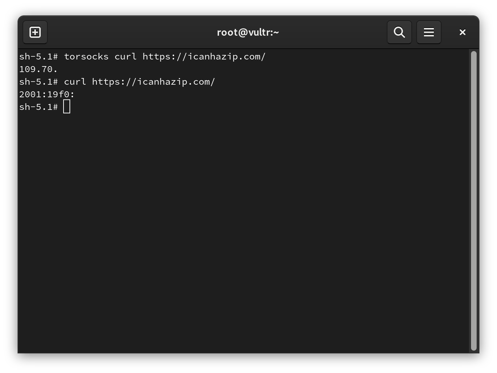

# Introduzione a `torsocks`

`torsocks` è un'utility per reindirizzare il traffico IP da un'applicazione a riga di comando alla rete [Tor](https://www.torproject.org/) o a un server SOCKS5.

## Utilizzare `torsocks`

```bash
dnf -y install epel-release
dnf -y install tor torsocks
systemctl enable --now tor
```

Seguono le opzioni comuni del comando `torsocks' che, in circostanze normali, non richiedono ulteriori opzioni. Le opzioni precedono l'applicazione da eseguire (ad esempio, `curl\`):

| Opzioni    | Descrizione                                              |
| ---------- | -------------------------------------------------------- |
| --shell    | Crea una nuova shell con LD_PRELOAD |
| -u USER    | Imposta il nome utente di SOCKS5                         |
| -p PASS    | Imposta la password di SOCKS5                            |
| -a ADDRESS | Imposta l'indirizzo del server SOCKS5                    |
| -P PORT    | Imposta la porta del server SOCKS5                       |
| -i         | Abilta l'isolamento di Tor                               |

Un esempio di output (ridotto) dal verificatore IP [icanhazip.com](https://icanhazip.com/) tramite `torsocks`:



Si noti come l'indirizzo IP di `torsocks' differisca dall'indirizzo IP diretto di `curl'.
