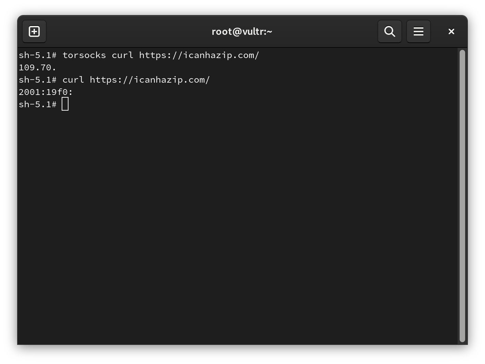

# `torsocks` - Вступ

`torsocks` — це утиліта для перенаправлення IP-трафіку з програми командного рядка через мережу [Tor](https://www.torproject.org/) або сервер SOCKS5.

## `torsocks` - Використання

```bash
dnf -y install epel-release
dnf -y install tor torsocks
systemctl enable --now tor
```

Стандартні параметри команди `torsocks` наведені далі, і за звичайних обставин не вимагають нічого додаткового. Параметри з’являються перед запуском програми (наприклад, `curl`):

| Опції      | Опис                                                               |
| ---------- | ------------------------------------------------------------------ |
| --shell    | Створює нову оболонку за допомогою LD_PRELOAD |
| -u USER    | Встановлює ім'я користувача SOCKS5                                 |
| -p PASS    | Встановлює пароль SOCKS5                                           |
| -a ADDRESS | Встановлює адресу сервера SOCKS5                                   |
| -P PORT    | Встановлює порт сервера SOCKS5                                     |
| -i         | Вмикає ізоляцію Tor                                                |

Зразок (відредагованого) результату перевірки IP [icanhazip.com](https://icanhazip.com/) через `torsocks`:



Зауважте, що IP-адреса «torsocks» відрізняється від прямої IP-адреси «curl».
