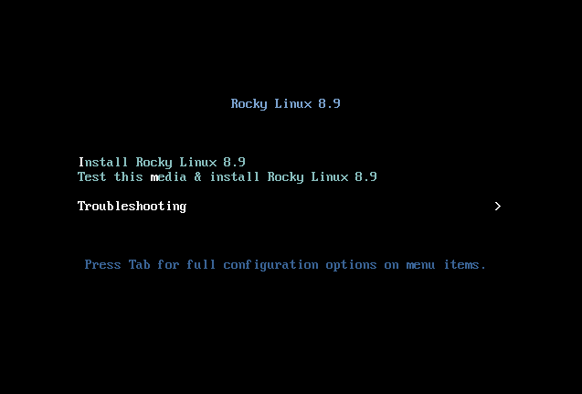

# Installazione di Rocky Linux 8

Questa guida mostra nel dettaglio i passaggi per installare una versione a 64 bit della distribuzione Rocky Linux su un sistema stand-alone.  Effettueremo un'installazione di categoria server utilizzando un'immagine di installazione del sistema operativo scaricata dal sito web del progetto Rocky Linux. Passeremo attraverso i passaggi di installazione e personalizzazione nelle sezioni seguenti.

## Prerequisiti per Installazione SO

Innanzitutto, è necessario scaricare la ISO da utilizzare per questa installazione di Rocky Linux.

L'ultima immagine ISO per la versione di Rocky Linux che utilizzeremo per questa installazione può essere scaricata da qui:

<https://www.rockylinux.org/download/>

Per scaricare l'ISO direttamente dalla riga di comando, utilizzare il comando `wget`:

```bash
wget https://download.rockylinux.org/pub/rocky/8.9/isos/x86_64/Rocky-8.9-x86_64-minimal.iso
```

Le ISO di Rocky Linux sono denominate secondo questa convenzione:

```text
Rocky-<MAJOR#>.<MINOR#>-<ARCH>-<VARIANT>.iso
```

Ad esempio, `Rocky-8.9-x86_64-minimal.iso`

!!! Note

    La pagina web del progetto Rocky elenca diversi mirror, situati in tutto il mondo. Scegliete il mirror geograficamente più vicino a voi. La lista dei mirror ufficiali può essere trovata [quì](https://mirrors.rockylinux.org/mirrormanager/mirrors).

## Verifica del file ISO dell'installazione

Se avete scaricato le ISO di Rocky Linux su una distribuzione Linux esistente, potete usare l'utility `sha256sum` per verificare che i file scaricati non siano corrotti. Mostreremo un esempio di come verificare il file `Rocky-8.5-x86_64-minimal.iso` controllando il suo checksum.

Per prima cosa scaricate il file che contiene le checksum ufficiali delle ISO disponibili. Mentre ci si trova ancora nella cartella che contiene la ISO di Rocky Linux scaricata, scaricare il file di checksum della ISO, digitando:

```bash
wget https://download.rockylinux.org/pub/rocky/8.9/isos/x86_64/CHECKSUM
```

Utilizzare l'utilità `sha256sum` per verificare l'integrità del file ISO contro la corruzione e/o la manomissione.

```bash
sha256sum -c CHECKSUM --ignore-missing
```

Questo controllerà l'integrità del file ISO scaricato in precedenza, a condizione che si trovi nella stessa directory. L'output dovrebbe mostrare:

```text
Rocky-8.9-x86_64-minimal.iso: OK
```

## L'Installazione

!!! Tip

    Prima dell'installazione, la Unified Extensible Firmware Interface (UEFI) o il Basic Input/Output System (BIOS) del sistema devono essere preconfigurati per l'avvio dal supporto corretto.

È possibile iniziare il processo di installazione se il computer è impostato per l'avvio dal supporto che contiene il file ISO.

Inserire e avviare il supporto di installazione (disco ottico, unità flash USB e così via).

Una volta avviato il computer, vi verrà presentata la schermata di benvenuto di Rocky Linux 8.



Se non si preme alcun tasto, il programma di installazione inizierà un conto alla rovescia, al termine del quale eseguirà automaticamente l'opzione predefinita, evidenziata:

`Test this media & install Rocky Linux 8`

È anche possibile premere ++enter++ in qualsiasi momento per avviare immediatamente il processo.

Verrà eseguita una rapida fase di verifica del supporto. Questa fase di verifica dei supporti può evitare di avviare l'installazione per poi scoprire a metà strada che il programma di installazione deve interromperla a causa di un supporto di installazione difettoso.

Dopo che la verifica del supporto è stata completata e il supporto è stato verificato come utilizzabile, il programma di installazione passa automaticamente alla schermata successiva.

Selezionare la lingua che si desidera utilizzare per l'installazione in questa schermata. Per questa guida, abbiamo scelto l'*Inglese (Stati Uniti)*. Quindi fare clic sul pulsante ++"Continue"++.

## Riepilogo Installazione

La schermata _Riepilogo Installazione_ è un'area all-in-one in cui si prendono le decisioni importanti sul sistema operativo da installare.

Lo schermo è approssimativamente diviso nelle seguenti sezioni:

- _Localizzazione_: (Supporto linguistico, e Tempo & Data)
- _Software_: (Installazione Sorgente e Selezione Software)
- _Sistema_: (Destinazione installazione e Rete & Nome Host)

Ci soffermeremo su ciascuna di queste sezioni e apporteremo modifiche ove necessario.

### Sezione Localizzazione

Questa sezione è utilizzata per personalizzare le voci relative al locale del sistema. Tra questi: tastiera, supporto della lingua, ora e data.

#### Tastiera

Nel nostro sistema demo di questa guida, accettiamo il valore predefinito (*English US*) e non apportiamo alcuna modifica.

Tuttavia, se è necessario apportare modifiche, dalla schermata *Installation Summary*, fare clic sull'opzione ++"Keyboard"++  per specificare il layout della tastiera del sistema. Se necessario, nella schermata successiva è possibile aggiungere altri layout di tastiera e specificarne l'ordine.

Fare clic su ++"done "++ al termine di questa schermata.

#### Supporto Lingue

L'opzione ++"Supporto lingua"++ della schermata *Riepilogo installazione* consente di specificare il supporto per ulteriori lingue che potrebbero essere necessarie sul sistema finito.

Accetteremo il valore predefinito (**Inglese - Stati Uniti**) e non apporteremo alcuna modifica, facendo clic su ++"done"++.

#### Data & Ora

Fare clic sull'opzione ++"Time & Date"++ nella schermata principale *Installation Summary* per visualizzare un'altra schermata che consente di selezionare il fuso orario in cui si trova la macchina. Scorri l'elenco delle regioni e delle città e seleziona l'area più vicina a te.

A seconda della fonte di installazione, l'opzione *Ora di rete* può essere impostata di default su *ON* o *OFF*. Accettare l'impostazione predefinita *ON*; ciò consente al sistema di impostare automaticamente l'ora corretta utilizzando il Network Time Protocol (NTP). Fare clic su ++“done ”++ dopo aver apportato le modifiche.

### Sezione Software

Nella sezione *Software* della schermata *Riepilogo installazione*, è possibile selezionare l'origine dell'installazione e i pacchetti aggiuntivi (applicazioni) che vengono installati.

#### Sorgente Installazione

Poiché stiamo eseguendo l'installazione utilizzando un'immagine completa di Rocky 8, noterete che il *supporto locale* è specificato automaticamente nella sezione Origine dell'installazione della schermata principale di *riepilogo dell'installazione*. Accetteremo le impostazioni predefinite.

!!! Tip

    Nell'area Origine dell'installazione si può scegliere di eseguire un'installazione basata sulla rete. Per un'installazione basata sulla rete, è necessario innanzitutto assicurarsi che una scheda di rete sul sistema di destinazione sia configurata correttamente e possa raggiungere Internet. Per eseguire un'installazione basata sulla rete, clicca su `Installation Source` e quindi seleziona il pulsante radio `On the network`. Una volta selezionato, scegli il protocollo `https` e digita il seguente URL nel campo di testo `download.rockylinux.org/pub/rocky/8/BaseOS/x86_64/os`. Clicca su `Done`.

#### Selezione Software

Facendo clic sull'opzione ++"Selezione software "++ nella schermata principale di *riepilogo dell'installazione*, si accede alla sezione dell'installazione in cui è possibile scegliere i pacchetti software esatti da installare sul sistema. L'area di selezione del software è suddivisa in:

- _Base Environment_: Server, Installazione minima, Sistema operativo personalizzato
- _Additional software for Selected Environment area_: Selezionando un Base Environment sul lato sinistro si presenta una varietà di software aggiuntivi correlati che possono essere installati per l'ambiente specificato sul lato destro.

Selezionare invece l'opzione *Installazione minima* (funzionalità di base).

Fare clic ++"done"++ in alto sullo schermo.

### Sezione Sistema

La sezione Sistema della schermata *Riepilogo installazione* viene utilizzata per personalizzare e apportare modifiche all'hardware sottostante del sistema di destinazione. Qui si creano le partizioni o i volumi del disco rigido, si specifica il file system da utilizzare e la configurazione di rete.

#### Destinazione Installazione

Dalla schermata *Riepilogo installazione*, fare clic sull'opzione `Destinazione installazione`. Si accede così all'area operativa corrispondente.

Verrà visualizzata una schermata con tutte le unità disco candidate disponibili sul sistema di destinazione. Se nel sistema è presente una sola unità disco, come nel nostro sistema campione, l'unità viene elencata sotto *Dischi standard locali* con un segno di spunta accanto. Facendo clic sull'icona del disco si attiva o disattiva il segno di spunta della selezione del disco. Vogliamo che sia selezionato/spuntato qui.

Nella sezione Opzioni di *Configurazione dell'archiviazione*, selezionare il pulsante di opzione ++"Automatic"++.

Quindi fare clic su ++“done”++ nella parte superiore dello schermo.

Una volta che il programma di installazione ha stabilito che il disco è utilizzabile, si torna alla schermata di *Riepilogo Installazione*.

### Rete & Nome Host

L'ultima operazione della procedura di installazione riguarda la configurazione di rete, dove è possibile configurare o modificare le impostazioni relative alla rete del sistema.

!!! Note

    Dopo aver fatto clic sull'opzione ++"Network & Hostname"++ , tutti i componenti dell'interfaccia di rete correttamente rilevati (come schede di rete Ethernet, wireless e così via) saranno elencati nel riquadro sinistro della schermata di configurazione della rete. A seconda della distribuzione Linux e della specifica configurazione hardware, i dispositivi Ethernet in Linux hanno nomi simili a `eth0`, `eth1`, `ens3`, `ens4`, `em1`, `em2`, `p1p1`, `enp0s3` e così via.

È possibile configurare ogni interfaccia tramite DHCP o impostare manualmente l'indirizzo IP. Se si sceglie di configurare manualmente, assicurarsi di avere pronte tutte le informazioni pertinenti, come l'indirizzo IP, la netmask e così via.

Facendo clic sul pulsante ++“Network & Hostname”++ nella schermata principale *Installation Summary* si apre la schermata di configurazione corrispondente. Tra le altre cose, è possibile configurare l'hostname del sistema (il nome predefinito è `localhost.localdomain`).

!!! Note

    È possibile modificare facilmente questo nome in un secondo momento, dopo l'installazione del sistema operativo. Per il momento, accettare il valore predefinito fornito per il nome dell'host.

La prossima importante operazione di configurazione riguarda le interfacce di rete del sistema. Innanzitutto, verificare che una scheda Ethernet (o qualsiasi altra scheda di rete) sia elencata nel riquadro di sinistra. Fare clic su uno qualsiasi dei dispositivi di rete rilevati nel riquadro di sinistra per selezionarlo. Le proprietà configurabili dell'adattatore di rete selezionato appariranno nel riquadro destro della schermata.

!!! Note

    Sul nostro sistema di esempio, abbiamo due dispositivi Ethernet (`ens3` e `ens4`), entrambi in stato connesso. Il tipo, il nome, la quantità e lo stato dei dispositivi di rete del vostro sistema possono variare rispetto a quelli del nostro sistema campione.

Assicurarsi che l'interruttore del dispositivo che si desidera configurare sia posizionato su `ON` nel riquadro di destra. In questa sezione verranno accettate tutte le impostazioni predefinite.

Fare clic su ++“done”++ per tornare alla schermata principale <em x-id=“3”>Installation summary</em>.

!!! warning "Attenzione"

    Prestare attenzione all'indirizzo IP del server in questa sezione del programma di installazione. Se non si dispone di un accesso fisico o facile alla console del sistema, queste informazioni saranno utili in seguito quando è necessario connettersi al server per continuare a lavorare.

## Fase di Installazione

Una volta soddisfatti delle scelte effettuate per le varie attività di installazione, la fase successiva del processo di installazione darà inizio all'installazione vera e propria.

### Sezione Impostazioni Utente

Questa sezione può essere utilizzata per creare una password per l'account utente `root` e anche per creare nuovi account amministrativi o non amministrativi.

### Impostare la password di root

Fare clic sul campo *Password di root* in *Impostazioni utente* per avviare la schermata dell'attività *Password di root*. Nella casella di testo *Password di root*, impostare una password forte per l'utente root.

!!! warning "Attenzione"

    Il superutente root è l'account più privilegiato del sistema. Pertanto, se si sceglie di utilizzarlo o di abilitarlo, è fondamentale proteggere questo account con una password forte.

Immettere nuovamente la stessa password nella casella di testo *Conferma*.

Fare clic su ++"done"++

### Creare un account utente

Fare quindi clic sul campo *Creazione utente* in *Impostazioni utente* per avviare la schermata dell'attività *Crea utente*. Quest'area operativa consente di creare un account utente privilegiato o non privilegiato (non amministrativo) sul sistema.

!!! Info

    La creazione e l'uso di un account non privilegiato per le attività quotidiane di un sistema è una buona pratica di amministrazione del sistema.

Creeremo un utente normale che può invocare i poteri di superutente (amministratore), come l'utente root, quando necessario.

Completare i campi della schermata *Create User* con le seguenti informazioni e fare clic su ++“done”++:

*Nome completo*: `rockstar`

*Nome utente*: `rockstar`

_Imposta questo utente come amministratore_: Spuntato

*Richiedi una password per utilizzare questo account*: Spuntato

*Password*: `04302021`

*Confermare password*: `04302021`

### Avviare l'installazione

Una volta soddisfatti delle scelte effettuate per le varie attività di installazione, fare clic sul pulsante Inizia l'installazione nella schermata principale di *Riepilogo Installazione*. L'installazione avrà inizio e il programma di installazione mostrerà l'avanzamento dell'installazione. Quando inizia l'installazione, iniziano ad essere eseguite varie attività in background, come il partizionamento del disco, la formattazione delle partizioni o dei volumi LVM, la verifica e la risoluzione delle dipendenze software, la scrittura del sistema operativo sul disco e così via.

!!! Note

    Se non si desidera continuare dopo aver fatto clic sul pulsante Inizia l'installazione, si può comunque uscire dall'installazione senza perdere i dati. Per uscire dal programma di installazione, è sufficiente resettare il sistema facendo clic sul pulsante Esci, premendo ctrl-alt-del sulla tastiera o premendo l'interruttore di reset o di alimentazione.

### Completare l'installazione

Dopo aver completato tutte le operazioni secondarie obbligatorie e dopo che il programma di installazione ha fatto il suo corso, verrà presentata una schermata finale di avanzamento dell'installazione con un messaggio di completato.

Infine, completare l'intera procedura facendo clic sul pulsante ++“Reboot System”++. Il sistema verrà riavviato.

### Accesso

Il sistema è ora impostato e pronto per l'uso. Verrà visualizzata la console Rocky Linux.


Per accedere al sistema, digitare `rockstar` al prompt di login e premere ++enter++.

Al prompt della password, digitare `04302021` (la passwrod di rockstar) e premere ++enter++ (la password <strong x-id=“1”><em x-id=“3”>non</em></strong> verrà riportata sullo schermo, è normale).

Dopo il login verrà eseguito il comando `whoami`, che mostra il nome dell'utente attualmente connesso.


