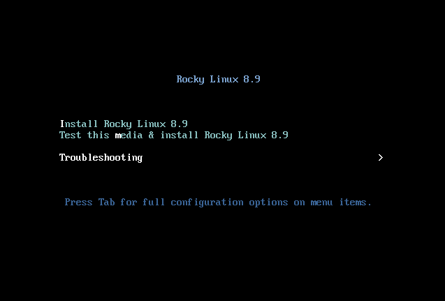
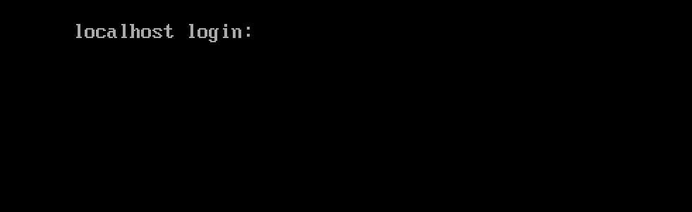

# Встановлення Rocky Linux 8

У цьому посібнику описано детальні кроки для встановлення 64-розрядної версії дистрибутива Rocky Linux на автономній системі.  Ми будемо виконувати встановлення класу сервера за допомогою образу інсталятора операційної системи, завантаженого з веб-сайту проекту Rocky Linux. У наступних розділах ми розглянемо кроки встановлення та налаштування.

## Передумови встановлення ОС

По-перше, вам потрібно завантажити ISO, який буде використовуватися для цієї інсталяції Rocky Linux.

Останній образ ISO для версії Rocky Linux, яку ми будемо використовувати для цієї інсталяції, можна завантажити тут:

<https://www.rockylinux.org/download/>

Щоб завантажити ISO безпосередньо з командного рядка, скористайтеся командою `wget`:

```bash
wget https://download.rockylinux.org/pub/rocky/8.9/isos/x86_64/Rocky-8.9-x86_64-minimal.iso
```

ISO Rocky Linux називаються відповідно до цієї угоди:

```text
Rocky-<MAJOR#>.<MINOR#>-<ARCH>-<VARIANT>.iso
```

Наприклад, `Rocky-8.9-x86_64-minimal.iso`

!!! Note "Примітка"

    Веб-сторінка проекту Rocky містить перелік кількох дзеркал, розташованих по всьому світу. По можливості вибирайте дзеркало, територіально найближче до вас. Список офіційних дзеркал можна знайти [тут](https://mirrors.rockylinux.org/mirrormanager/mirrors).

## Перевірка файлу ISO інсталятора

Якщо ви завантажили Rocky Linux ISO в існуючий дистрибутив Linux, ви можете скористатися утилітою `sha256sum`, щоб переконатися, що файли, які ви завантажили, не пошкоджені. Перевіривши його контрольну суму, ми покажемо приклад перевірки файлу `Rocky-8.5-x86_64-minimal.iso`.

Спочатку завантажте файл, який містить офіційні контрольні суми для доступних ISO. Перебуваючи в папці, яка містить завантажений ISO Rocky Linux, завантажте файл контрольної суми для ISO, введіть:

```bash
wget https://download.rockylinux.org/pub/rocky/8.9/isos/x86_64/CHECKSUM
```

Використовуйте утиліту `sha256sum`, щоб перевірити цілісність файлу ISO на пошкодження та/або втручання.

```bash
sha256sum -c CHECKSUM --ignore-missing
```

Це перевірить цілісність раніше завантаженого файлу ISO, якщо він знаходиться в тому самому каталозі. Вихід має показати:

```text
Rocky-8.9-x86_64-minimal.iso: OK
```

## Встановлення

!!! tip "Порада"

    Перед інсталяцією уніфікований розширюваний інтерфейс мікропрограми (UEFI) або базову систему вводу/виводу (BIOS) потрібно попередньо налаштувати для завантаження з правильного носія.

Ми можемо почати процес встановлення, якщо комп’ютер налаштовано на завантаження з носія, який містить файл ISO.

Вставте та завантажтеся з інсталяційного носія (оптичний диск, флешка тощо).

Після завантаження комп’ютера ви побачите екран привітання Rocky Linux 8.



Якщо ви не натиснете жодну клавішу, інсталятор почне зворотний відлік, після чого процес інсталяції автоматично виконає стандартний, виділений параметр:

`Перевірте цей носій і встановіть Rocky Linux 8`

Ви також можете будь-коли натиснути ++enter++, щоб негайно розпочати процес.

Відбудеться швидка перевірка медіа. Цей етап перевірки носія може позбавити вас від проблем із запуском інсталяції лише на півдорозі, щоб дізнатися, що інсталятор має перервати через неправильний інсталяційний носій.

Після завершення перевірки носія та його придатності до використання інсталятор автоматично перейде до наступного екрана.

На цьому екрані виберіть мову, яку ви хочете використовувати для встановлення. Для цього посібника ми вибрали *English (United States)*. Потім натисніть кнопку ++"Continue"++.

## Підсумок Інсталяції

Екран *Підсумок інсталяції* — це всеохоплююча область, де ви приймаєте важливі рішення щодо операційної системи, яку потрібно встановити.

Екран приблизно поділено на такі частини:

- *Localization*: (Клавіатура, підтримка мови та час і дата)
- *Software*: (Джерело встановлення та вибір програмного забезпечення)
- *System*: (Місце призначення та мережа та ім’я хоста)

Далі ми розглянемо кожен із цих розділів і внесемо необхідні зміни.

### Розділ локалізації

Цей розділ використовується для налаштування елементів, пов’язаних із системою. Це включає – клавіатуру, підтримку мови, час і дату.

#### Клавіатура

У нашій демонстраційній системі в цьому посібнику ми приймаємо значення за умовчанням (*English US*) і не вносимо жодних змін.

Однак, якщо вам потрібно внести будь-які зміни тут, на екрані *Підсумок встановлення* натисніть опцію ++"Клавіатура"++, щоб указати розкладку клавіатури системи. Ви можете додати додаткові розкладки клавіатури, якщо потрібно, на наступному екрані та вказати їх порядок.

Натисніть ++"done"++, коли ви закінчите з цим екраном.

#### Підтримка мови

Параметр ++"Language Support"++ на екрані *Installation Summary* дає змогу вказати підтримку додаткових мов, які можуть знадобитися вам у готовій системі.

Ми приймемо значення за замовчуванням (**англійська – США**) і не внесемо жодних змін, натисніть ++"done"++.

#### Час & Дата

Натисніть опцію ++"Time & Date"++ на головному екрані *Підсумок встановлення*, щоб відкрити інший екран, який дозволить вам вибрати часовий пояс, у якому знаходиться машина. Прокрутіть список регіонів і міст і виберіть найближчу до вас область.

Залежно від джерела інсталяції для параметра *Мережевий час* можна встановити значення *УВІМК.* або *ВИМКНЕНО* за умовчанням. Прийміть стандартне налаштування *ON*; це дозволяє системі автоматично встановлювати правильний час за допомогою мережевого протоколу часу (NTP). Натисніть ++"done"++ після внесення будь-яких змін.

### Розділ програмного забезпечення

У розділі *Програмне забезпечення* на екрані *Підсумок встановлення* ви можете вибрати джерело встановлення, а також додаткові пакети ( програми), які встановлюються.

#### Джерело встановлення

Оскільки ми виконуємо нашу інсталяцію, використовуючи повний образ Rocky 8, ви помітите, що *Локальний носій* автоматично вказано в розділі «Джерело інсталяції» на головному екрані *Підсумок інсталяції*. Ми приймемо стандартні налаштування.

!!! tip "Порада"

    Область «Джерело інсталяції» — це місце, де ви можете вибрати встановлення через мережу. Для мережевої інсталяції вам спочатку потрібно переконатися, що мережевий адаптер у цільовій системі налаштовано правильно та може підключитися до Інтернету. Щоб виконати встановлення через мережу, клацніть «Джерело встановлення» та виберіть перемикач «У мережі». Після вибору виберіть `https` як протокол і введіть наступну URL-адресу в текстове поле `download.rockylinux.org/pub/rocky/8/BaseOS/x86_64/os`. Натисніть `Готово`.

#### Вибір програмного забезпечення

Натиснувши опцію ++"Вибір програмного забезпечення"++ на головному екрані *Підсумок встановлення*, ви побачите розділ встановлення, де ви можете вибрати точні пакети програмного забезпечення, які буде встановлено в системі. Зона вибору програмного забезпечення поділяється на:

- *Базове середовище*: сервер, мінімальна інсталяція, спеціальна операційна система
- *Додаткове програмне забезпечення для області вибраного середовища*: вибір базового середовища ліворуч представляє різноманітне пов’язане додаткове програмне забезпечення, яке можна встановити для заданого середовища праворуч.

Натомість виберіть опцію *Мінімальна інсталяція* (базова функція).

Натисніть ++"done"++ у верхній частині екрана.

### Системний розділ

Розділ «Система» на екрані *Підсумок встановлення* використовується для налаштування та внесення змін до апаратного забезпечення цільової системи. Тут ви створюєте розділи або томи жорсткого диска, вказуєте файлову систему, яка буде використовуватися, і вказуєте конфігурацію мережі.

#### Місце призначення

На екрані *Підсумок встановлення* клацніть опцію `Місце призначення`. Це приведе вас до відповідної області завдань.

Ви побачите екран із усіма дисками-кандидатами, доступними у цільовій системі. Якщо у вас є лише один дисковод у системі, як у нашій зразковій системі, ви побачите диск у списку *Локальних стандартних дисків* із позначкою біля нього. Натискання піктограми диска вмикає або вимикає позначку вибору диска. Ми хочемо, щоб це було вибрано/перевірено тут.

У розділі параметрів *Налаштування сховища* виберіть перемикач ++"Автоматично"++.

Потім натисніть ++"done"++ у верхній частині екрана.

Коли інсталятор визначить, що у вас є придатний для використання диск, ви повернетеся до екрана *Підсумок встановлення*.

### Мережа & Ім'я хоста

Останнім завданням процедури інсталяції є конфігурація мережі, де ви можете налаштувати або налаштувати параметри, пов’язані з мережею, для системи.

!!! Note "Примітка"

    Після того, як ви клацнете опцію ++"Network & Hostname"++, усе правильно визначене обладнання мережевого інтерфейсу (наприклад, Ethernet, бездротові мережеві карти тощо) буде перераховано на лівій панелі екрана налаштування мережі. Залежно від дистрибутива Linux і конкретної установки апаратного забезпечення пристрої Ethernet у Linux мають назви, схожі на `eth0`, `eth1`, `ens3`, `ens4`, `em1`, `em2`, `p1p1`, `enp0s3`, і так далі.

Ви можете або налаштувати кожен інтерфейс за допомогою DHCP, або вручну встановити IP-адресу. Якщо ви вирішите налаштувати вручну, переконайтеся, що підготували всю відповідну інформацію, наприклад IP-адресу, маску мережі тощо.

Натискання кнопки ++"Network & Hostname"++ на головному екрані *Підсумок встановлення* відкриває відповідний екран конфігурації. Серед іншого, у вас є можливість налаштувати ім’я хоста системи (типове ім’я `localhost.localdomain`).

!!! Note "Примітка"

    Ви можете легко змінити цю назву після встановлення ОС. Наразі прийміть значення за замовчуванням, надане для імені хоста.

Наступне важливе завдання налаштування пов’язане з мережевими інтерфейсами в системі. Спочатку переконайтеся, що Ethernet-карта (або будь-яка мережева карта) указана на лівій панелі. Натисніть будь-який із виявлених мережевих пристроїв на лівій панелі, щоб вибрати його. Властивості вибраного мережевого адаптера, які можна налаштувати, з’являться на правій панелі екрана.

!!! Note "Примітка"

    У нашому прикладі системи ми маємо два пристрої Ethernet ("ens3" і "ens4"), усі вони знаходяться в підключеному стані. Тип, назва, кількість і стан мережевих пристроїв у вашій системі можуть відрізнятися від пристроїв у нашій зразковій системі.

Переконайтеся, що перемикач пристрою, який ви хочете налаштувати, переведено в положення `ON` на правій панелі. Ми приймемо всі значення за замовчуванням у цьому розділі.

Натисніть ++"done"++, щоб повернутися до головного екрана *Підсумок встановлення*.

!!! Warning "Важливо"

    Зверніть увагу на IP-адресу сервера в цьому розділі інсталятора. Якщо у вас немає фізичного або легкого консольного доступу до системи, ця інформація буде корисною, коли вам потрібно буде підключитися до сервера, щоб продовжити роботу на ньому.

## Фаза встановлення

Коли ви задоволені своїм вибором для різних завдань встановлення, наступний етап процесу встановлення розпочне власне встановлення.

### Розділ налаштувань користувача

Цей розділ можна використовувати для створення пароля для облікового запису користувача `root`, а також для створення нових адміністративних або неадміністративних облікових записів.

### Встановіть пароль root

Натисніть поле *Root Password* у *User Settings*, щоб запустити *Root Пароль* екран завдання. У текстовому полі *Root Password* установіть надійний пароль для користувача root.

!!! Warning "Важливо"

    Суперкористувач root є найбільш привілейованим обліковим записом у системі. Тому, якщо ви вирішите використовувати або ввімкнути його, дуже важливо захистити цей обліковий запис надійним паролем.

Знову введіть той самий пароль у текстове поле *Підтвердити*.

Натисніть ++"done"++.

### Створіть обліковий запис користувача

Потім клацніть поле *Створення користувача* в розділі *Параметри користувача*, щоб запустити екран завдань *Створити користувача*. Ця область завдань дозволяє створити привілейований або непривілейований (не адміністративний) обліковий запис користувача в системі.

!!! Info "Інформація"

    Створення та використання непривілейованого облікового запису для повсякденних завдань у системі є хорошою практикою адміністрування системи.

Ми створимо звичайного користувача, який може використовувати повноваження суперкористувача (адміністратора), такі ж, як користувач root, коли це необхідно.

Заповніть поля на екрані *Створити користувача* такою інформацією, а потім натисніть ++"done"++:

*Full name*: `rockstar`

*Username*: `rockstar`

*Make this user administrator*: Checked

*Require a password to use this account*: Checked

*Password*: `04302021`

*Confirm password*: `04302021`

### Почніть установку

Коли ви задоволені своїм вибором для різних завдань встановлення, натисніть кнопку «Почати встановлення» на головному екрані *Підсумок встановлення*. Розпочнеться інсталяція, і інсталятор покаже прогрес інсталяції. Коли почнеться інсталяція, у фоновому режимі почнуть виконуватися різноманітні завдання, як-от розділення диска, форматування розділів або томів LVM, перевірка та вирішення програмних залежностей, запис операційної системи на диск тощо.

!!! Note "Примітка"

    Якщо ви не бажаєте продовжувати після натискання кнопки «Почати інсталяцію», ви все одно можете безпечно завершити інсталяцію без втрати даних. Щоб вийти з інсталятора, скиньте систему, натиснувши кнопку «Вийти», натиснувши ctrl-alt-del на клавіатурі або натиснувши кнопку скидання чи живлення.

### Завершіть установку

Після того, як ви виконаєте всі обов’язкові підзавдання та програма встановлення запустить свій курс, вам буде запропоновано остаточний екран перебігу встановлення з повним повідомленням.

Нарешті завершіть всю процедуру, натиснувши кнопку ++"Reboot System"++. Система перезавантажиться.

### Log In

Тепер система налаштована та готова до використання. Ви побачите консоль Rocky Linux.



Щоб увійти в систему, введіть `rockstar` у рядку входу та натисніть ++enter++.

У вікні запиту пароля введіть `04302021` (пароль rockstar) і натисніть ++enter++ (пароль ***не*** відтворюється на екрані, це нормально).

Ми запустимо команду `whoami` після входу; ця команда показує ім'я користувача, який зараз увійшов в систему.


