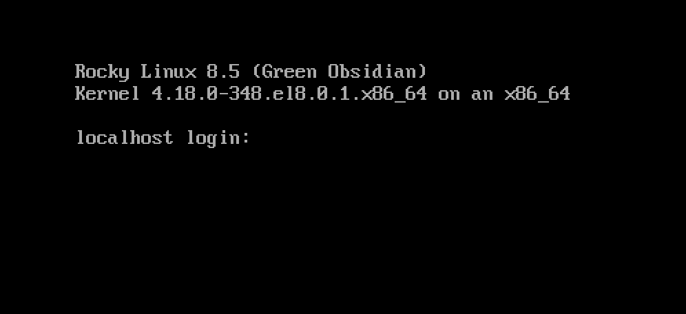

# 安装 Rocky Linux 8

本指南介绍了在独立系统上安装 64 位 Rocky Linux 发行版的详细步骤。  我们将使用从Rocky Linux项目网站下载的ISO镜像文件执行服务器类安装。 我们将在以下部分逐步完成安装和自定义步骤。


## 操作系统安装前提

首先，您需要下载ISO镜像文件以用于安装Rocky Linux。

用于此安装的Rocky Linux版本的最新ISO镜像可从以下位置下载：

```
https://www.rockylinux.org/download/
```

要直接从命令行下载 ISO，请使用 `wget` 命令：

```
wget https://download.rockylinux.org/pub/rocky/8.5/isos/x86_64/Rocky-8.5-x86_64-minimal.iso
```

Rocky Linux ISO 的命名遵循以下约定：

```
Rocky-<主版本号#>.<次版本号#>-<架构>-<变体>.iso
```

例如  `Rocky-8.5-x86_64-minimal.iso`

!!! note "说明"

    Rocky项目网页列出了几个镜像，它们位于全球各地。 选择地理位置离您最近的镜像。 官方镜像列表可在 [这里](https://mirrors.rockylinux.org/mirrormanager/mirrors) 找到。

## 验证安装的 ISO 文件

如果您已经在现有的 GNU/Linux 发行版上下载了 Rocky Linux ISO，那么可以使用 sha256sum 程序验证下载的文件没有损坏。 接下来通过一个示例，演示如何验证 `Rocky-8.5-x86_64-minimal.iso`。

首先下载包含可用于 ISO 的官方校验和的文件。 在包含已下载的Rocky Linux ISO的文件夹中下载ISO的校验和文件时，键入：

```
wget https://download.rockylinux.org/pub/rocky/8.7/isos/x86_64/CHECKSUM
```

使用 `sha256sum` 工具来验证ISO文件的完整性，防止损坏或者被篡改。

```
sha256sum -c CHECKSUM --ignore-missing
```

这将检查先前下载的ISO文件的完整性，前提是该文件位于同一目录中。 输出应显示：

```
Rocky-8.7-x86_64-minimal.iso: OK
```

## 安装

!!! tip "提示"

    在开始正确安装之前，系统的统一可扩展固件接口（UEFI）或基本输入/输出系统（BIOS）应配置为从正确的介质引导。

如果将计算机设置为从包含ISO文件的介质启动，则可以开始安装过程。

插入并从安装介质（光盘、USB闪存驱动器等）引导。

启动后，您将看到Rocky Linux的初始安装界面。


如果您不按任何键，提示将开始倒计时，之后安装过程将自动执行默认的突出显示选项：

`Test this media & install Rocky Linux 8`

您还可以随时按 <kbd>Enter</kbd> 键立即启动该过程。

将执行快速介质验证步骤。 此介质验证步骤，可以避免您在中途安装发现安装程序因安装介质损坏导致中止安装的情况出现。

介质检查运行完成，并且介质被成功验证为可用后，安装程序将自动跳到下一个界面。

在界面中选择要用于执行安装的语言。 在本指南中，我们选择_English (United States)_。 然后单击<kbd>Continue</kbd>按钮。

## 安装信息摘要

_Installation Summary_ 是一个集合多种设置的区域，您可以在其中对要安装的操作系统做出重要决定。

界面大致分为以下几部分：

- _Localization_：(键盘、语言支持以及时间和日期)
- _Software_：(安装源和软件选择)
- _System_：(安装目的地以及网络和主机名)

接下来将深入研究其中的每一个部分，并在必要时进行更改。

### Localization部分

此部分用于自定义与系统区域设置相关的项目。 包括 — 键盘、语言支持、时间和日期。

#### 分组不同格式类型

在本指南的演示系统上，我们选择默认值 (_English US_) ，不做其他更改。

但是，如果需要在此处进行任何更改，请从 _Installation Summary_ 界面中单击 <kbd>Keyboard</kbd> 选项指定系统的键盘布局。 如果需要，可以在后续界面中添加其他键盘布局并指定其顺序。

完成后，单击 <kbd>Done</kbd> 。

#### Language Support

<em x-id=“3”>安装摘要</em>屏幕上的<kbd>语言支持</kbd>选项，使您能够指定对已完成系统上，可能需要的其他语言的支持。

此处接受默认值 (__English – United States__) ，不做任何更改。 单击 <kbd>Done</kbd> 。

#### Time & Date

点击 <kbd>Time & Date</kbd> ，调出另一个界面，您可以通过该界面，选择机器所在的时区。 滚动区域和城市列表，选择离您最近的区域。

根据您的安装源，默认情况下可以将 _Network Time_ 选项设置为 _ON_ 或 _OFF_。 接受默认 _ON_ 设置；这允许系统使用网络时间协议 (NTP) 自动设置正确的时间。 进行任何更改后，请单击<kbd>Done</kbd>。

### Software部分

在 _Installation Summary_ 界面的 _Software_ 部分，您可以选择安装源以及要安装的其他软件包(应用程序)。

#### Installation Source

由于我们使用完整的 Rocky 8 镜像进行安装，您会注意到，_安装源_ 部分下会自动指定本地介质。 我们将接受预设的默认设置。

!!! Tip "提示"

    安装源区域是您可以选择执行基于网络安装的区域。 对于基于网络的安装，首先需要确保目标系统上的网络适配器配置正确，并且能够访问internet。 要执行基于网络的安装，请单击`Installation Source`，然后选择`On the network`单选按钮。 选择后，选择`https`作为协议，并在文本字段中键入以下URL `download.rockylinux.org/pub/rocky/8/BaseOS/x86_64/os`， 单击`Done`。

#### Software部分

单击<kbd>Software Selection</kbd>选项，将显示安装部分，从中您可以选择系统上要确定安装的软件包。 软件选择区域被划分为：

- _Base Environment_ : 服务器、最小安装、自定义操作系统
- _Additional software for Selected Environment area_ : 在左边选择一个基本环境，在右边呈现出可以为给定环境安装的各种相关附加软件。

我们这里选择 _最小安装_(基本功能)。

单击界面顶部的<kbd>Done</kbd>。

### System部分

_Installation Summary_界面用于自定义和更改目标系统的底层硬件。 在此处可以创建硬盘分区或LVM、指定要使用的文件系统，以及指定网络配置。

#### 安装目的地

在 _Installation Summary_ 界面上，点击 <kbd>Installation Destination</kbd> 选项。 这会将您带到相应的任务区域。

您将看到一个界面，显示目标系统上可用的所有候选磁盘驱动器。 如果系统上只有一个磁盘驱动器，如示例所示，您将看到在 _Local Standard Disks_ 下列出的驱动器，在它旁边有一个复选标记。 单击磁盘图标将打开或关闭磁盘选择复选标记。 我们在这里选择/勾选它。

在 _Storage Configuration_ 选项部分下，选择<kbd>Automatic</kbd>单选按钮。

然后单击界面顶部的 <kbd>Done</kbd> 。

安装程序确定有可用的磁盘后，将返回到 _Installation Summary_ 界面。

### Network & Hostname

安装过程的最后一项任务是网络配置，您可以在其中配置或调整系统的网络相关设置。

!!! Note "说明"

    单击 <kbd>Network & Hostname</kbd> 选项后，所有正确检测到的网络接口硬件(如以太网、无线网卡等)都将列在网络配置界面的左窗格中。 Linux 中以太网设备的名称类似于`eth0`、`eth1`、`ens3`、`ens4`、`em1`、`em2`、`p1p1`、`enp0s3`等，具体取决于 Linux 发行版和特定的硬件设置。

对于每个接口，您可以使用 DHCP 或手动配置 IP 地址。 如果您选择手动配置，请确保已准备好所有相关信息，如 IP 地址、子网掩码等。

单击 _Installation Summary_下的 <kbd>Network & Hostname</kbd> 按钮，将打开相应的配置界面。 此外，您还可以选择配置系统的主机名（默认为 `localhost.localdomain` ）。

!!! Note "说明"

    在安装操作系统之后，您可以很容易地更改此名称。 现在此处主机名为默认值。

下一个重要的配置任务与系统上的网络接口相关。 首先，验证左窗格中是否列出了以太网卡（或任何网卡）。 单击左窗格中检测到的任何网络设备，将其选中， 所选网络适配器的可配置属性将出现在界面的右窗格中。

!!! 在前面的例子中，这些参数与模块相同， 用 `=` 分隔的参数的值。

    在我们的示例系统中，我们有两个以太网设备（`ens3`和`ens4`），它们都处于连接状态。 您系统上的网络设备的类型、名称、数量和状态可能与示例系统上的不同。

确保要配置设备的开关在右窗格中处于 `ON` 位置。 我们将接受这一部分的所有默认值。

单击<kbd>Done</kbd>返回 _Installation Summary_ 主界面。

!!! Warning "警告"

    注意此安装程序此部分服务器的 IP 地址。 如果您无法对系统进行物理或轻松的控制台访问，当您需要连接到服务器以继续使用它时，这些信息将在以后派上用场。

## 安装阶段

一旦您对各种安装任务的选择感到满意，安装过程的下一阶段将开始正确的安装。

### User Settings部分

此部分可用于为 `root` 用户帐户创建密码，也可用于创建新的管理员或非管理员帐户。

### 设置root密码

单击 _User Settings_ 下面的_Root Password_ ，启动_Root Password_任务界面。 在 _Root Password_ 文本框中，为 root 用户设置了一个强大的密码。

!!! Warning "警告"

    root超级用户是系统中具有最高特权的帐户。 因此，如果您选择使用或启用它，使用强密码保护此帐户就显得非常重要。

在 _Confirm_ 文本框中再次输入相同的密码。

单击<kbd>Done</kbd>。


### 创建用户账户

接下来点击 _User Settings_ 下面的 _User Creation_ ，以启动 _Create User_任务界面。 此界面允许您在系统上创建特权或非特权（非管理）用户帐户。

!!! info "信息"

    !!! Info "资料"
        在系统上创建和使用非特权帐户执行日常任务是一种很好的系统管理习惯。

我们将创建一个常规的普通用户，在需要时可以调用超级用户（管理员）权限。

用以下信息填写 _Create User_ 屏幕中的字段，然后单击<kbd>Done</kbd>：

_Full name_: `rockstar`

_Username_: `rockstar`

_Make this user administrator_: 选中

_Require a password to use this account_: 选中

_Password_: `04302021`

_Confirm password_: `04302021`

### 开始安装

一旦您对各种安装任务的选择感到满意，请单击主界面_Installation Summary_上的"开始安装"按钮。 安装将开始，安装程序将显示安装进度。 安装开始时，各种任务将开始在后台运行，例如对磁盘进行分区、格式化分区或LVM卷、检查并解决软件依赖关系、将操作系统写入磁盘等。

!!! Note "说明"

    如果您不想在单击"开始安装"按钮后继续， 您仍然可以在不丢失数据的情况下安全地返回安装。 要退出安装程序，只需单击"Quit"按钮，按键盘上的ctrl-alt-del组合键，或者按下重置或电源开关，即可重置系统。

### 完成安装

完成所有必需的子任务且安装程序运行完毕后，您将看到带有安装进度完毕的屏幕信息。

最后，单击<kbd>Reboot System</kbd>按钮来完成整个过程， 系统将重启。

### 登录

该系统现在已经设置好且可以使用了。 您将看到Rocky Linux控制台。



要登录到系统，请在登录提示处键入 `rockstar`，然后按 <kbd>Enter</kbd> 键。

在密码提示处，键入 `04302021`(rockstar 的密码)，然后按  <kbd>Enter</kbd> 键(密码将 ***不会*** 显示在屏幕上，这是正常的）。

登录后运行`whoami`命令，该命令显示当前登录用户的名称。


