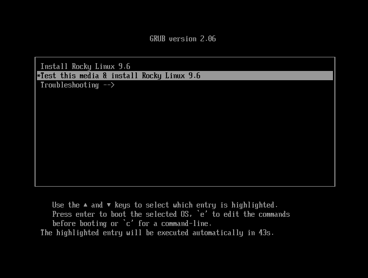

# Installazione di Rocky Linux 9

Questa è una guida dettagliata per l'installazione di una versione a 64 bit della distribuzione Rocky Linux su un sistema standalone. Verrà eseguita un'installazione server-class e verranno illustrate le opzioni di installazione e personalizzazione.

## Prerequisiti per l'installazione del sistema operativo

Scaricate la ISO da utilizzare per questa installazione di Rocky Linux.\
È possibile scaricare l'ultima immagine ISO della versione di Rocky Linux per questa installazione qui:

<https://www.rockylinux.org/download/>

Per scaricare l'ISO direttamente dalla riga di comando su un sistema Linux esistente, utilizzare il comando `wget`:

```bash
wget https://download.rockylinux.org/pub/rocky/9/isos/x86_64/Rocky-9.6-x86_64-minimal.iso
```

Le ISO di Rocky Linux seguono questa convenzione di denominazione:

```text
Rocky-<MAJOR#>.<MINOR#>-<ARCH>-<VARIANT>.iso
```

Per esempio, `Rocky-9.6-x86_64-minimal.iso`

!!! Note

    ```
    Il sito web del Rocky Project elenca diversi mirror situati in tutto il mondo. Selezionate il mirror geograficamente più vicino a voi. L'elenco dei mirror ufficiali è disponibile [qui] (https://mirrors.rockylinux.org/mirrormanager/mirrors).
    ```

## Verifica del file ISO del programma di installazione

Se avete scaricato le ISO di Rocky Linux su una distribuzione Linux esistente, potete usare l'utility `sha256sum` per verificare che i file scaricati non siano corrotti. Dimostreremo come verificare il file `Rocky-9.6-x86_64-minimal.iso` controllando il suo checksum.

1. Scaricate il file che contiene le checksum ufficiali delle ISO disponibili.

2. Mentre ci si trova ancora nella cartella che contiene l'ISO di Rocky Linux scaricata, scaricare il file di checksum dell'ISO, digitare:

    ```bash
    wget -O CHECKSUM https://download.rockylinux.org/pub/rocky/9/isos/x86_64/CHECKSUM
    ```

3. Utilizzare l'utilità `sha256sum` per verificare l'integrità del file ISO contro la corruzione o la manomissione.

    ```bash
    sha256sum -c CHECKSUM --ignore-missing
    ```

   Controllerà l'integrità del file ISO scaricato in precedenza, a condizione che si trovi nella stessa directory. Si dovrebbe vedere questo risultato:

    ```text
    Rocky-9.6-x86_64-minimal.iso: OK
    ```

## Installazione

!!! tip

    Prima di iniziare l'installazione vera e propria, la Unified Extensible Firmware Interface (UEFI) o il Basic Input/Output System (BIOS) del sistema devono essere preconfigurati per l'avvio dal supporto corretto.

Se il computer è impostato per l'avvio dal supporto che contiene il file ISO, possiamo iniziare il processo di installazione.

1. Inserire e avviare il supporto di installazione (ad esempio, disco ottico, unità flash USB).

2. Dopo l'avvio del computer, viene visualizzata la schermata iniziale di benvenuto di Rocky Linux 9.6.

   

3. Se non si preme alcun tasto, il programma di installazione avvia un conto alla rovescia, al termine del quale il processo di installazione esegue automaticamente l'opzione predefinita, evidenziata:

   `Test this media & install Rocky Linux 9.6`

   È anche possibile premere ++enter++ in qualsiasi momento per avviare immediatamente il processo.

4. Viene eseguita una rapida fase di verifica dei supporti.\
   Questa fase di verifica del supporto può evitare di avviare l'installazione per poi scoprire a metà strada che il programma di installazione deve essere interrotto a causa di un supporto di installazione difettoso.

5. Una volta completato il controllo del supporto e verificata la sua utilizzabilità, il programma di installazione passa automaticamente alla schermata successiva.

6. Selezionare la lingua che si desidera utilizzare per l'installazione di questa schermata. Per questa guida, si seleziona _English (United States)_. Quindi fare clic sul pulsante ++“continua ”++.

## Riepilogo Installazione

La schermata `Installation Summary` è un'area completa in cui si prendono decisioni importanti sull'installazione del sistema.

La schermata è suddivisa grossomodo nelle seguenti sezioni:

 - _LOCALIZATION_
 - _SOFTWARE_
 - _SYSTEM_
 - _USER SETTINGS_

Si approfondiranno ciascuna di queste sezioni, apportando le modifiche necessarie.

### Sezione Localization

Questa sezione consente di personalizzare le voci relative alla posizione geografica del sistema. Tra questi: tastiera, supporto della lingua, ora e data.

#### Tastiera

Nel sistema demo di questa guida, si accetta il valore predefinito (_English US_) e non si apporta alcuna modifica.

Tuttavia, se è necessario apportare modifiche, dalla schermata _Installation Summary_, fare clic sull'opzione ++"keyboard"++ per specificare il layout della tastiera del sistema. Con il pulsante ++plus++ è possibile aggiungere altri layout di tastiera, se necessario, nella schermata successiva e selezionare l'ordine preferito.

Al termine di questa schermata, fare clic su ++“done ”++.

#### Supporto Lingua

L'opzione `Language Support` nella schermata _Installation Summary_ consente di specificare il supporto per altre lingue.

Si accetterà il valore predefinito, **English (United States)**, e non si apporterà alcuna modifica. Fare clic su "Done".

#### Time & Date

Fare clic sull'opzione ++"Time & Date"++ nella schermata principale _Riepilogo installazione_ per visualizzare un'altra schermata che consente di selezionare il fuso orario in cui si trova la macchina. Scorrete l'elenco delle regioni e delle città e selezionate l'area più vicina a voi.

A seconda dell'origine dell'installazione, l'opzione _Network Time_ potrebbe essere _ON_ o _OFF_ per impostazione predefinita. Accettare l'impostazione predefinita _ON_. Ciò consente al sistema di impostare automaticamente l'ora corretta utilizzando il Network Time Protocol (NTP).

Fare clic su ++“done ”++ dopo aver apportato le modifiche.

### Sezione Software

Nella sezione _Software_ della schermata _Installation Summary_, è possibile selezionare o modificare l'origine dell'installazione e i pacchetti aggiuntivi (applicazioni) che vengono installati.

#### Origine d'Installazione

Poiché l'installazione utilizza un'immagine ISO di Rocky Linux 9.6, si noterà che _Local Media_ è specificato automaticamente nella sezione Origine dell'installazione della schermata principale _Installation Summary_. È possibile accettare le impostazioni predefinite.

!!! Tip

    ```
    L'area Source dell'installazione consente di eseguire un'installazione network-based (ad esempio, se si utilizza la ISO di avvio di Rocky Linux - Rocky-9.6-x86_64-boot.iso). Per un'installazione network-based, è necessario innanzitutto assicurarsi che una scheda di rete sul sistema di destinazione sia configurata correttamente e possa accedere a Internet. Per eseguire un'installazione network-based, fare clic su +++"Installation Source"++ e selezionare il pulsante di opzione ++"On the network"++. Una volta selezionato, scegliere il protocollo corretto e digitare l'URI dell'origine dell'installazione. Fare clic su ++"Done"++.
    ```

#### Sezione Software

Facendo clic sull'opzione ++"Software Selection"++ nella schermata principale _Installation Summary_ si accede alla sezione dell'installazione in cui è possibile selezionare gli esatti pacchetti software installati sul sistema. Esistono due aree di selezione del software:

 - **Ambiente di base**: Installazione minima e sistema operativo personalizzato
 - **Software aggiuntivo per l'ambiente selezionato**: La selezione di un ambiente di base sul lato sinistro presenta una serie di software aggiuntivi da installare per l'ambiente in questione sul lato destro.

Selezionare l'opzione _Minimal Install_ (funzionalità di base).

Fare clic su ++“done ”++ nella parte superiore dello schermo.

### Sezione di Sistema

Utilizzare la sezione Sistema della schermata _Installation Summary_ per personalizzare e apportare modifiche all'hardware sottostante del sistema di destinazione. Qui si creano le partizioni o i volumi del disco rigido, si specifica il file system, la configurazione di rete, si attiva o disattiva KDUMP o si seleziona un profilo di sicurezza.

#### Destinazione d'Installazione

Nella schermata _Installation Summary_, fare clic sull'opzione ++"Installation Destination"++. Si accede così all'area operativa corrispondente.

Verrà visualizzata una schermata con tutte le unità disco candidate disponibili sul sistema di destinazione. Se nel sistema è presente una sola unità disco, come nel nostro sistema campione, l'unità viene elencata sotto _Local Standard Disks_ con un segno di spunta accanto. Facendo clic sull'icona del disco si attiva o disattiva il segno di spunta della selezione del disco. Mantenere la spunta per selezionare il disco.

Nella sezione _Storage Configuration_:

1. Selezionare il pulsante di opzione ++“Automatic”++.

2. Fare clic su ++“done ”++ nella parte superiore dello schermo.

3. Una volta accertato che il disco è utilizzabile, il programma di installazione torna alla schermata _Installation Summary_.

### Network & Host Name

Il seguente importante compito della procedura di installazione, nell'area Sistema, riguarda la configurazione di rete, dove è possibile configurare o modificare le impostazioni relative alla rete del sistema.

!!! Note

    ```
    Dopo aver fatto clic sull'opzione ++"Network & Hostname"++ , tutti i dispositivi di interfaccia di rete correttamente rilevati (come schede di rete Ethernet, wireless, ecc.) saranno elencati nel riquadro sinistro della schermata di configurazione della rete. A seconda della configurazione hardware specifica, i dispositivi Ethernet in Linux hanno nomi simili a `eth0`, `eth1`, `ens3`, `ens4`, `em1`, `em2`, `p1p1`, `enp0s3` e così via. 
    È possibile configurare ogni interfaccia utilizzando DHCP o impostando manualmente l'indirizzo IP. 
    Se si sceglie di configurare manualmente, assicurarsi di avere pronte tutte le informazioni necessarie, come l'indirizzo IP, la netmask e altri dettagli rilevanti.
    ```

Facendo clic sul pulsante ++"Network & Hostname"++ nella schermata principale _Installation Summary_ si apre la schermata di configurazione corrispondente. Tra le altre cose, è possibile configurare l'hostname del sistema.

!!! Note

    ```
    È possibile modificare facilmente l'hostname del sistema in un secondo momento, dopo l'installazione del sistema operativo.
    ```

La seguente importante operazione di configurazione riguarda le interfacce di rete del sistema.

1. Verificare che nel riquadro di sinistra sia elencata una scheda Ethernet (o qualsiasi altra scheda di rete)
2. Fare clic su uno qualsiasi dei dispositivi di rete rilevati nel riquadro di sinistra per selezionarlo.\
   Le proprietà configurabili dell'adattatore di rete selezionato appaiono nel riquadro destro della schermata.

!!! Note

    ```
    Nel nostro sistema campione, abbiamo due dispositivi Ethernet (`ens3` e `ens4`), tutti in stato di connessione. Il tipo, il nome, la quantità e lo stato dei dispositivi di rete sul vostro sistema potrebbero essere diversi da quelli del nostro sistema demo.
    ```

Verificare che l'interruttore del dispositivo che si desidera configurare sia in posizione `ON` (blu) nel riquadro di destra.
In questa sezione verranno accettate tutte le impostazioni predefinite.

Fare clic su ++"done "++ per tornare alla schermata principale _Installation Summary_.

!!! Warning "Attenzione"

    ```
    Prestare attenzione all'indirizzo IP del server in questa sezione del programma di installazione. Supponiamo che non si disponga di un accesso fisico o facile alla console del sistema. In tal caso, queste informazioni saranno utili in seguito, quando sarà necessario collegarsi al server per continuare a lavorarci dopo il completamento dell'installazione del sistema operativo (OS).
    ```

### Sezione User Settings

Utilizzare questa sezione per creare una password per l'account utente `root` e per creare nuovi account amministrativi o non amministrativi.

#### Root Password

1. Fare clic sul campo _Root Password_  in _User Settings_ per avviare la schermata dell'attività _Root Password_.

   !!! Warning "Attenzione"

        ```
         Il superutente root è l'account più privilegiato del sistema. Se si sceglie di utilizzarlo o abilitarlo, è necessario proteggere questo account con una password forte.
        ```

2. Nella casella di testo _Root Password_, impostare una password forte per l'utente root.

3. Immettere nuovamente la stessa password nella casella di testo _Confirm_.

4. Fare clic su ++"done"++.

#### User Creation

Per creare l'utente:

1. Fare clic sul campo _User Creation_ in _User Settings_ per avviare la schermata dell'attività _Create User_.\
   Quest'area operativa consente di creare un account utente privilegiato (amministrativo) o non privilegiato (non amministrativo).

   !!! Info

        ```
         La creazione e l'uso di un account non privilegiato per le attività quotidiane di un sistema è una pratica ottimale nell'amministrazione del sistema.
        ```

   Sarà creato un utente normale che può invocare i poteri di superutente (amministratore) quando necessario.

2. Completate i campi della schermata _Create User_ con le seguenti informazioni:

    - **Full name**:
       `rockstar`
    - **Username**:
       `rockstar`
    - **Make this user administrator**:
       Selezionato
    - **Require a password to use this account**:
       Selezionato
    - **Password**:
       `04302021`
    - **Confirm password**:
       `04302021`

3. Fare clic su ++"done"++.

## Fase dell'Installer

Una volta soddisfatti delle scelte fatte per le varie operazioni di installazione, inizierà la fase successiva del processo di installazione: l'installazione vera e propria.

### Inizio Installazione

Una volta soddisfatti delle scelte effettuate per le varie operazioni di installazione, fare clic sul pulsante ++"Begin Installation"++ nella schermata principale Installation Summary\*.

L'installazione avrà inizio e l'installer mostrerà l'avanzamento dell'installazione.
Dopo l'avvio dell'installazione, vengono eseguite varie attività in background, tra cui il partizionamento del disco, la formattazione delle partizioni o dei volumi LVM, la verifica e la risoluzione delle dipendenze software e la scrittura del sistema operativo sul disco.

!!! Note

    ```
    Se non si desidera continuare dopo aver fatto clic sul pulsante Inizia l'installazione, si può comunque uscire dall'installazione senza perdere i dati. Per uscire dal programma di installazione, è sufficiente resettare il sistema facendo clic sul pulsante Esci, premendo Ctrl-Alt-Canc sulla tastiera o premendo l'interruttore di reset o di alimentazione.
    ```

### Completare l'Installazione

Dopo che il programma di installazione ha completato il suo lavoro, verrà visualizzata una schermata finale di avanzamento dell'installazione con un messaggio di completamento.

Infine, completare l'intera procedura facendo clic sul pulsante ++"Reboot System"++. Il sistema verrà riavviato.

### Log In

Il sistema è ora impostato e pronto per l'uso. Verrà visualizzata la console Rocky Linux.


Per accedere al sistema:

1. Digitare `rockstar` al prompt di login e premere ++enter++.

2. Al prompt della password, digitate `04302021` (la password di Rockstar) e premete ++invio++ (la password non verrà riecheggiata sullo schermo, è normale).

3. Eseguire il comando `whoami` dopo il login.\
   Questo comando mostra il nome dell'utente attualmente collegato.


