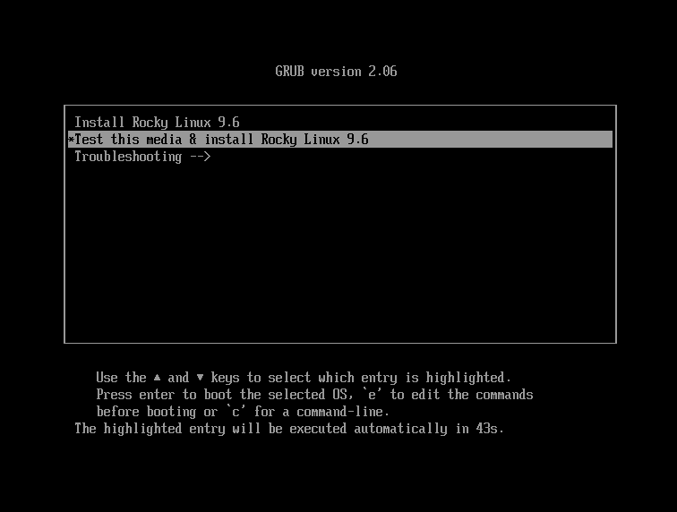

# Встановлення Rocky Linux 9

Це детальний посібник із встановлення 64-розрядної версії дистрибутива Rocky Linux в автономній системі. Ми виконаємо інсталяцію серверного класу та розглянемо варіанти інсталяції та налаштування.

## Необхідні умови для встановлення операційної системи

Завантажте ISO-файл для цієї установки Rocky Linux.\
Ви можете завантажити найновіший ISO-образ для версії Rocky Linux для цієї установки тут:

<https://www.rockylinux.org/download/>

Щоб завантажити ISO-образ безпосередньо з командного рядка на існуючій системі на базі Linux, скористайтеся командою `wget`:

```bash
wget https://download.rockylinux.org/pub/rocky/9/isos/x86_64/Rocky-9.6-x86_64-minimal.iso
```

ISO Rocky Linux дотримується цієї угоди про іменування:

```text
Rocky-<MAJOR#>.<MINOR#>-<ARCH>-<VARIANT>.iso
```

Наприклад, `Rocky-9.6-x86_64-minimal.iso`

!!! Note "Примітка"

    На вебсайті Rocky Project перелічено кілька дзеркал, розташованих по всьому світу. Виберіть дзеркало, яке географічно найближче до вас. Список офіційних дзеркал можна знайти [тут](https://mirrors.rockylinux.org/mirrormanager/mirrors).

## Перевірка файлу ISO програми встановлення

Якщо ви завантажили ISO-образ Rocky Linux на існуючий дистрибутив Linux, ви можете скористатися утилітою `sha256sum`, щоб перевірити, чи завантажені вами файли не пошкоджені. Ми продемонструємо, як перевірити файл `Rocky-9.6-x86_64-minimal.iso`, перевіривши його контрольну суму.

1. Завантажте файл, який містить офіційні контрольні суми для доступних ISO.

2. Перебуваючи в папці, яка містить завантажений ISO Rocky Linux, завантажте файл контрольної суми для ISO, введіть:

      ```bash
      wget -O CHECKSUM https://download.rockylinux.org/pub/rocky/9/isos/x86_64/CHECKSUM
      ```

3. Використовуйте утиліту `sha256sum` для перевірки цілісності ISO-файлу на предмет пошкодження або несанкціонованого втручання.

      ```bash
      sha256sum -c CHECKSUM --ignore-missing
      ```

    Це перевіряє цілісність файлу ISO, завантаженого раніше, за умови, що він знаходиться в тому самому каталозі. Ви повинні побачити цей вивід:

      ```text
      Rocky-9.6-x86_64-minimal.iso: OK
      ```

## Встановлення

!!! tip

    Перед належним встановленням уніфікований розширюваний інтерфейс вбудованого програмного забезпечення (UEFI) або базову систему введення/виведення (BIOS) потрібно попередньо налаштувати для завантаження з правильного носія.

Якщо ви налаштували комп'ютер на завантаження з носія з ISO-файлом, ви можете розпочати встановлення.

1. Вставте та завантажтеся з інсталяційного носія (оптичний диск, флешка тощо).

2. Після завантаження комп'ютера ви побачите вітальний екран Rocky Linux 9.6.

    

3. Якщо ви не натиснете жодної клавіші, програма встановлення почне зворотний відлік, після чого процес встановлення автоматично виконає виділений параметр за замовчуванням:

    `Test this media & install Rocky Linux 9.6`

    Ви також можете будь-коли натиснути ++enter++, щоб негайно розпочати процес.

4. Відбувається швидка перевірка медіа.\
    Цей крок перевірки носія може позбавити вас клопоту з початком інсталяції, після якого ви виявляєте, що програма інсталяції має бути зупинена через несправний інсталяційний носій.

5. Після завершення перевірки носія та його придатності до використання програма встановлення автоматично переходить до наступного екрана.

6. Виберіть мову, яку ви хочете використовувати для встановлення цього екрана. Для цього посібника ми обрали _English (United States)_. Потім натисніть кнопку ++"continue"++.

## Підсумок Інсталяції

Екран «Підсумок встановлення» – це універсальна область, де ви приймаєте важливі рішення щодо встановлення системи.

Екран приблизно поділено на такі частини:

- _LOCALIZATION_
- _SOFTWARE_
- _SYSTEM_
- _USER SETTINGS_

Далі ми розглянемо кожен із цих розділів і внесемо необхідні зміни.

### Розділ локалізації

Цей розділ налаштовує елементи, пов’язані з географічним розташуванням системи. Це включає – клавіатуру, підтримку мови, час і дату.

#### Клавіатура

У демонстраційній системі цього посібника ми приймаємо значення за замовчуванням (_англійська (США)_) і не вносимо жодних змін.

Однак, якщо вам потрібно внести будь-які зміни тут, на екрані _Підсумок встановлення_ натисніть опцію ++"клавіатура"++, щоб указати розкладку клавіатури системи. Використовуючи кнопку ++plus++, ви можете додати додаткові розкладки клавіатури, якщо потрібно, на наступному екрані та навіть вказати бажаний порядок.

Коли ви закінчите з цим екраном, натисніть кнопку ++"готово"++.

#### Підтримка мови

Опція «Підтримка мов» на екрані _Підсумок встановлення_ дозволяє вказати підтримку додаткових мов.

Ми приймемо значення за замовчуванням, **Англійська (Сполучені Штати)**, і не внесемо жодних змін. Натисніть кнопку «Готово».

#### Час і дата

Натисніть опцію ++"Час і дата"++ на головному екрані _Підсумок встановлення_, щоб відкрити ще один екран, на якому можна вибрати часовий пояс, у якому знаходиться машина. Прокрутіть список регіонів і міст і виберіть найближчу до вас область.

Залежно від джерела інсталяції, параметр _Мережевий час_ може бути за замовчуванням _УВІМК._ або _ВИМК._. Прийміть налаштування за замовчуванням _УВІМК._. Це дозволяє системі автоматично встановлювати правильний час за допомогою протоколу мережевого часу (NTP).

Натисніть ++"done"++ після внесення будь-яких змін.

### Розділ програмного забезпечення

У розділі _Програмне забезпечення_ на екрані _Підсумок встановлення_ ви можете вибрати або змінити джерело встановлення, а також додаткові пакети (програми), які встановлюються.

#### Джерело встановлення

Оскільки під час встановлення використовується ISO-образ Rocky Linux 9.6, ви помітите, що _Локальний носій_ автоматично вказується в розділі «Джерело встановлення» на головному екрані _Підсумок встановлення_. Ви можете прийняти стандартні налаштування.

!!! tip "Порада"

    Розділ «Джерело інсталяції» дозволяє виконати мережеву інсталяцію (наприклад, якщо ви використовуєте завантажувальний ISO-образ Rocky Linux — Rocky-9.6-x86_64-boot.iso). Для мережевої інсталяції переконайтеся, що мережевий адаптер на цільовій системі налаштовано правильно та має доступ до Інтернету. Щоб виконати мережеву інсталяцію, натисніть ++«Джерело інсталяції»++, а потім виберіть перемикач ++«У мережі»++. Після вибору виберіть правильний протокол і введіть URI для джерела інсталяції. Натисніть ++«Готово»++.

#### Вибір програмного забезпечення

Натискання опції ++"Вибір програмного забезпечення"++ на головному екрані _Підсумок встановлення_ відкриє розділ встановлення, де ви можете вибрати точні пакети програмного забезпечення, встановлені в системі. Існує дві області вибору програмного забезпечення:

- **Базове середовище**: Мінімальна інсталяція та користувацька операційна система
- **Додаткове програмне забезпечення для вибраного середовища**: Вибір базового середовища ліворуч відображає різноманітне додаткове програмне забезпечення для встановлення для цього середовища праворуч.

Виберіть опцію _Мінімальна інсталяція_ (базова функціональність).

Натисніть ++"done"++ у верхній частині екрана.

### Системний розділ

Використовуйте розділ «Система» на екрані _Підсумок встановлення_ для налаштування та внесення змін до параметрів, пов’язаних з базовим обладнанням цільової системи. Тут ви створюєте розділи або томи жорсткого диска, вказуєте файлову систему, вказуєте конфігурацію мережі, увімкніть або вимкніть KDUMP або виберіть профіль безпеки.

#### Місце призначення

На екрані _Підсумок встановлення_ виберіть опцію ++"Місце призначення встановлення"++. Це приведе вас до відповідної області завдань.

Ви побачите екран із усіма дисками-кандидатами, доступними у цільовій системі. Якщо у вашій системі лише один дисковод, як у нашій зразковій системі, ви побачите диск у списку _Локальні стандартні диски_ з позначкою поруч із ним. Клацання на значку диска вмикає або вимикає позначку вибору диска. Поставте прапорець, щоб вибрати диск.

У розділі _Конфігурація сховища_:

1. Виберіть перемикач ++"Automatic"++.

2. Натисніть ++"done"++ у верхній частині екрана.

3. Щойно програма встановлення визначить, що у вас є вільний диск, вона повернеться до екрана _Підсумок встановлення_.

### Мережа та ім'я хоста

Наступне важливе завдання процедури інсталяції в системній області стосується конфігурації мережі, де ви можете налаштувати або налаштувати параметри, пов’язані з мережею, для системи.

!!! Note "Примітка"

    Після натискання опції ++"Мережа та ім'я хоста"++ все правильно виявлене обладнання мережевого інтерфейсу (наприклад, Ethernet, бездротові мережеві карти тощо) буде перераховано в лівій панелі екрана конфігурації мережі. Залежно від конкретної конфігурації обладнання, пристрої Ethernet у Linux мають назви, подібні до `eth0`, `eth1`, `ens3`, `ens4`, `em1`, `em2`, `p1p1`, `enp0s3` тощо.
    
    Ви можете налаштувати кожен інтерфейс за допомогою DHCP або вручну встановити IP-адресу.
    
    Якщо ви вирішите налаштувати вручну, переконайтеся, що у вас є вся необхідна інформація, така як IP-адреса, маска мережі та інші відповідні дані.

Натискання кнопки ++"Мережа та ім'я хоста"++ на головному екрані _Підсумок встановлення_ відкриває відповідний екран конфігурації. Крім іншого, у вас є можливість налаштувати ім’я хоста системи.

!!! Note "Примітка"

    Ви можете легко змінити ім’я хоста системи пізніше після встановлення ОС.

Наступне важливе завдання налаштування пов’язане з мережевими інтерфейсами в системі.

1. Переконайтеся, що на лівій панелі зазначено плату Ethernet (або будь-яку мережеву карту).
2. Натисніть будь-який із виявлених мережевих пристроїв на лівій панелі, щоб вибрати його.\
    Налаштовувані властивості вибраного мережевого адаптера відображаються в правій області екрана.

!!! Note "Примітка"

    У нашій зразковій системі є два пристрої Ethernet (`ens3` та `ens4`), всі з яких перебувають у підключеному стані. Тип, назва, кількість та стан мережевих пристроїв у вашій системі можуть відрізнятися від тих, що є в нашій демонстраційній системі.

Переконайтеся, що перемикач пристрою, який ви хочете налаштувати, знаходиться в положенні «УВІМК.» (синій) на правій панелі.
Ми приймемо всі значення за замовчуванням у цьому розділі.

Натисніть кнопку ++"готово"++, щоб повернутися до головного екрана _Підсумок встановлення_.

!!! Warning "Важливо"

    Зверніть увагу на IP-адресу сервера в цьому розділі інсталятора. Припустимо, у вас немає фізичного або легкого консольного доступу до системи. У такому разі ця інформація стане в пригоді пізніше, коли вам потрібно буде підключитися до сервера, щоб продовжити роботу на ньому після завершення встановлення ОС.

### Розділ налаштувань користувача

Використовуйте цей розділ для створення пароля для облікового запису користувача `root` та для створення нових облікових записів адміністратора або неадміністратора.

#### Пароль root

1. Клацніть поле _Пароль root_ у розділі _Налаштування користувача_, щоб розпочати екран завдання _Пароль root_.

    !!! Warning "Важливо"

          ```
           Суперкористувач root — це обліковий запис із найвищими привілеями в системі. Тому, якщо ви вирішите використовувати або ввімкнути його, вам необхідно захистити цей обліковий запис надійним паролем.
          ```

2. У текстовому полі _Пароль root_ встановіть надійний пароль для користувача root.

3. Введіть той самий пароль ще раз у текстове поле _Підтвердити_.

4. Натисніть ++"done"++.

#### Створення користувача

Щоб створити користувача:

1. Клацніть поле _Створення користувача_ у розділі _Налаштування користувача_, щоб розпочати екран завдання _Створення користувача_.\
    Ця область завдань призначена для створення привілейованого (адміністративного) або непривілейованого (неадміністративного) облікового запису користувача.

    !!! Info "Інформація"

          ```
           Створення та використання непривілейованого облікового запису для щоденних завдань у системі є найкращою практикою системного адміністрування.
          ```

    Ми створимо звичайного користувача, який за потреби може використовувати повноваження суперкористувача (адміністратора).

2. Заповніть поля на екрані _Створити користувача_, вказавши таку інформацію:

    - **Full name**:
        `rockstar`
    - **Username**:
        `rockstar`
    - **Make this user administrator**:
        Checked
    - **Require a password to use this account**:
        Checked
    - **Password**:
        `04302021`
    - **Confirm password**:
        `04302021`

3. Натисніть ++"done"++.

## Фаза встановлення

Коли ви задоволені своїм вибором для різних завдань встановлення, наступний етап процесу встановлення розпочне власне встановлення.

### Почніть установку

Щойно ви будете задоволені вибраними параметрами для різних завдань встановлення, натисніть кнопку ++"Розпочати встановлення"++ на головному екрані _Підсумок встановлення_.

Розпочнеться інсталяція, і програма інсталяції покаже прогрес інсталяції.
Після початку інсталяції у фоновому режимі почнуть виконуватися різноманітні завдання, наприклад створення розділів диска, форматування розділів або томів LVM, перевірка та вирішення програмних залежностей, запис операційної системи на диск тощо.

!!! Note "Примітка"

    Якщо ви не бажаєте продовжувати після натискання кнопки «Почати встановлення», ви можете безпечно вийти з інсталяції без втрати даних. Щоб вийти з інсталятора, скиньте налаштування системи, натиснувши кнопку «Вийти», натиснувши Ctrl-Alt-Delete на клавіатурі або натиснувши кнопку скидання чи вимикач живлення.

### Завершіть установку

Після завершення програми інсталяції ви побачите екран останнього процесу інсталяції з повним повідомленням.

Нарешті завершіть всю процедуру, натиснувши кнопку ++"Reboot System"++. Система перезавантажується.

### Log In

Тепер система налаштована та готова до використання. Ви побачите консоль Rocky Linux.


Щоб увійти в систему:

1. Введіть `rockstar` у запиті для входу та натисніть ++enter++.

2. У запиті пароля введіть `04302021` (пароль Rockstar) і натисніть ++enter++ (пароль _**не**_ відображатиметься на екрані, це нормально).

3. Виконайте команду `whoami` після входу в систему.\
    Ця команда показує ім'я користувача, який наразі ввійшов у систему.


